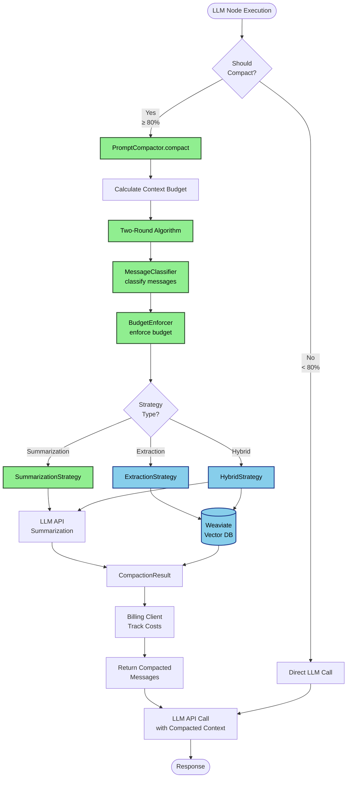
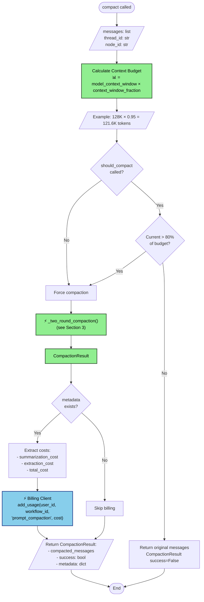
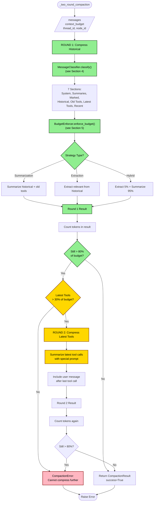
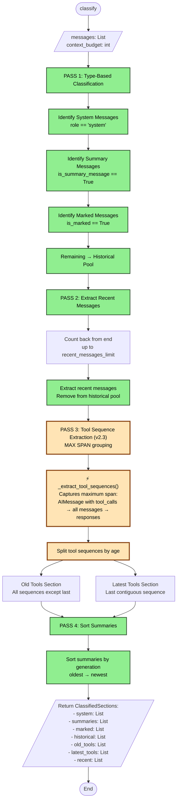
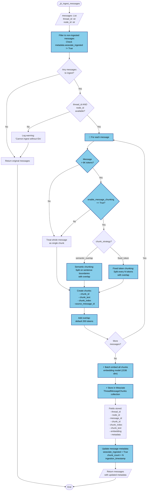
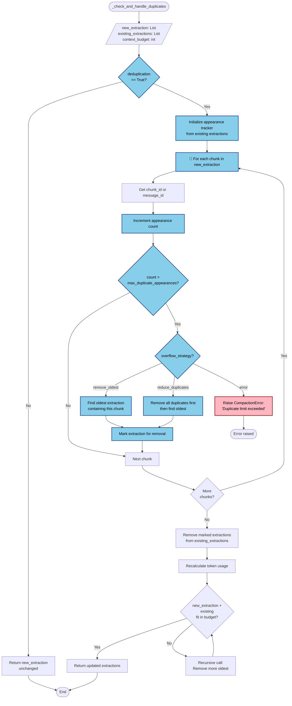
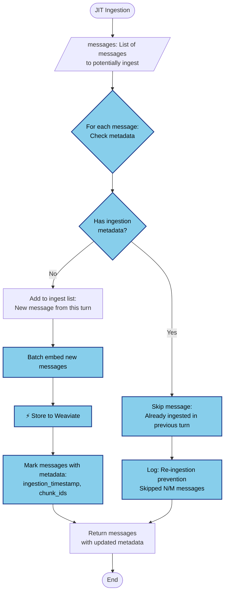
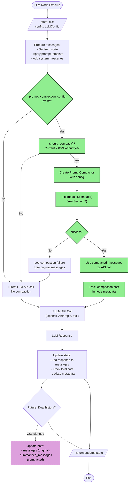

# Prompt Compaction - Complete Code Flow Diagrams

**Version:** v2.1
**Last Updated:** 2025-11-12
**Purpose:** Comprehensive end-to-end code flow documentation for code review, debugging, and onboarding

---

## Table of Contents

1. [Overview](#overview)
2. [How to Read These Diagrams](#how-to-read-these-diagrams)
3. [System Overview](#1-system-overview)
4. [Main Entry Point: PromptCompactor.compact()](#2-main-entry-point-promptcompactorcompact)
5. [Two-Round Compaction Algorithm](#3-two-round-compaction-algorithm)
6. [Message Classification](#4-message-classification)
7. [Budget Enforcement & Dynamic Reallocation](#5-budget-enforcement--dynamic-reallocation)
8. [Strategy Execution Flows](#6-strategy-execution-flows)
   - [6.1 SummarizationStrategy](#61-summarizationstrategy)
   - [6.2 ExtractionStrategy (v2.1)](#62-extractionstrategy-v21)
   - [6.3 HybridStrategy (v2.1)](#63-hybridstrategy-v21)
9. [v2.1 Feature Flows](#7-v21-feature-flows)
   - [7.1 JIT Ingestion with Chunking](#71-jit-ingestion-with-message-chunking)
   - [7.2 Chunk Expansion Modes](#72-chunk-expansion-modes)
   - [7.3 Deduplication & Overflow Handling](#73-deduplication--overflow-handling)
   - [7.4 Marked Message Overflow & Reattachment](#74-marked-message-overflow--reattachment)
   - [7.5 Multi-Turn Iterative Summarization](#75-multi-turn-iterative-summarization)
10. [Integration Points](#8-integration-points)
    - [8.1 LLM Node Integration](#81-llm-node-integration)
    - [8.2 Weaviate Integration](#82-weaviate-integration)
    - [8.3 Billing Integration](#83-billing-integration)
11. [Edge Case Handling](#9-edge-case-handling)
    - [9.1 Tool Compression (Round 2)](#91-tool-compression-round-2)
    - [9.2 Oversized Single Message](#92-oversized-single-message)
    - [9.3 Circular Dependencies](#93-circular-dependencies-in-budget-reallocation)
12. [Code References](#code-references)

---

## Overview

This document provides comprehensive visual documentation of all major code paths through the Prompt Compaction system. It covers both v2.0 core features and v2.1 enhancements.

**Key Features Documented:**
- Two-round compaction algorithm (v2.0)
- Message classification (7 sections, 4-pass algorithm)
- Dynamic budget reallocation with priority-based redistribution
- Three compaction strategies (Summarization, Extraction, Hybrid)
- JIT ingestion with message chunking (v2.1)
- Chunk expansion modes (v2.1)
- Deduplication with overflow handling (v2.1)
- Marked message overflow & reattachment (v2.1)
- Integration with LLM Node, Weaviate, and Billing

---

## How to Read These Diagrams

### Color Coding

```mermaid
graph LR
    V20[v2.0 Feature] :::v20
    V21[v2.1 Feature] :::v21
    EDGE[Edge Case] :::edge
    ERROR[Error Path] :::error

    classDef v20 fill:#90EE90,stroke:#2F4F2F,stroke-width:2px,color:#000
    classDef v21 fill:#87CEEB,stroke:#1E3A8A,stroke-width:2px,color:#000
    classDef edge fill:#FFD700,stroke:#8B4513,stroke-width:2px,color:#000
    classDef error fill:#FFB6C1,stroke:#8B0000,stroke-width:2px,color:#000
```

- **Green**: v2.0 core features
- **Blue**: v2.1 new features and enhancements
- **Yellow**: Edge cases and special handling
- **Red**: Error paths and exceptions

### Symbols

- **Rectangle**: Process/operation
- **Diamond**: Decision point (if/else)
- **Parallelogram**: Data input/output
- **Circle**: Start/end point
- **⚡**: Async operation
- **🔄**: Loop/iteration
- **📊**: Token count or metrics

### File References

All diagrams include references to source code:
- Format: `filename.py:line_number`
- Example: `compactor.py:945` refers to line 945 in compactor.py

---

## 1. System Overview

High-level architecture showing all components and their interactions.



**Key Components:**

| Component | File | Purpose |
|-----------|------|---------|
| PromptCompactor | `compactor.py:861-1362` | Main orchestrator (481 lines) |
| MessageClassifier | `context_manager.py:372-474` | 4-pass classification with **v2.3 MAX SPAN** tool grouping (102 lines) |
| BudgetEnforcer | `context_manager.py:1006-1246` | Budget enforcement with dynamic reallocation (240 lines) |
| SummarizationStrategy | `strategies.py:442-959` | **v3.0 linear batching** summarization (NO hierarchical merge) (517 lines) |
| ExtractionStrategy | `strategies.py:962-2032` | Vector similarity extraction with v2.1 features (1070 lines) |
| HybridStrategy | `strategies.py:2034-2344` | Extract + summarize (310 lines) |

**External Dependencies:**

| Dependency | Purpose | Integration Point |
|------------|---------|-------------------|
| Weaviate | Vector storage for message chunks | `strategies.py:1300-1400` |
| LLM APIs | Summarization, rewrite | `strategies.py:500-550` |
| Billing Client | Cost tracking | `compactor.py:1080-1090` |

---

## 2. Main Entry Point: PromptCompactor.compact()

Complete flow from entry to exit.

**File**: `compactor.py:945-1095`



**Key Code Snippets:**

```python
# compactor.py:950-970
async def compact(
    self,
    messages: List[BaseMessage],
    thread_id: Optional[str] = None,
    node_id: Optional[str] = None,
) -> CompactionResult:
    """Main entry point for prompt compaction."""

    # Calculate context budget
    context_budget = int(
        self.model_context_window * self.context_window_fraction
    )

    # Two-round compaction
    result = await self._two_round_compaction(
        messages=messages,
        context_budget=context_budget,
        thread_id=thread_id,
        node_id=node_id,
    )

    # Billing integration (v2.1)
    if result.metadata and result.metadata.get("total_cost"):
        await self.billing_client.add_usage(...)

    return result
```

**Decision Points:**

1. **should_compact() check**: If called via `compact_if_needed()`, checks 80% threshold first
2. **Billing integration**: Only track costs if metadata exists and has cost data

---

## 3. Two-Round Compaction Algorithm

Core v2.0 feature that handles tool compression edge cases.

**File**: `compactor.py:1100-1250`



**Why Two Rounds?**

Round 1 compresses historical messages and old tool calls, but preserves latest tool calls (within tool exception threshold of 30%). This is critical for:
- Maintaining tool call context for the LLM
- Preserving recent tool results needed for final response

Round 2 only triggers if:
1. After Round 1, still > 80% of budget
2. Latest tools > 30% of budget (configurable via `tool_exception_threshold`)

**Code Reference:**

```python
# compactor.py:1100-1150
async def _two_round_compaction(
    self,
    messages: List[BaseMessage],
    context_budget: int,
    thread_id: Optional[str] = None,
    node_id: Optional[str] = None,
) -> CompactionResult:
    """Two-round compaction to handle tool call edge cases."""

    # Round 1: Compress historical + old tools
    classified = self.classifier.classify(messages, context_budget)
    enforced = self.enforcer.enforce_budget(classified, context_budget)
    result = await self.strategy.compact(enforced, context_budget, thread_id, node_id)

    # Check if Round 2 needed
    result_tokens = count_tokens(result.compacted_messages)
    threshold = context_budget * 0.8

    if result_tokens > threshold:
        latest_tools_tokens = count_tokens(classified.latest_tools)
        tool_threshold = context_budget * self.tool_exception_threshold  # default 0.3

        if latest_tools_tokens > tool_threshold:
            # Round 2: Compress latest tools
            result = await self._compress_latest_tools(result, context_budget)

    return result
```

---

## 4. Message Classification

4-pass algorithm that classifies messages into 7 sections with **v2.3 MAX SPAN grouping** for tool sequences.

**File**: `context_manager.py:372-474`



**7 Sections in Priority Order:**

| Section | Description | Budget Priority | Compactable? |
|---------|-------------|-----------------|--------------|
| 1. System | System prompts, instructions | Sacred (never reallocated) | ❌ No |
| 2. Summaries | Previous compaction summaries | High (priority=3) | ✅ Yes (in Round 1) |
| 3. Marked | User-marked important messages | High (priority=2) | ❌ No |
| 4. Historical | Old conversation messages | Medium (priority=1) | ✅ Yes (in Round 1) |
| 5. Old Tools | Tool calls before last recent tool | Medium | ✅ Yes (in Round 1) |
| 6. Latest Tools | Tool calls after last recent tool | Low (exception threshold 30%) | ✅ Yes (in Round 2 only) |
| 7. Recent | Last N messages | Low | ❌ No |

**Code Reference:**

```python
# context_manager.py:350-450
def classify(
    self, messages: List[BaseMessage], context_budget: int
) -> ClassifiedSections:
    """4-pass classification algorithm."""

    system_msgs = []
    summary_msgs = []
    marked_msgs = []
    historical_msgs = []

    # PASS 1: Type-based classification
    for msg in messages:
        if msg.type == "system":
            system_msgs.append(msg)
        elif getattr(msg, "is_summary_message", False):
            summary_msgs.append(msg)
        elif getattr(msg, "is_marked", False):
            marked_msgs.append(msg)
        else:
            historical_msgs.append(msg)

    # PASS 2: Extract recent messages
    recent_limit = self.config.recent_messages_limit  # default: 10
    recent_msgs = historical_msgs[-recent_limit:]
    historical_msgs = historical_msgs[:-recent_limit]

    # PASS 3: Tool sequence extraction
    old_tools, latest_tools = self._extract_tool_sequences(
        historical_msgs, recent_msgs
    )

    # PASS 4: Sort summaries by generation
    summary_msgs.sort(key=lambda m: m.additional_kwargs.get("generation", 0))

    return ClassifiedSections(
        system=system_msgs,
        summaries=summary_msgs,
        marked=marked_msgs,
        historical=historical_msgs,
        old_tools=old_tools,
        latest_tools=latest_tools,
        recent=recent_msgs,
    )
```

### v2.3 MAX SPAN Tool Sequence Grouping

**Critical Enhancement**: Tool sequences capture the **maximum span** between opening and closing brackets, including ALL message types in between.

**Algorithm** (`context_manager.py:476-500`):

```python
def _extract_tool_sequences(messages: List[BaseMessage]) -> Tuple[List[List[BaseMessage]], List[BaseMessage]]:
    """
    Extract tool call sequences with MAX SPAN grouping (v2.3).
    
    A tool sequence captures the MAXIMUM SPAN between opening and closing brackets:
    1. AIMessage with tool_calls opens the bracket
    2. ALL messages in between are included (tool calls, tool responses, human messages, etc.)
    3. Tool responses close their corresponding calls
    4. After all calls closed, continue including HumanMessages until next AIMessage
    5. Sequence ends when: all calls closed + next AIMessage arrives (or end of messages)
    
    v2.3 MAX SPAN features:
    - Includes ALL message types between tool call and response (not just tool-related)
    - Captures user follow-up questions between tool calls
    - Preserves conversational context within tool sequences
    - More robust pairing for complex multi-tool scenarios
    """
```

**Example MAX SPAN Sequence**:

```
[AIMessage with tool_calls=[TC1, TC2]]  ← Opens bracket
[ToolMessage TC1 response]
[HumanMessage "what about X?"]          ← INCLUDED in MAX SPAN!
[ToolMessage TC2 response]              ← All calls now closed
[HumanMessage "follow up"]              ← Continue including HumanMessages
[AIMessage "regular response"]          ← Closes sequence (next AIMessage)
```

**Why MAX SPAN Matters**:
- Old approach: Only included tool-specific messages, lost conversational context
- v2.3 MAX SPAN: Preserves complete conversational flow within tool execution
- Critical for tool sequence summarization (v2.3 `compress_tool_sequence_to_summary`)

---

## 5. Budget Enforcement & Dynamic Reallocation

BudgetEnforcer ensures each section stays within limits and reallocates surplus.

**File**: `context_manager.py:600-800`

```mermaid
graph TB
    START([enforce_budget]) --> INPUT[/classified: ClassifiedSections<br/>context_budget: int/]

    INPUT --> CALC[Calculate Section Limits:<br/>- system: 10%<br/>- summaries: 20%<br/>- marked: 15%<br/>- historical: 30%<br/>- old_tools: 10%<br/>- latest_tools: 10%<br/>- recent: 5%]

    CALC --> SACRED[Mark Sacred Sections<br/>system_limit: never reallocated]

    SACRED --> ENFORCE_LOOP[🔄 For each section]
    ENFORCE_LOOP --> COUNT[Count section tokens]
    COUNT --> CHECK{Tokens ><br/>limit?}

    CHECK -->|Over| TRUNCATE[Truncate section<br/>Keep newest messages]
    CHECK -->|Under| SURPLUS[Calculate surplus<br/>surplus = limit - actual]

    TRUNCATE --> NEXT[Next section]
    SURPLUS --> NEXT
    NEXT --> MORE{More<br/>sections?}

    MORE -->|Yes| ENFORCE_LOOP
    MORE -->|No| TOTAL_SURPLUS[Sum all surplus tokens]

    TOTAL_SURPLUS --> REALLOC_CHECK{surplus > 0<br/>AND<br/>any priority sections<br/>were truncated?}

    REALLOC_CHECK -->|No| DONE[Return enforced sections]
    REALLOC_CHECK -->|Yes| REALLOC[DYNAMIC REALLOCATION]

    REALLOC --> PRIORITIES[Priority List:<br/>1. summaries (p=3)<br/>2. marked (p=2)<br/>3. historical (p=1)]

    PRIORITIES --> REALLOC_LOOP[🔄 For each priority level<br/>highest → lowest]
    REALLOC_LOOP --> FIND_TRUNC[Find truncated sections<br/>at this priority]

    FIND_TRUNC --> DISTRIBUTE{surplus<br/>available?}
    DISTRIBUTE -->|Yes| ADD_TOKENS[Add tokens to section<br/>up to original limit]
    ADD_TOKENS --> REDUCE_SURPLUS[Reduce surplus]
    REDUCE_SURPLUS --> NEXT_PRIORITY[Next priority]

    DISTRIBUTE -->|No| NEXT_PRIORITY
    NEXT_PRIORITY --> MORE_PRIORITY{More<br/>priorities?}

    MORE_PRIORITY -->|Yes| REALLOC_LOOP
    MORE_PRIORITY -->|No| DONE

    DONE --> END([End])

    classDef v20 fill:#90EE90,stroke:#2F4F2F,stroke-width:2px,color:#000
    classDef edge fill:#FFD700,stroke:#8B4513,stroke-width:2px,color:#000

    class CALC,SACRED,ENFORCE_LOOP,CHECK,TRUNCATE,SURPLUS v20
    class REALLOC,PRIORITIES,REALLOC_LOOP,DISTRIBUTE,ADD_TOKENS edge
```

**Budget Allocation (Default):**

| Section | Default % | Tokens (128K @ 95%) | Priority | Reallocatable? |
|---------|-----------|---------------------|----------|----------------|
| System | 10% | 12.16K | Sacred | ❌ Never |
| Summaries | 20% | 24.32K | 3 (High) | ✅ Yes |
| Marked | 15% | 18.24K | 2 (Medium) | ✅ Yes |
| Historical | 30% | 36.48K | 1 (Low) | ✅ Yes |
| Old Tools | 10% | 12.16K | 0 | ✅ Yes |
| Latest Tools | 10% | 12.16K | 0 | ✅ Yes |
| Recent | 5% | 6.08K | 0 | ✅ Yes |

**Dynamic Reallocation Example:**

```
Initial State:
- Summaries: 10K used / 24K limit → 14K surplus
- Historical: 40K used / 36K limit → truncated to 36K (4K lost)
- Marked: 5K used / 18K limit → 13K surplus
Total surplus: 27K

Reallocation:
1. Priority 3 (Summaries): Not truncated, skip
2. Priority 2 (Marked): Not truncated, skip
3. Priority 1 (Historical): Truncated! Add 4K back from surplus
   - Historical: 36K → 40K (restored to original)
   - Remaining surplus: 23K

Final State:
- All truncated sections restored
- 23K surplus remains unused (buffer)
```

**Code Reference:**

```python
# context_manager.py:600-700
def enforce_budget(
    self, classified: ClassifiedSections, context_budget: int
) -> EnforcedSections:
    """Enforce section limits and reallocate surplus."""

    # Calculate limits
    limits = {
        "system": int(context_budget * 0.10),  # Sacred
        "summaries": int(context_budget * 0.20),
        "marked": int(context_budget * 0.15),
        "historical": int(context_budget * 0.30),
        # ... etc
    }

    # Enforce limits and track surplus
    enforced = {}
    surplus_tokens = 0
    truncated_sections = []

    for section_name, section_messages in classified.items():
        section_tokens = count_tokens(section_messages)
        limit = limits[section_name]

        if section_tokens > limit:
            # Truncate (keep newest)
            enforced[section_name] = truncate_to_limit(section_messages, limit)
            truncated_sections.append(section_name)
        else:
            enforced[section_name] = section_messages
            surplus_tokens += (limit - section_tokens)

    # Dynamic reallocation
    if surplus_tokens > 0 and truncated_sections:
        enforced = self._reallocate_surplus(
            enforced, surplus_tokens, truncated_sections, limits
        )

    return EnforcedSections(**enforced)
```

---

## 6. Strategy Execution Flows

Three compaction strategies with different approaches.

### 6.1 SummarizationStrategy (v3.0 Linear Batching)

**MAJOR ARCHITECTURE CHANGE (v3.0)**: Switched from hierarchical merging to linear batching. Budget is divided equally across batches, eliminating infinite loop risks and ensuring predictable LLM call count.

**File**: `strategies.py:442-959`

```mermaid
graph TB
    START([compact]) --> INPUT[/sections: Dict<br/>budget: ContextBudget/]

    INPUT --> CHECK_EMPTY{historical +<br/>old_tools<br/>empty?}

    CHECK_EMPTY -->|Yes| EARLY_EXIT[Return original messages<br/>No compaction needed]
    CHECK_EMPTY -->|No| CONVERT[Convert old_tools to text<br/>check_and_fix_orphaned_tool_responses]

    CONVERT --> COMBINE_MSG[Combine existing summaries<br/>+ historical messages]
    COMBINE_MSG --> SPLIT[Split by model context limit<br/>70% of context window]

    SPLIT --> CALC_BUDGET["📊 Calculate target tokens per batch:<br/>budget.summary_limit / num_batches<br/>(min 500 tokens)"]

    CALC_BUDGET --> LOG["Log: Linear batching<br/>{num_messages} → {num_batches} batches<br/>(NO merging)"]

    LOG --> PARALLEL["⚡ Parallel batch processing<br/>(asyncio.gather all batches)"]

    PARALLEL --> BATCH_LOOP[🔄 For each batch]
    BATCH_LOOP --> CAP_TOKENS["Cap max_tokens to model limit<br/>(v3.0 bugfix)"]

    CAP_TOKENS --> LLM_CALL["⚡ LLM API Call<br/>prompt: Summarize batch<br/>max_tokens: capped_target"]

    LLM_CALL --> CREATE_MSG[Create summary AIMessage<br/>generation=0<br/>linear_batch=True<br/>batch_idx=N]

    CREATE_MSG --> MORE_BATCHES{More<br/>batches?}
    MORE_BATCHES -->|Yes| BATCH_LOOP
    MORE_BATCHES -->|No| DONE[All summaries complete<br/>NO hierarchical merge]

    DONE --> COMBINE[Combine sections:<br/>System → Summaries →<br/>Marked → Latest Tools → Recent]

    COMBINE --> CALC_COST[Calculate costs:<br/>- total_tokens<br/>- compression_ratio]

    CALC_COST --> RESULT[/Return CompactionResult:<br/>- compacted_messages<br/>- summaries (all batch summaries)<br/>- metadata/]

    RESULT --> END([End])
    EARLY_EXIT --> END

    classDef v30 fill:#FFE4B5,stroke:#8B4513,stroke-width:3px,color:#000
    classDef v21 fill:#87CEEB,stroke:#1E3A8A,stroke-width:2px,color:#000

    class COMBINE_MSG,SPLIT,CALC_BUDGET,LOG,PARALLEL,CAP_TOKENS,DONE v30
    class CONVERT v21
```

**v3.0 Linear Batching Key Changes:**

1. **NO Hierarchical Merging**: Eliminates infinite loop risks and unpredictable LLM call counts
2. **Budget Division**: `target_tokens_per_summary = budget / num_batches` (distributed equally)
3. **Predictable Costs**: Number of LLM calls = number of batches (no recursive merging)
4. **Cap max_tokens**: Prevents API errors when target exceeds model's output limit (v3.0 bugfix)
5. **All batches generation=0**: Flat structure, no hierarchy
6. **Parallel Execution**: All batches processed simultaneously with `asyncio.gather`

**Code Reference:**

```python
# strategies.py:450-550
async def compact(
    self,
    enforced: EnforcedSections,
    context_budget: int,
    thread_id: Optional[str] = None,
    node_id: Optional[str] = None,
) -> CompactionResult:
    """Summarization strategy implementation."""

    messages_to_compact = enforced.historical + enforced.old_tools

    if not messages_to_compact:
        return CompactionResult(
            compacted_messages=self._combine_sections(enforced),
            success=False,
        )

    # v2.1: Add section labels
    labeled_messages = self._add_section_labels(enforced)

    # Batch processing
    batch_size = self.config.batch_size  # default: 20
    batches = [
        messages_to_compact[i:i+batch_size]
        for i in range(0, len(messages_to_compact), batch_size)
    ]

    # Step 3: Divide budget equally across batches (v3.0)
    target_tokens_per_summary = max(
        500,  # Minimum per batch
        budget.summary_limit // len(batches)  # Equal distribution
    )
    
    logger.info(
        f"Linear batching: {len(all_messages)} messages "
        f"→ {len(batches)} batches (no merging)"  # v3.0!
    )
    
    # Step 4: Parallel summarization (all batches at once)
    tasks = [
        self._summarize_single_batch(
            messages=batch,
            max_output_tokens=target_tokens_per_summary,
            batch_idx=i,
        )
        for i, batch in enumerate(batches)
    ]
    summaries = await asyncio.gather(*tasks)  # Parallel execution
    
    # NO hierarchical merge! (v3.0 change)
    # Old code had: while count_tokens(summaries) > budget: merge()
    # New code: Direct return of all batch summaries

    # Step 5: Return all summaries (NO hierarchical merge check!)
    return SummarizationResult(
        summaries=list(summaries),
        token_usage={"total_tokens": sum(...)},
        cost=sum(get_message_metadata(s, "cost", 0.0) for s in summaries),
    )
```

**✅ v3.0 LINEAR BATCHING - NO HIERARCHICAL MERGE**
- Lines 769, 820: Explicit "no merging" comments
- Line 825-828: Budget divided: `budget.summary_limit // len(batches)`
- Line 849: All batches executed in parallel
- Line 860-864: Direct return - NO merge loop!

---

### 6.2 ExtractionStrategy (v2.1)

Vector similarity-based extraction with chunking, expansion, and deduplication.

**File**: `strategies.py:1195-1700`

```mermaid
graph TB
    START([compact]) --> SNAPSHOT["⚡ Snapshot metadata (v2.1)<br/>Store original metadata state"]

    SNAPSHOT --> INPUT[/enforced: EnforcedSections<br/>context_budget: int<br/>thread_id, node_id/]

    INPUT --> CHECK_EMPTY{historical<br/>messages<br/>empty?}

    CHECK_EMPTY -->|Yes| EARLY_EXIT[Return original messages<br/>success=False]
    CHECK_EMPTY -->|No| CHECK_OVERSIZED{Any single message<br/>> 60% of budget?}

    CHECK_OVERSIZED -->|Yes| OVERSIZED["⚡ Handle oversized message<br/>(see Section 9.2)"]
    OVERSIZED --> JIT
    CHECK_OVERSIZED -->|No| JIT

    JIT["⚡ _jit_ingest_messages()<br/>(see Section 7.1)"]
    JIT --> DEDUP_FILTER["⚡ Deduplication filtering<br/>Skip already-extracted messages"]

    DEDUP_FILTER --> EMBED_QUERY["⚡ Embed query<br/>query = recent messages"]
    EMBED_QUERY --> EMBED_HIST["⚡ Embed historical messages<br/>with chunking if > 6K tokens"]

    EMBED_HIST --> SEARCH["⚡ Vector similarity search<br/>Weaviate query"]
    SEARCH --> TOP_K[Get top_k chunks<br/>default: 5]

    TOP_K --> CONSTRUCTION{Construction<br/>Strategy?}

    CONSTRUCTION -->|DUMP| DUMP_MODE[Concatenate all chunk texts<br/>Create single extraction summary]
    CONSTRUCTION -->|EXTRACT_FULL| EXTRACT_MODE[Map chunks → source messages]
    CONSTRUCTION -->|LLM_REWRITE| REWRITE_MODE[LLM rewrite chunks with query]

    EXTRACT_MODE --> EXPANSION["⚡ Chunk expansion<br/>(see Section 7.2)"]
    EXPANSION --> DEDUP["⚡ Deduplication & overflow<br/>(see Section 7.3)"]

    DUMP_MODE --> COMBINE
    REWRITE_MODE --> COMBINE
    DEDUP --> COMBINE

    COMBINE[Combine sections:<br/>System → Summaries → Extracted →<br/>Marked → Latest Tools → Recent]

    COMBINE --> ADD_LABELS["⚡ Add section labels (v2.1)"]
    ADD_LABELS --> UPDATE_META["⚡ Identify messages with<br/>updated metadata (v2.1)"]

    UPDATE_META --> CALC_COST[Calculate costs:<br/>- extraction_cost<br/>- weaviate_cost]

    CALC_COST --> RESULT[/Return CompactionResult:<br/>- compacted_messages<br/>- success: True<br/>- metadata: {costs, updated_messages}/]

    RESULT --> END([End])
    EARLY_EXIT --> END

    classDef v21 fill:#87CEEB,stroke:#1E3A8A,stroke-width:2px,color:#000
    classDef edge fill:#FFD700,stroke:#8B4513,stroke-width:2px,color:#000

    class SNAPSHOT,JIT,DEDUP_FILTER,EMBED_QUERY,EMBED_HIST,SEARCH,EXPANSION,DEDUP,ADD_LABELS,UPDATE_META v21
    class CHECK_OVERSIZED,OVERSIZED edge
```

**v2.1 Enhancements:**

1. **Metadata Snapshot**: Track original state for change detection
2. **JIT Ingestion**: Lazy Weaviate storage only when extraction first needed
3. **Message Chunking**: Handle messages > 6K tokens (embedding model limit)
4. **Chunk Expansion**: Reconstruct full messages from relevant chunks
5. **Deduplication**: Track chunk appearances across extractions
6. **Overflow Handling**: Remove oldest extractions when duplicates exceed limit

**Code Reference:**

```python
# strategies.py:1195-1400
async def compact(
    self,
    enforced: EnforcedSections,
    context_budget: int,
    thread_id: Optional[str] = None,
    node_id: Optional[str] = None,
) -> CompactionResult:
    """Extraction strategy with v2.1 enhancements."""

    # v2.1: Snapshot metadata
    original_metadata = self._snapshot_metadata(enforced.historical)

    if not enforced.historical:
        return CompactionResult(
            compacted_messages=self._combine_sections(enforced),
            success=False,
        )

    # Extract relevant messages
    extracted = await self._extract_relevant_messages(
        historical=enforced.historical,
        recent=enforced.recent,
        context_budget=context_budget,
        thread_id=thread_id,
        node_id=node_id,
    )

    # Combine sections
    compacted = self._combine_sections(
        enforced, extracted_messages=extracted
    )

    # v2.1: Add labels and identify updated messages
    compacted = self._add_section_labels(compacted)
    updated_ids = self._identify_updated_messages(original_metadata, compacted)

    return CompactionResult(
        compacted_messages=compacted,
        success=True,
        metadata={
            "extraction_cost": self._calculate_cost(extracted),
            "updated_message_ids": updated_ids,
        },
    )
```

**Internal Flow (_extract_relevant_messages):**

```python
# strategies.py:1450-1600
async def _extract_relevant_messages(
    self,
    historical: List[BaseMessage],
    recent: List[BaseMessage],
    context_budget: int,
    thread_id: str,
    node_id: str,
) -> List[BaseMessage]:
    """Core extraction logic."""

    # Check for oversized messages
    oversized = self._find_oversized_messages(historical, context_budget)
    if oversized:
        return await self._handle_oversized(oversized, context_budget)

    # JIT ingestion
    historical = await self._jit_ingest_messages(
        historical, thread_id, node_id
    )

    # Deduplication filtering
    historical = self._filter_already_extracted(historical)

    # Embed query and historical
    query_embedding = await self._embed_messages(recent)

    # Chunk historical if needed (v2.1)
    chunks = []
    for msg in historical:
        if count_tokens(msg) > 6000 and self.config.enable_message_chunking:
            msg_chunks = self._chunk_message(msg)
            chunks.extend(msg_chunks)
        else:
            chunks.append({"message_id": msg.id, "text": msg.content})

    # Embed chunks
    chunk_embeddings = await self._embed_chunks(chunks)

    # Vector search
    results = await self.weaviate_client.similarity_search(
        query_embedding=query_embedding,
        limit=self.config.top_k,
        thread_id=thread_id,
        node_id=node_id,
    )

    # Construction strategy
    if self.config.construction_strategy == "DUMP":
        return self._dump_construction(results)
    elif self.config.construction_strategy == "EXTRACT_FULL":
        return await self._extract_full_construction(results, context_budget)
    else:  # LLM_REWRITE
        return await self._llm_rewrite_construction(results, recent)
```

---

### 6.3 HybridStrategy (v2.1)

5% extraction budget + 95% summarization budget for balanced compression.

**File**: `strategies.py:2121-2450`

```mermaid
graph TB
    START([compact]) --> SNAPSHOT["⚡ Snapshot metadata (v2.1)"]

    SNAPSHOT --> INPUT[/enforced: EnforcedSections<br/>context_budget: int<br/>thread_id, node_id/]

    INPUT --> CHECK_EMPTY{historical<br/>messages<br/>empty?}

    CHECK_EMPTY -->|Yes| EARLY_EXIT[Return original messages<br/>success=False]
    CHECK_EMPTY -->|No| CALC_BUDGETS[Calculate budgets:<br/>extraction_budget = 5%<br/>summarization_budget = 95%]

    CALC_BUDGETS --> PHASE1[PHASE 1: Extraction]
    PHASE1 --> EXTRACT["⚡ ExtractionStrategy.compact()<br/>with extraction_budget"]

    EXTRACT --> EXTRACT_RESULT[extracted_messages<br/>+ extraction_metadata]
    EXTRACT_RESULT --> REMAINING[remaining_messages =<br/>historical - extracted]

    REMAINING --> PHASE2[PHASE 2: Summarization]
    PHASE2 --> SUMMARIZE["⚡ SummarizationStrategy.compact()<br/>with summarization_budget"]

    SUMMARIZE --> SUMMARY_RESULT[summaries<br/>+ summarization_metadata]

    SUMMARY_RESULT --> COMBINE[Combine sections:<br/>System → Summaries (old + new) →<br/>Extracted → Marked →<br/>Latest Tools → Recent]

    COMBINE --> ADD_LABELS["⚡ Add section labels (v2.1)"]
    ADD_LABELS --> UPDATE_META["⚡ Identify messages with<br/>updated metadata (v2.1)"]

    UPDATE_META --> CALC_COST[Calculate combined costs:<br/>- extraction_cost<br/>- summarization_cost<br/>- total_cost]

    CALC_COST --> RESULT[/Return CompactionResult:<br/>- compacted_messages<br/>- success: True<br/>- metadata: {combined_costs}/]

    RESULT --> END([End])
    EARLY_EXIT --> END

    classDef v21 fill:#87CEEB,stroke:#1E3A8A,stroke-width:2px,color:#000

    class SNAPSHOT,CALC_BUDGETS,PHASE1,EXTRACT,PHASE2,SUMMARIZE,ADD_LABELS,UPDATE_META v21
```

**Why Hybrid?**

Combines best of both worlds:
- **Extraction (5%)**: Retrieves most relevant messages with full context
- **Summarization (95%)**: Compresses remaining messages efficiently

This ensures:
- High-quality context retention (extraction)
- Aggressive compression (summarization)
- Balanced token usage

**Code Reference:**

```python
# strategies.py:2121-2300
async def compact(
    self,
    enforced: EnforcedSections,
    context_budget: int,
    thread_id: Optional[str] = None,
    node_id: Optional[str] = None,
) -> CompactionResult:
    """Hybrid strategy: 5% extraction + 95% summarization."""

    # v2.1: Snapshot metadata
    original_metadata = self._snapshot_metadata(enforced.historical)

    if not enforced.historical:
        return CompactionResult(
            compacted_messages=self._combine_sections(enforced),
            success=False,
        )

    # Calculate budgets
    extraction_budget = int(context_budget * self.config.extraction_fraction)  # 0.05
    summarization_budget = int(context_budget * self.config.summarization_fraction)  # 0.95

    # Phase 1: Extraction
    extraction_result = await self.extraction_strategy.compact(
        enforced=enforced,
        context_budget=extraction_budget,
        thread_id=thread_id,
        node_id=node_id,
    )

    # Get remaining messages
    extracted_ids = {msg.id for msg in extraction_result.compacted_messages}
    remaining = [msg for msg in enforced.historical if msg.id not in extracted_ids]

    # Phase 2: Summarization
    enforced_remaining = EnforcedSections(
        system=enforced.system,
        summaries=enforced.summaries,
        marked=enforced.marked,
        historical=remaining,  # Only remaining messages
        old_tools=enforced.old_tools,
        latest_tools=enforced.latest_tools,
        recent=enforced.recent,
    )

    summarization_result = await self.summarization_strategy.compact(
        enforced=enforced_remaining,
        context_budget=summarization_budget,
        thread_id=thread_id,
        node_id=node_id,
    )

    # Combine results
    compacted = self._combine_sections(
        enforced,
        extracted_messages=extraction_result.compacted_messages,
        new_summaries=summarization_result.compacted_messages,
    )

    # v2.1: Labels and metadata tracking
    compacted = self._add_section_labels(compacted)
    updated_ids = self._identify_updated_messages(original_metadata, compacted)

    # Calculate combined costs
    total_cost = (
        extraction_result.metadata.get("extraction_cost", 0) +
        summarization_result.metadata.get("summarization_cost", 0)
    )

    return CompactionResult(
        compacted_messages=compacted,
        success=True,
        metadata={
            "extraction_cost": extraction_result.metadata.get("extraction_cost"),
            "summarization_cost": summarization_result.metadata.get("summarization_cost"),
            "total_cost": total_cost,
            "updated_message_ids": updated_ids,
        },
    )
```

---

## 7. v2.1 Feature Flows

New features added in v2.1 for enhanced extraction capabilities.

### 7.1 JIT Ingestion with Message Chunking

Lazy Weaviate storage only when extraction first needed, with chunking for large messages.

**File**: `strategies.py:1750-1950`



**Chunking Strategies:**

1. **semantic_overlap** (default):
   - Split on sentence boundaries (NLTK sentence tokenizer)
   - Respect semantic units (don't break mid-sentence)
   - Add 200 token overlap between chunks
   - Better quality for extraction

2. **fixed_token**:
   - Split every `chunk_size_tokens` (default 6000)
   - Add `chunk_overlap_tokens` (default 200)
   - Faster, simpler implementation
   - May break semantic units

**Code Reference:**

```python
# strategies.py:1750-1900
async def _jit_ingest_messages(
    self,
    messages: List[BaseMessage],
    thread_id: str,
    node_id: str,
) -> List[BaseMessage]:
    """JIT ingestion with message chunking (v2.1)."""

    # Filter to non-ingested
    non_ingested = [
        msg for msg in messages
        if not msg.additional_kwargs.get("weaviate_ingested", False)
    ]

    if not non_ingested:
        return messages

    if not thread_id or not node_id:
        logger.warning("Cannot ingest without thread_id and node_id")
        return messages

    # Chunk all messages
    all_chunks = []
    message_chunk_counts = {}

    for msg in non_ingested:
        msg_tokens = count_tokens(msg.content)

        if msg_tokens > 6000 and self.config.enable_message_chunking:
            # Chunk message
            if self.config.chunk_strategy == "semantic_overlap":
                chunks = self._chunk_semantic(msg)
            else:  # fixed_token
                chunks = self._chunk_fixed_token(msg)

            message_chunk_counts[msg.id] = len(chunks)
            all_chunks.extend(chunks)
        else:
            # Whole message as single chunk
            chunk = {
                "message_id": msg.id,
                "chunk_id": f"{msg.id}_0",
                "chunk_index": 0,
                "chunk_text": msg.content,
                "metadata": msg.additional_kwargs,
            }
            message_chunk_counts[msg.id] = 1
            all_chunks.append(chunk)

    # Batch embed
    embeddings = await self._batch_embed_chunks(all_chunks)

    # Store in Weaviate
    await self.weaviate_client.store_chunks(
        chunks=all_chunks,
        embeddings=embeddings,
        thread_id=thread_id,
        node_id=node_id,
    )

    # Update message metadata
    for msg in non_ingested:
        msg.additional_kwargs["weaviate_ingested"] = True
        msg.additional_kwargs["chunk_count"] = message_chunk_counts[msg.id]
        msg.additional_kwargs["ingestion_timestamp"] = datetime.utcnow().isoformat()

    return messages
```

**Chunk Schema in Weaviate:**

```python
{
    "class": "ThreadMessageChunk",
    "properties": [
        {"name": "thread_id", "dataType": ["string"]},
        {"name": "node_id", "dataType": ["string"]},
        {"name": "message_id", "dataType": ["string"]},
        {"name": "chunk_id", "dataType": ["string"]},
        {"name": "chunk_index", "dataType": ["int"]},
        {"name": "chunk_text", "dataType": ["text"]},
        {"name": "chunk_tokens", "dataType": ["int"]},
        {"name": "metadata", "dataType": ["object"]},
    ],
    "vectorizer": "text2vec-openai",
    "moduleConfig": {
        "text2vec-openai": {
            "model": "text-embedding-3-small",
            "dimensions": 1536,
        }
    }
}
```

---

### 7.2 Chunk Expansion Modes

Three modes for reconstructing full messages from relevant chunks.

**File**: `strategies.py:2000-2200`

```mermaid
graph TB
    START([After vector search]) --> INPUT[/results: List of chunks<br/>with relevance scores/]

    INPUT --> MODE{expansion_mode?}

    MODE -->|DUMP| DUMP_PATH[DUMP Mode]
    MODE -->|EXTRACT_FULL| EXTRACT_PATH[EXTRACT_FULL Mode]
    MODE -->|LLM_REWRITE| REWRITE_PATH[LLM_REWRITE Mode]

    DUMP_PATH --> DUMP_CONCAT[Concatenate all chunk texts]
    DUMP_CONCAT --> DUMP_SUMMARY[Create extraction summary:<br/>AIMessage with all chunks]
    DUMP_SUMMARY --> DUMP_RETURN[Return single summary message]

    EXTRACT_PATH --> EXT_MAP[Map chunks → source messages]
    EXT_MAP --> EXT_DEDUP[Deduplicate by message_id]
    EXT_DEDUP --> EXT_SORT[Sort messages by:<br/>1. Max chunk relevance score<br/>2. Chronological order]

    EXT_SORT --> EXT_BUDGET{All messages<br/>fit in budget?}
    EXT_BUDGET -->|Yes| EXT_ALL[Return all messages]
    EXT_BUDGET -->|No| EXT_BINARY[Binary search:<br/>Find max messages that fit]

    EXT_BINARY --> EXT_GRAPH[Add graph edges:<br/>type: EXTRACTION<br/>source_chunk_ids]
    EXT_GRAPH --> EXT_RETURN[Return full messages<br/>with metadata]
    EXT_ALL --> EXT_GRAPH

    REWRITE_PATH --> REWRITE_PROMPT[Build prompt:<br/>'Synthesize these chunks<br/>to answer: {query}']
    REWRITE_PROMPT --> REWRITE_CHUNKS[Add all chunk texts to prompt]
    REWRITE_CHUNKS --> REWRITE_LLM["⚡ LLM API call<br/>with retry decorator"]

    REWRITE_LLM --> REWRITE_RESULT[Create AIMessage:<br/>- content: LLM response<br/>- metadata: chunk_ids, cost]
    REWRITE_RESULT --> REWRITE_RETURN[Return single rewritten message]

    DUMP_RETURN --> END([End])
    EXT_RETURN --> END
    REWRITE_RETURN --> END

    classDef v21 fill:#87CEEB,stroke:#1E3A8A,stroke-width:2px,color:#000

    class MODE,DUMP_PATH,EXTRACT_PATH,REWRITE_PATH,EXT_MAP,EXT_DEDUP,EXT_SORT,EXT_BINARY,EXT_GRAPH,REWRITE_LLM v21
```

**Expansion Mode Comparison:**

| Mode | Output | Quality | Token Cost | Use Case |
|------|--------|---------|------------|----------|
| DUMP | Single summary with all chunks concatenated | Low | Low | Quick testing, low-importance extraction |
| EXTRACT_FULL | Full source messages (deduplicated) | **High** | Medium | **Default**: Best quality, maintains full context |
| LLM_REWRITE | Single LLM-synthesized message | Medium | **High** | Specific queries needing synthesis |

**Code Reference:**

```python
# strategies.py:2000-2150
async def _expand_chunks(
    self,
    search_results: List[Dict],
    context_budget: int,
    query: str,
) -> List[BaseMessage]:
    """Expand chunks to full messages based on expansion_mode."""

    mode = self.config.expansion_mode

    if mode == "DUMP":
        # Simple concatenation
        all_text = "\n\n".join([chunk["text"] for chunk in search_results])
        summary = AIMessage(
            content=all_text,
            additional_kwargs={
                "is_extraction_summary": True,
                "chunk_ids": [c["chunk_id"] for c in search_results],
            }
        )
        return [summary]

    elif mode == "EXTRACT_FULL":
        # Map chunks to source messages
        message_map = {}
        for chunk in search_results:
            msg_id = chunk["message_id"]
            if msg_id not in message_map:
                message_map[msg_id] = {
                    "message": chunk["source_message"],
                    "max_score": chunk["score"],
                    "chunk_ids": [chunk["chunk_id"]],
                }
            else:
                # Update max score
                message_map[msg_id]["max_score"] = max(
                    message_map[msg_id]["max_score"], chunk["score"]
                )
                message_map[msg_id]["chunk_ids"].append(chunk["chunk_id"])

        # Sort by relevance then chronological
        messages = sorted(
            message_map.values(),
            key=lambda m: (-m["max_score"], m["message"].timestamp)
        )

        # Binary search to fit in budget
        extraction_budget = int(context_budget * self.config.extraction_budget_fraction)

        # Find max messages that fit
        fitted_messages = self._binary_search_fit(
            [m["message"] for m in messages],
            extraction_budget
        )

        # Add graph edges
        for msg_data in messages:
            if msg_data["message"] in fitted_messages:
                msg_data["message"].additional_kwargs["graph_edges"] = [
                    {
                        "type": "EXTRACTION",
                        "source_chunk_ids": msg_data["chunk_ids"],
                    }
                ]

        return fitted_messages

    else:  # LLM_REWRITE
        # Build rewrite prompt
        chunks_text = "\n\n".join([
            f"[Chunk {i+1}]\n{chunk['text']}"
            for i, chunk in enumerate(search_results)
        ])

        prompt = f"""Synthesize these relevant message chunks to answer the following query:

Query: {query}

Chunks:
{chunks_text}

Provide a coherent synthesis that captures the most important information."""

        # LLM call with retry
        response = await self._llm_call_with_retry(prompt)

        rewritten = AIMessage(
            content=response.content,
            additional_kwargs={
                "is_extraction_rewrite": True,
                "source_chunk_ids": [c["chunk_id"] for c in search_results],
                "rewrite_cost": response.metadata.get("cost", 0),
            }
        )

        return [rewritten]
```

**Chunk Score Aggregation:**

When multiple chunks from same message are retrieved, use `chunk_score_aggregation`:
- **max** (default): Use highest chunk score as message score
- **mean**: Average all chunk scores
- **sum**: Sum all chunk scores

---

### 7.3 Deduplication & Overflow Handling

Track chunk appearances across extractions and handle overflow with configurable strategies.

**File**: `strategies.py:2250-2450`



**Deduplication Configuration:**

```python
class ExtractionConfig(BaseModel):
    # Deduplication (v2.1)
    deduplication: bool = True  # Enable/disable deduplication
    allow_duplicate_chunks: bool = True  # Allow chunks to appear multiple times
    max_duplicate_appearances: int = 3  # Max appearances before overflow handling

    # Overflow handling (v2.1)
    overflow_strategy: str = "remove_oldest"  # remove_oldest | reduce_duplicates | error
```

**Overflow Strategies:**

1. **remove_oldest** (default):
   - Find oldest extraction containing duplicate chunk
   - Remove entire extraction
   - Frees up space for new extraction

2. **reduce_duplicates**:
   - First pass: Remove all duplicate chunks from all extractions
   - Second pass: If still over limit, remove oldest extraction
   - Preserves more context but more complex

3. **error**:
   - Raise CompactionError when limit exceeded
   - Forces user to increase limit or change strategy
   - Useful for debugging/testing

**Code Reference:**

```python
# strategies.py:2250-2400
def _check_and_handle_duplicates(
    self,
    new_extraction: List[BaseMessage],
    existing_extractions: List[List[BaseMessage]],
    context_budget: int,
) -> List[List[BaseMessage]]:
    """Check for duplicates and handle overflow (v2.1)."""

    if not self.config.deduplication:
        return existing_extractions + [new_extraction]

    # Initialize appearance tracker
    chunk_appearances = {}
    extraction_chunks = {}  # Track which extractions contain which chunks

    for i, extraction in enumerate(existing_extractions):
        extraction_chunks[i] = []
        for msg in extraction:
            chunk_ids = msg.additional_kwargs.get("source_chunk_ids", [])
            for chunk_id in chunk_ids:
                chunk_appearances[chunk_id] = chunk_appearances.get(chunk_id, 0) + 1
                extraction_chunks[i].append(chunk_id)

    # Check new extraction
    overflow_chunks = []
    for msg in new_extraction:
        chunk_ids = msg.additional_kwargs.get("source_chunk_ids", [])
        for chunk_id in chunk_ids:
            chunk_appearances[chunk_id] = chunk_appearances.get(chunk_id, 0) + 1

            if chunk_appearances[chunk_id] > self.config.max_duplicate_appearances:
                overflow_chunks.append(chunk_id)

    if not overflow_chunks:
        return existing_extractions + [new_extraction]

    # Handle overflow
    if self.config.overflow_strategy == "error":
        raise CompactionError(
            f"Duplicate chunk limit exceeded: {overflow_chunks}"
        )

    elif self.config.overflow_strategy == "remove_oldest":
        # Find oldest extraction with overflow chunks
        for i in range(len(existing_extractions)):
            if any(chunk in extraction_chunks[i] for chunk in overflow_chunks):
                # Remove this extraction
                logger.info(f"Removing extraction {i} due to overflow")
                existing_extractions.pop(i)
                break

    elif self.config.overflow_strategy == "reduce_duplicates":
        # First pass: Remove duplicate chunks
        for i, extraction in enumerate(existing_extractions):
            filtered_msgs = []
            for msg in extraction:
                chunk_ids = msg.additional_kwargs.get("source_chunk_ids", [])
                # Keep only if no overflow chunks
                if not any(chunk in overflow_chunks for chunk in chunk_ids):
                    filtered_msgs.append(msg)
            existing_extractions[i] = filtered_msgs

        # Second pass: Remove empty extractions
        existing_extractions = [e for e in existing_extractions if e]

        # If still over budget, remove oldest
        total_tokens = count_tokens_multi(existing_extractions + [new_extraction])
        if total_tokens > context_budget:
            existing_extractions.pop(0)  # Remove oldest

    return existing_extractions + [new_extraction]
```

**Appearance Tracking:**

```python
# Example state across multiple extractions
{
    "chunk_abc123": 2,  # Appeared in 2 extractions
    "chunk_def456": 3,  # At limit (max_duplicate_appearances=3)
    "chunk_ghi789": 4,  # OVERFLOW! Trigger overflow strategy
}
```

---

### 7.4 Marked Message Overflow & Reattachment

LRU-based overflow for marked messages with FIFO reattachment.

**File**: `context_manager.py:850-1050`

```mermaid
graph TB
    START([Budget Enforcement]) --> INPUT[/marked_messages: List<br/>marked_limit: int/]

    INPUT --> COUNT{len(marked) ><br/>marked_limit?}

    COUNT -->|No| NO_OVERFLOW[Keep all marked messages<br/>No overflow]
    COUNT -->|Yes| OVERFLOW_DETECTED[OVERFLOW DETECTED]

    OVERFLOW_DETECTED --> SORT[Sort marked by timestamp<br/>oldest → newest]
    SORT --> SPLIT[Split:<br/>- Keep: newest N messages<br/>- Overflow: oldest messages]

    SPLIT --> MARK_FLAG[Mark overflow messages:<br/>originally_marked = True]
    MARK_FLAG --> MOVE_OVERFLOW[Move overflow to<br/>overflow_section in state]

    MOVE_OVERFLOW --> COMPACTION_COMPLETE[Compaction complete]
    COMPACTION_COMPLETE --> NEXT_COMPACTION[Next compaction cycle]

    NEXT_COMPACTION --> REATTACH_CHECK{Space available<br/>in marked section?}

    REATTACH_CHECK -->|No| KEEP_OVERFLOW[Keep in overflow]
    REATTACH_CHECK -->|Yes| CALC_SPACE[Calculate available space:<br/>space = limit - current_marked]

    CALC_SPACE --> FIFO[Get overflow messages<br/>in FIFO order<br/>oldest overflow first]
    FIFO --> BINARY_SEARCH[Binary search:<br/>Max messages that fit in space]

    BINARY_SEARCH --> REATTACH[Reattach messages<br/>to marked section]
    REATTACH --> REMOVE_FLAG[Remove originally_marked flag]
    REMOVE_FLAG --> UPDATE_OVERFLOW[Remove reattached from overflow]

    UPDATE_OVERFLOW --> DONE[Continue compaction]
    KEEP_OVERFLOW --> DONE
    NO_OVERFLOW --> DONE

    DONE --> END([End])

    classDef v21 fill:#87CEEB,stroke:#1E3A8A,stroke-width:2px,color:#000

    class OVERFLOW_DETECTED,SORT,SPLIT,MARK_FLAG,MOVE_OVERFLOW,REATTACH_CHECK,CALC_SPACE,FIFO,BINARY_SEARCH,REATTACH,REMOVE_FLAG v21
```

**Overflow & Reattachment Logic:**

**Overflow (LRU - Least Recently Used):**
```
Initial: 20 marked messages, limit = 15

[M1, M2, M3, M4, M5, ..., M15, M16, M17, M18, M19, M20]
 └────────── Oldest ──────────┘  └────── Newest ──────┘

After overflow:
Kept (15 newest): [M6, M7, M8, ..., M20]
Overflow (5 oldest): [M1, M2, M3, M4, M5] (marked with originally_marked=True)
```

**Reattachment (FIFO - First In, First Out):**
```
Next compaction: 12 marked messages currently, limit = 15, space = 3

Overflow section: [M1, M2, M3, M4, M5]
                   └── Try to reattach oldest first

Reattach M1, M2, M3 (fit in 3 slots)

Result:
Marked: [M6, M7, ..., M20, M1, M2, M3] (15 messages)
Overflow: [M4, M5] (remaining)
```

**Code Reference:**

```python
# context_manager.py:850-1000
def _handle_marked_overflow(
    self,
    marked_messages: List[BaseMessage],
    marked_limit: int,
    overflow_section: List[BaseMessage],
) -> Tuple[List[BaseMessage], List[BaseMessage]]:
    """Handle marked message overflow with LRU and FIFO reattachment (v2.1)."""

    # Check if overflow needed
    if len(marked_messages) <= marked_limit:
        # Try to reattach from overflow (FIFO)
        if overflow_section:
            space_available = marked_limit - len(marked_messages)

            if space_available > 0:
                # Sort overflow by overflow timestamp (FIFO)
                overflow_section.sort(
                    key=lambda m: m.additional_kwargs.get("overflow_timestamp", 0)
                )

                # Binary search for max that fit
                reattachable = self._binary_search_fit(
                    overflow_section, space_available
                )

                # Reattach
                for msg in reattachable:
                    msg.additional_kwargs.pop("originally_marked", None)
                    msg.additional_kwargs.pop("overflow_timestamp", None)
                    marked_messages.append(msg)

                # Remove from overflow
                overflow_section = [
                    m for m in overflow_section if m not in reattachable
                ]

                logger.info(f"Reattached {len(reattachable)} marked messages from overflow")

        return marked_messages, overflow_section

    # Overflow needed (LRU)
    # Sort by timestamp (oldest first)
    marked_messages.sort(key=lambda m: m.additional_kwargs.get("timestamp", 0))

    # Keep newest
    keep_count = marked_limit
    kept_messages = marked_messages[-keep_count:]
    overflow_messages = marked_messages[:-keep_count]

    # Mark overflow
    for msg in overflow_messages:
        msg.additional_kwargs["originally_marked"] = True
        msg.additional_kwargs["overflow_timestamp"] = datetime.utcnow().timestamp()

    # Add to overflow section
    overflow_section.extend(overflow_messages)

    logger.info(
        f"Moved {len(overflow_messages)} marked messages to overflow (LRU)"
    )

    return kept_messages, overflow_section
```

**State Tracking:**

```python
# Example state with overflow
{
    "messages": [...],  # Current conversation
    "summarized_messages": [...],  # Compacted history (future v2.1)
    "overflow_section": [  # Overflow marked messages
        {
            "id": "msg_123",
            "content": "...",
            "is_marked": True,
            "originally_marked": True,  # Flag for reattachment
            "overflow_timestamp": 1699123456.789,
        },
        # ... more overflow messages
    ],
}
```

---

### 7.5 Multi-Turn Iterative Summarization

Progressive compaction across multiple LLM calls with dual history support and re-ingestion prevention.

**Files**: `llm_node.py:1725-1801`, `compactor.py:945-1038`, `strategies.py:1367-1416`

#### Overview

Multi-turn iterative summarization enables workflows to maintain both:
- **Full history** (`messages_history`): Complete uncompacted message history
- **Summarized history** (`summarized_messages`): Compacted messages from previous turn

Each turn's compaction builds on the previous turn's summarized messages, achieving progressive token reduction while preserving full context for reference.

#### 3-Turn Workflow Example

```mermaid
graph TB
    START([Workflow Start]) --> TURN1[**Turn 1**: First LLM Call]

    TURN1 --> INPUT1[/Input: messages_history = 50 msgs<br/>summarized_messages = None/]
    INPUT1 --> CHECK1{Compaction<br/>needed?}
    CHECK1 -->|Yes<br/>≥80%| COMPACT1[Compact 50 messages]
    COMPACT1 --> RESULT1[/Output:<br/>current_messages = 5 new msgs<br/>summarized_messages = 25 compacted<br/>messages_history = 55 total/]

    RESULT1 --> TURN2[**Turn 2**: Second LLM Call]
    TURN2 --> INPUT2[/Input: messages_history = 55 msgs<br/>summarized_messages = 25 msgs/]
    INPUT2 --> CHECK2{Compaction<br/>needed?}
    CHECK2 -->|Yes| IDENTIFY2[Identify new messages:<br/>55 - 25 = 30 new msgs]
    IDENTIFY2 --> PREVENT2[Re-ingestion prevention:<br/>Skip 25 already-ingested msgs<br/>Ingest only 30 new msgs]
    PREVENT2 --> COMPACT2[Compact 25 summarized<br/>+ 30 new = 55 msgs]
    COMPACT2 --> RESULT2[/Output:<br/>current_messages = 8 new msgs<br/>summarized_messages = 20 compacted<br/>messages_history = 63 total/]

    RESULT2 --> TURN3[**Turn 3**: Third LLM Call]
    TURN3 --> INPUT3[/Input: messages_history = 63 msgs<br/>summarized_messages = 20 msgs/]
    INPUT3 --> CHECK3{Compaction<br/>needed?}
    CHECK3 -->|Yes| IDENTIFY3[Identify new messages:<br/>63 - 20 = 43 new msgs]
    IDENTIFY3 --> PREVENT3[Re-ingestion prevention:<br/>Skip 20 already-ingested msgs<br/>Ingest only 43 new msgs]
    PREVENT3 --> COMPACT3[Compact 20 summarized<br/>+ 43 new = 63 msgs]
    COMPACT3 --> RESULT3[/Output:<br/>current_messages = 6 new msgs<br/>summarized_messages = 18 compacted<br/>messages_history = 69 total/]

    RESULT3 --> END([Progressive Reduction:<br/>50 → 25 → 20 → 18 compacted<br/>While full history grows: 50 → 55 → 63 → 69])

    classDef v21 fill:#87CEEB,stroke:#1E3A8A,stroke-width:2px,color:#000

    class IDENTIFY2,PREVENT2,COMPACT2,IDENTIFY3,PREVENT3,COMPACT3 v21
```



#### Dual History Flow

```mermaid
graph LR
    START([LLM Node]) --> INPUT[/Input Data/]

    INPUT --> EXTRACT[Extract from input_data:<br/>- messages_history full<br/>- summarized_messages compacted]

    EXTRACT --> DECISION{summarized_messages<br/>provided?}

    DECISION -->|Yes<br/>Iterative| ITERATIVE[Use summarized as base:<br/>messages_to_compact = summarized<br/>full_history = messages_history]
    DECISION -->|No<br/>First time| FIRST[Use full history:<br/>messages_to_compact = messages_history<br/>full_history = None]

    ITERATIVE --> COMPACT[PromptCompactor.compact]
    FIRST --> COMPACT

    COMPACT --> IDENTIFY[Identify current_messages:<br/>IDs in full_history but not in messages]

    IDENTIFY --> REINGEST_CHECK{current_messages<br/>found?}

    REINGEST_CHECK -->|Yes| FILTER[Filter to non-ingested:<br/>Check is_message_ingested]
    REINGEST_CHECK -->|No| SKIP_FILTER[No new messages to ingest]

    FILTER --> INGEST[JIT Ingest only new messages<br/>⚡ Weaviate storage]
    INGEST --> STRATEGIES[Execute Strategy<br/>Extraction/Summarization/Hybrid]
    SKIP_FILTER --> STRATEGIES

    STRATEGIES --> OUTPUT[/Output:<br/>- current_messages<br/>- summarized_messages<br/>- messages_with_updated_metadata/]

    OUTPUT --> WORKFLOW[Workflow State Update]
    WORKFLOW --> NEXT[Next LLM Call]

    classDef v21 fill:#87CEEB,stroke:#1E3A8A,stroke-width:2px,color:#000

    class ITERATIVE,IDENTIFY,REINGEST_CHECK,FILTER,INGEST v21
```



#### Re-Ingestion Prevention

**File**: `strategies.py:1405-1416`



#### Code References

**LLM Node Dual History Integration** (`llm_node.py:1741-1784`):

```python
# v2.1 Iterative Summarization: Determine which messages to compact
# If summarized_messages provided, use that as base for compaction
# Otherwise use full messages_history
messages_to_compact = (
    input_data.summarized_messages
    if input_data.summarized_messages
    else messages
)
full_history_for_compactor = input_data.messages_history if input_data.messages_history else None

# Compact messages with dual history support
compaction_result = await self._compactor.compact(
    messages=messages_to_compact,  # Summarized or full
    ext_context=ext_context,
    app_context=app_context,
    full_history=full_history_for_compactor,  # v2.1: For identifying new messages
    current_messages=None,  # v2.1: Let compactor identify from full_history
)
```

**Compactor Current Messages Identification** (`compactor.py:980-996`):

```python
# v2.1 Iterative Summarization: Identify current_messages if not provided
if current_messages is None and full_history is not None:
    # Identify new messages by comparing full_history with messages
    # New messages are those in full_history but not in messages
    existing_ids = {msg.id for msg in messages if hasattr(msg, 'id') and msg.id}
    current_messages = [
        msg for msg in full_history
        if hasattr(msg, 'id') and msg.id and msg.id not in existing_ids
    ]
    if current_messages:
        self.info(
            f"Identified {len(current_messages)} new messages for this turn "
            f"(full_history: {len(full_history)}, summarized: {len(messages)})"
        )
elif current_messages is None:
    # No full_history provided, treat all messages as current
    current_messages = []
```

**Re-Ingestion Prevention** (`strategies.py:1405-1416`):

```python
# Filter to only non-ingested messages (v2.1 re-ingestion prevention)
to_ingest = [msg for msg in messages if not is_message_ingested(msg)]
already_ingested = len(messages) - len(to_ingest)

if already_ingested > 0:
    logger.info(
        f"Re-ingestion prevention: Skipping {already_ingested}/{len(messages)} "
        f"already-ingested messages (section: {section_label})"
    )

if not to_ingest or not self.store_embeddings:
    return messages
```

#### Workflow State Pattern

**Edge Mappings for Iterative Summarization:**

```json
{
  "edges": [
    {
      "src_node_id": "llm_node_1",
      "dst_node_id": "llm_node_2",
      "mappings": [
        // Full history (always append)
        {"src_field": "current_messages", "dst_field": "messages_history"},
        // Summarized history (replace with compacted)
        {"src_field": "summarized_messages", "dst_field": "summarized_messages"}
      ]
    }
  ],
  "state_reducers": {
    "messages_history": "add_messages",  // Append-only
    "summarized_messages": "replace"     // Replace with latest compaction
  }
}
```

**Progressive Token Reduction Example:**

```
Turn 1: Initial Call
├─ Input:  50 messages, 0 compacted
├─ Compact: 50 → 25 messages
└─ Output: Full history = 55 msgs, Summarized = 25 msgs

Turn 2: Iterative Compaction
├─ Input:  55 full history, 25 summarized
├─ Identify: 55 - 25 = 30 new messages
├─ Re-ingestion: Skip 25 already-ingested, ingest 30 new
├─ Compact: 25 + 30 = 55 → 20 messages
└─ Output: Full history = 63 msgs, Summarized = 20 msgs (25% reduction)

Turn 3: Further Compaction
├─ Input:  63 full history, 20 summarized
├─ Identify: 63 - 20 = 43 new messages
├─ Re-ingestion: Skip 20 already-ingested, ingest 43 new
├─ Compact: 20 + 43 = 63 → 18 messages
└─ Output: Full history = 69 msgs, Summarized = 18 msgs (10% further reduction)

Result: Progressive compaction from 50 → 25 → 20 → 18 messages
        While maintaining full context: 50 → 55 → 63 → 69 messages
```

**Benefits:**

1. **Progressive Reduction**: Each turn compacts on already-compacted history
2. **Efficiency**: Only ingests new messages (no duplicate Weaviate storage)
3. **Context Preservation**: Full history always available for reference
4. **Workflow Flexibility**: Supports multi-turn conversations with HITL loops

---

## 8. Integration Points

How Prompt Compaction integrates with external systems.

### 8.1 LLM Node Integration

LLM node calls compaction before API calls.

**File**: `services/workflow_service/registry/nodes/llm/llm_node.py:450-650`



**Code Reference:**

```python
# llm_node.py:500-600
async def execute(self, state: dict, config: LLMConfig) -> dict:
    """Execute LLM node with optional prompt compaction."""

    # Prepare messages
    messages = self._prepare_messages(state, config)

    # Check if compaction needed
    if config.prompt_compaction_config:
        compactor = PromptCompactor(
            config=config.prompt_compaction_config,
            model_context_window=config.model_context_window,
            billing_client=self.billing_client,
        )

        # Check threshold
        if compactor.should_compact(messages):
            result = await compactor.compact(
                messages=messages,
                thread_id=state.get("thread_id"),
                node_id=config.node_id,
            )

            if result.success:
                logger.info(
                    f"Prompt compaction successful: "
                    f"{len(messages)} → {len(result.compacted_messages)} messages"
                )
                messages = result.compacted_messages

                # Track compaction cost
                if result.metadata:
                    state.setdefault("_node_metadata", {}).setdefault(
                        config.node_id, {}
                    )["compaction_cost"] = result.metadata.get("total_cost", 0)
            else:
                logger.warning("Prompt compaction failed, using original messages")

    # LLM API call
    response = await self.llm_client.chat_completion(
        messages=messages,
        model=config.model,
        temperature=config.temperature,
        # ... other params
    )

    # Update state
    state["messages"].append(response.message)

    # Future: Dual history (v2.1 planned)
    # if "summarized_messages" in state:
    #     state["summarized_messages"] = messages  # Compacted version

    return state
```

**Configuration in Workflow:**

```python
# Example workflow node config
{
    "node_id": "llm_analysis",
    "node_type": "llm",
    "config": {
        "model": "gpt-4",
        "model_context_window": 128000,
        "prompt_compaction_config": {
            "strategy": "hybrid",
            "context_window_fraction": 0.95,
            "compaction_threshold": 0.8,
            "summarization_config": {
                "batch_size": 20,
            },
            "extraction_config": {
                "construction_strategy": "EXTRACT_FULL",
                "top_k": 5,
                "enable_message_chunking": True,
                "expansion_mode": "full_message",
                "deduplication": True,
                "max_duplicate_appearances": 3,
                "overflow_strategy": "remove_oldest",
            },
            "hybrid_config": {
                "extraction_fraction": 0.05,
                "summarization_fraction": 0.95,
            },
        },
    },
}
```

---

### 8.2 Weaviate Integration

Vector database for JIT ingestion and similarity search.

**File**: `libs/src/weaviate_client/thread_message_client.py:100-300`

```mermaid
graph TB
    START([Weaviate Integration]) --> INIT[Initialize Client:<br/>ThreadMessageChunkClient]

    INIT --> SCHEMA_CHECK{Schema<br/>exists?}

    SCHEMA_CHECK -->|No| CREATE_SCHEMA[Create ThreadMessageChunks schema:<br/>- thread_id, node_id<br/>- message_id, chunk_id<br/>- chunk_text<br/>- embedding (1536 dim)<br/>- metadata]

    SCHEMA_CHECK -->|Yes| OPERATIONS
    CREATE_SCHEMA --> OPERATIONS

    OPERATIONS --> OP_CHOICE{Operation?}

    OP_CHOICE -->|Store| STORE_PATH[store_chunks]
    OP_CHOICE -->|Search| SEARCH_PATH[similarity_search]
    OP_CHOICE -->|Cleanup| CLEANUP_PATH[cleanup_old_chunks]

    STORE_PATH --> BATCH_PREP[Prepare batch objects:<br/>For each chunk]
    BATCH_PREP --> BATCH_ADD[Batch add to Weaviate<br/>with embeddings]
    BATCH_ADD --> BATCH_RESULT[Return: stored chunk IDs]

    SEARCH_PATH --> QUERY_BUILD[Build vector query:<br/>- nearVector: query_embedding<br/>- limit: top_k<br/>- where: {thread_id, node_id}]
    QUERY_BUILD --> SEARCH_EXEC["⚡ Execute similarity search"]
    SEARCH_EXEC --> SEARCH_RESULT[Return: chunks with scores]

    CLEANUP_PATH --> FIND_OLD[Find chunks older than N days:<br/>where: {created_at < threshold}]
    FIND_OLD --> DELETE_BATCH[Batch delete old chunks]
    DELETE_BATCH --> CLEANUP_RESULT[Return: deleted count]

    BATCH_RESULT --> END([End])
    SEARCH_RESULT --> END
    CLEANUP_RESULT --> END

    classDef v21 fill:#87CEEB,stroke:#1E3A8A,stroke-width:2px,color:#000

    class INIT,CREATE_SCHEMA,STORE_PATH,BATCH_PREP,BATCH_ADD,SEARCH_PATH,QUERY_BUILD,SEARCH_EXEC,CLEANUP_PATH v21
```

**Weaviate Schema:**

```python
# thread_message_client.py:50-100
THREAD_MESSAGE_CHUNK_SCHEMA = {
    "class": "ThreadMessageChunk",
    "description": "Message chunks for prompt compaction extraction",
    "properties": [
        {
            "name": "thread_id",
            "dataType": ["string"],
            "description": "LangGraph thread ID",
            "indexFilterable": True,
            "indexSearchable": False,
        },
        {
            "name": "node_id",
            "dataType": ["string"],
            "description": "Workflow node ID",
            "indexFilterable": True,
            "indexSearchable": False,
        },
        {
            "name": "message_id",
            "dataType": ["string"],
            "description": "Source message ID",
            "indexFilterable": True,
            "indexSearchable": False,
        },
        {
            "name": "chunk_id",
            "dataType": ["string"],
            "description": "Unique chunk ID (message_id_index)",
            "indexFilterable": True,
            "indexSearchable": False,
        },
        {
            "name": "chunk_index",
            "dataType": ["int"],
            "description": "Index of chunk within message",
        },
        {
            "name": "chunk_text",
            "dataType": ["text"],
            "description": "Chunk content",
            "indexFilterable": False,
            "indexSearchable": True,
        },
        {
            "name": "chunk_tokens",
            "dataType": ["int"],
            "description": "Token count of chunk",
        },
        {
            "name": "metadata",
            "dataType": ["object"],
            "description": "Additional metadata",
        },
        {
            "name": "created_at",
            "dataType": ["date"],
            "description": "Ingestion timestamp",
        },
    ],
    "vectorizer": "text2vec-openai",
    "moduleConfig": {
        "text2vec-openai": {
            "model": "text-embedding-3-small",
            "dimensions": 1536,
            "vectorizeClassName": False,
        }
    },
}
```

**Store Chunks:**

```python
# thread_message_client.py:150-200
async def store_chunks(
    self,
    chunks: List[Dict],
    embeddings: List[List[float]],
    thread_id: str,
    node_id: str,
) -> List[str]:
    """Store message chunks with embeddings in Weaviate."""

    batch_objects = []

    for chunk, embedding in zip(chunks, embeddings):
        batch_objects.append({
            "class": "ThreadMessageChunk",
            "properties": {
                "thread_id": thread_id,
                "node_id": node_id,
                "message_id": chunk["message_id"],
                "chunk_id": chunk["chunk_id"],
                "chunk_index": chunk["chunk_index"],
                "chunk_text": chunk["chunk_text"],
                "chunk_tokens": count_tokens(chunk["chunk_text"]),
                "metadata": chunk.get("metadata", {}),
                "created_at": datetime.utcnow().isoformat(),
            },
            "vector": embedding,
        })

    # Batch insert
    with self.client.batch as batch:
        for obj in batch_objects:
            batch.add_data_object(**obj)

    return [obj["properties"]["chunk_id"] for obj in batch_objects]
```

**Similarity Search:**

```python
# thread_message_client.py:250-300
async def similarity_search(
    self,
    query_embedding: List[float],
    limit: int,
    thread_id: str,
    node_id: str,
) -> List[Dict]:
    """Vector similarity search for relevant chunks."""

    result = (
        self.client.query
        .get("ThreadMessageChunk", [
            "thread_id",
            "node_id",
            "message_id",
            "chunk_id",
            "chunk_index",
            "chunk_text",
            "chunk_tokens",
            "metadata",
        ])
        .with_near_vector({
            "vector": query_embedding,
            "certainty": 0.7,  # Min similarity threshold
        })
        .with_where({
            "operator": "And",
            "operands": [
                {"path": ["thread_id"], "operator": "Equal", "valueString": thread_id},
                {"path": ["node_id"], "operator": "Equal", "valueString": node_id},
            ]
        })
        .with_limit(limit)
        .with_additional(["certainty", "distance"])
        .do()
    )

    chunks = []
    for item in result["data"]["Get"]["ThreadMessageChunk"]:
        chunks.append({
            "message_id": item["message_id"],
            "chunk_id": item["chunk_id"],
            "chunk_index": item["chunk_index"],
            "text": item["chunk_text"],
            "tokens": item["chunk_tokens"],
            "metadata": item["metadata"],
            "score": item["_additional"]["certainty"],
            "distance": item["_additional"]["distance"],
        })

    return chunks
```

**Cleanup (Optional):**

```python
# thread_message_client.py:350-400
async def cleanup_old_chunks(self, days_threshold: int = 30) -> int:
    """Delete chunks older than threshold (optional maintenance)."""

    threshold_date = (
        datetime.utcnow() - timedelta(days=days_threshold)
    ).isoformat()

    result = (
        self.client.batch.delete_objects(
            class_name="ThreadMessageChunk",
            where={
                "path": ["created_at"],
                "operator": "LessThan",
                "valueDate": threshold_date,
            }
        )
    )

    deleted_count = result.get("results", {}).get("successful", 0)
    logger.info(f"Deleted {deleted_count} old chunks (>{days_threshold} days)")

    return deleted_count
```

---

### 8.3 Billing Integration

Track compaction costs for user billing.

**File**: `compactor.py:1080-1090`, `services/kiwi_app/billing/client.py:200-300`

```mermaid
graph TB
    START([After Compaction]) --> RESULT[CompactionResult received]

    RESULT --> CHECK_META{metadata<br/>exists?}

    CHECK_META -->|No| SKIP[Skip billing]
    CHECK_META -->|Yes| EXTRACT[Extract costs from metadata:<br/>- summarization_cost<br/>- extraction_cost<br/>- total_cost]

    EXTRACT --> CHECK_COST{total_cost > 0?}

    CHECK_COST -->|No| SKIP
    CHECK_COST -->|Yes| GET_CONTEXT[Get context:<br/>- user_id<br/>- workflow_id<br/>- node_id]

    GET_CONTEXT --> BUILD_META[Build metadata:<br/>- strategy<br/>- messages_before<br/>- messages_after<br/>- compression_ratio<br/>- costs breakdown]

    BUILD_META --> BILLING_CALL["⚡ billing_client.add_usage(<br/>  user_id,<br/>  workflow_id,<br/>  'prompt_compaction',<br/>  total_cost,<br/>  metadata<br/>)"]

    BILLING_CALL --> DB_INSERT["⚡ Insert to PostgreSQL:<br/>usage_logs table"]

    DB_INSERT --> CREDIT_CHECK{User has<br/>credits?}

    CREDIT_CHECK -->|Yes| DEDUCT[Deduct from credits]
    CREDIT_CHECK -->|No| BILL_STRIPE[Bill via Stripe<br/>(if enabled)]

    DEDUCT --> USAGE_UPDATE[Update user usage stats]
    BILL_STRIPE --> USAGE_UPDATE

    USAGE_UPDATE --> DONE[Return success]
    SKIP --> DONE

    DONE --> END([End])

    classDef v20 fill:#90EE90,stroke:#2F4F2F,stroke-width:2px,color:#000

    class RESULT,CHECK_META,EXTRACT,CHECK_COST,BILLING_CALL,DB_INSERT,CREDIT_CHECK,DEDUCT v20
```

**Cost Calculation:**

```python
# Cost sources in CompactionResult.metadata
{
    "summarization_cost": 0.05,  # LLM API cost for summarization
    "extraction_cost": 0.02,     # Embedding + Weaviate cost
    "total_cost": 0.07,          # Sum of all costs

    # Additional metadata for billing
    "strategy": "hybrid",
    "messages_before": 150,
    "messages_after": 45,
    "compression_ratio": 3.33,
    "tokens_saved": 85000,
}
```

**Billing Client Call:**

```python
# compactor.py:1080-1090
async def compact(...) -> CompactionResult:
    """Main compact method with billing integration."""

    # ... compaction logic ...

    result = await self._two_round_compaction(...)

    # Billing integration (v2.1)
    if result.metadata and result.metadata.get("total_cost"):
        await self.billing_client.add_usage(
            user_id=self.user_id,
            workflow_id=self.workflow_id,
            usage_type="prompt_compaction",
            cost=result.metadata["total_cost"],
            metadata={
                "strategy": self.config.strategy,
                "node_id": node_id,
                "messages_before": len(messages),
                "messages_after": len(result.compacted_messages),
                "compression_ratio": result.metadata.get("compression_ratio"),
                "summarization_cost": result.metadata.get("summarization_cost"),
                "extraction_cost": result.metadata.get("extraction_cost"),
            },
        )

    return result
```

**Billing Client Implementation:**

```python
# billing/client.py:250-300
async def add_usage(
    self,
    user_id: str,
    workflow_id: str,
    usage_type: str,
    cost: float,
    metadata: dict,
) -> None:
    """Track usage and bill user."""

    async with self.db_session() as session:
        # Insert usage log
        usage_log = UsageLog(
            user_id=user_id,
            workflow_id=workflow_id,
            usage_type=usage_type,
            cost=cost,
            metadata=metadata,
            created_at=datetime.utcnow(),
        )
        session.add(usage_log)

        # Check user credits
        user = await session.get(User, user_id)

        if user.credits >= cost:
            # Deduct from credits
            user.credits -= cost
            logger.info(f"Deducted {cost} credits from user {user_id}")
        else:
            # Bill via Stripe (if enabled)
            if self.stripe_enabled:
                await self._bill_stripe(user, cost)
            else:
                logger.warning(
                    f"User {user_id} has insufficient credits and Stripe billing disabled"
                )

        # Update usage stats
        user.total_usage += cost
        user.last_usage_at = datetime.utcnow()

        await session.commit()
```

**Usage Logs Table:**

```sql
CREATE TABLE usage_logs (
    id UUID PRIMARY KEY DEFAULT gen_random_uuid(),
    user_id UUID NOT NULL REFERENCES users(id),
    workflow_id UUID REFERENCES workflows(id),
    usage_type VARCHAR(50) NOT NULL,  -- 'prompt_compaction', 'llm_call', etc.
    cost DECIMAL(10, 6) NOT NULL,
    metadata JSONB,
    created_at TIMESTAMP NOT NULL DEFAULT NOW(),
    INDEX idx_user_usage (user_id, created_at),
    INDEX idx_usage_type (usage_type)
);
```

**Querying Usage:**

```python
# Get user's total compaction costs
SELECT
    user_id,
    SUM(cost) as total_compaction_cost,
    COUNT(*) as compaction_count,
    AVG((metadata->>'compression_ratio')::float) as avg_compression_ratio
FROM usage_logs
WHERE usage_type = 'prompt_compaction'
    AND created_at >= NOW() - INTERVAL '30 days'
GROUP BY user_id;
```

---

## 9. Edge Case Handling

Special handling for unusual scenarios.

### 9.1 Tool Compression (Round 2)

Compress latest tool calls when they exceed 30% of budget.

**File**: `compactor.py:1250-1400`

```mermaid
graph TB
    START([Round 2 Triggered]) --> INPUT[/result_after_round_1<br/>latest_tools: List<br/>context_budget: int/]

    INPUT --> CHECK{latest_tools ><br/>30% of budget?}

    CHECK -->|No| NO_COMPRESS[Do not compress tools<br/>Raise CompactionError]
    CHECK -->|Yes| FIND_USER[Find user message<br/>after last tool call]

    FIND_USER --> BUILD_SEQUENCE[Build tool sequence:<br/>latest_tools + user_message]
    BUILD_SEQUENCE --> SPECIAL_PROMPT[Build special prompt:<br/>'Summarize these tool calls<br/>preserving critical context']

    SPECIAL_PROMPT --> INCLUDE_TOOLS[Include all tool calls:<br/>- Tool name<br/>- Tool arguments<br/>- Tool result]

    INCLUDE_TOOLS --> INCLUDE_USER[Include user message:<br/>'to answer: {user_message}']

    INCLUDE_USER --> LLM_CALL["⚡ LLM API Call<br/>with retry logic"]

    LLM_CALL --> RETRY{Success?}

    RETRY -->|No| RETRY_LOGIC[Retry with exponential backoff<br/>Max 3 attempts]
    RETRY_LOGIC --> RETRY
    RETRY -->|Yes| SUMMARY[Create tool summary:<br/>AIMessage with metadata]

    SUMMARY --> ADD_META[Add metadata:<br/>is_tool_summary = True<br/>original_tool_count = N<br/>compression_round = 2]

    ADD_META --> REPLACE[Replace latest_tools<br/>with summary]
    REPLACE --> REBUILD[Rebuild message list:<br/>System → Summaries → Marked →<br/>Historical → Old Tools →<br/>Tool Summary → Recent]

    REBUILD --> COUNT[Count tokens]
    COUNT --> FINAL_CHECK{Still > 80%?}

    FINAL_CHECK -->|Yes| ERROR[CompactionError:<br/>'Cannot compress further']
    FINAL_CHECK -->|No| SUCCESS[Return CompactionResult]

    NO_COMPRESS --> ERROR
    ERROR --> END_ERROR([Raise Error])
    SUCCESS --> END([End])

    classDef edge fill:#FFD700,stroke:#8B4513,stroke-width:2px,color:#000
    classDef error fill:#FFB6C1,stroke:#8B0000,stroke-width:2px,color:#000

    class CHECK,FIND_USER,BUILD_SEQUENCE,SPECIAL_PROMPT,INCLUDE_TOOLS,LLM_CALL,SUMMARY,REPLACE edge
    class NO_COMPRESS,ERROR error
```

**Why Tool Compression Exists:**

Tool calls can consume significant context:
- Tool arguments (can be large JSON objects)
- Tool results (API responses, database queries, etc.)
- Multiple tool calls in sequence

**When to trigger:**
- After Round 1, still > 80% of budget
- Latest tools > 30% of budget (configurable via `tool_exception_threshold`)

**Special Prompt:**

```python
TOOL_COMPRESSION_PROMPT = """You are summarizing a sequence of tool calls to preserve context while reducing token usage.

Tool calls:
{tool_calls}

User message after tools:
{user_message}

Provide a concise summary that:
1. Lists which tools were called and why
2. Summarizes key results from each tool
3. Preserves any critical data needed to answer the user's question
4. Maintains the logical flow of tool execution

Focus on information relevance to answering: "{user_message}"
"""
```

**Code Reference:**

```python
# compactor.py:1250-1350
async def _compress_latest_tools(
    self,
    result_after_round_1: CompactionResult,
    context_budget: int,
) -> CompactionResult:
    """Round 2: Compress latest tool calls (edge case)."""

    # Get classified sections
    messages = result_after_round_1.compacted_messages
    classified = self.classifier.classify(messages, context_budget)

    # Check if compression warranted
    latest_tools_tokens = count_tokens(classified.latest_tools)
    tool_threshold = context_budget * self.tool_exception_threshold  # 0.3

    if latest_tools_tokens <= tool_threshold:
        raise CompactionError(
            f"Cannot compress further: latest tools ({latest_tools_tokens}) "
            f"<= threshold ({tool_threshold})"
        )

    # Find user message after last tool
    user_msg_after_tools = None
    tool_indices = [messages.index(t) for t in classified.latest_tools]
    last_tool_idx = max(tool_indices)

    for i in range(last_tool_idx + 1, len(messages)):
        if messages[i].type == "human":
            user_msg_after_tools = messages[i]
            break

    if not user_msg_after_tools:
        raise CompactionError("Cannot find user message after tool calls")

    # Build compression prompt
    tool_calls_text = self._format_tool_calls(classified.latest_tools)
    prompt = TOOL_COMPRESSION_PROMPT.format(
        tool_calls=tool_calls_text,
        user_message=user_msg_after_tools.content,
    )

    # LLM call with retry
    summary_response = await self._llm_call_with_retry(prompt)

    # Create summary message
    tool_summary = AIMessage(
        content=summary_response.content,
        additional_kwargs={
            "is_tool_summary": True,
            "original_tool_count": len(classified.latest_tools),
            "compression_round": 2,
            "summarization_cost": summary_response.metadata.get("cost", 0),
        }
    )

    # Rebuild message list (replace latest_tools with summary)
    compacted = (
        classified.system +
        classified.summaries +
        classified.marked +
        classified.historical +
        classified.old_tools +
        [tool_summary] +  # Replace latest_tools
        classified.recent
    )

    # Final check
    compacted_tokens = count_tokens(compacted)
    if compacted_tokens > context_budget * 0.8:
        raise CompactionError(
            f"Still over budget after Round 2: {compacted_tokens} > "
            f"{context_budget * 0.8}"
        )

    return CompactionResult(
        compacted_messages=compacted,
        success=True,
        metadata={
            **result_after_round_1.metadata,
            "round_2_executed": True,
            "tool_compression_cost": summary_response.metadata.get("cost", 0),
        },
    )
```

---

### 9.2 Oversized Single Message

Handle messages >60% of budget with chunking and summarization.

**File**: `strategies.py:1900-2100`

```mermaid
graph TB
    START([Detect Oversized]) --> INPUT[/message: BaseMessage<br/>context_budget: int/]

    INPUT --> CHECK{message_tokens ><br/>60% of budget?}

    CHECK -->|No| NORMAL[Normal extraction flow]
    CHECK -->|Yes| OVERSIZED[OVERSIZED MESSAGE DETECTED]

    OVERSIZED --> CHUNK[Chunk message:<br/>Split into smaller pieces<br/>~10K tokens each]

    CHUNK --> OVERLAP[Add overlap:<br/>500 tokens between chunks]
    OVERLAP --> PARALLEL[🔄 Parallel summarization<br/>For each chunk]

    PARALLEL --> CHUNK_SUMMARY["⚡ LLM summarize chunk:<br/>'Summarize this part of<br/>a larger message'"]

    CHUNK_SUMMARY --> COLLECT[Collect all chunk summaries]
    COLLECT --> COMBINE[Combine summaries chronologically]

    COMBINE --> CHECK_SIZE{Combined summaries<br/>still > 60%?}

    CHECK_SIZE -->|No| DONE[Return combined summaries]
    CHECK_SIZE -->|Yes| RECURSIVE[RECURSIVE COMPRESSION]

    RECURSIVE --> META_SUMMARY["⚡ Meta-summary:<br/>Summarize the summaries"]
    META_SUMMARY --> FINAL[Return meta-summary]

    NORMAL --> END([End])
    DONE --> END
    FINAL --> END

    classDef edge fill:#FFD700,stroke:#8B4513,stroke-width:2px,color:#000

    class OVERSIZED,CHUNK,OVERLAP,PARALLEL,CHUNK_SUMMARY,CHECK_SIZE,RECURSIVE,META_SUMMARY edge
```

**Example:**

```
Message: 100K tokens
Budget: 121K tokens (128K @ 95%)
Threshold: 72.6K tokens (60% of budget)

100K > 72.6K → OVERSIZED

Step 1: Chunk into ~10K pieces
- Chunk 1: 0-10K tokens
- Chunk 2: 9.5K-19.5K tokens (500 token overlap)
- Chunk 3: 19K-29K tokens
- ...
- Chunk 10: 90K-100K tokens

Step 2: Parallel summarize each chunk
- Summary 1: 2K tokens (80% compression)
- Summary 2: 2K tokens
- ...
- Summary 10: 2K tokens

Step 3: Combine summaries
- Total: 20K tokens (within budget!)

If still too large:
Step 4: Meta-summary
- Summarize all 10 summaries → Final summary: 3K tokens
```

**Code Reference:**

```python
# strategies.py:1900-2050
async def _handle_oversized_message(
    self,
    message: BaseMessage,
    context_budget: int,
) -> List[BaseMessage]:
    """Handle single message exceeding 60% of budget."""

    msg_tokens = count_tokens(message.content)
    threshold = context_budget * 0.6

    if msg_tokens <= threshold:
        # Not oversized
        return [message]

    logger.warning(
        f"Oversized message detected: {msg_tokens} tokens > {threshold} threshold"
    )

    # Chunk message
    chunk_size = 10000  # 10K tokens per chunk
    overlap = 500       # 500 token overlap

    chunks = self._chunk_text(
        message.content,
        chunk_size=chunk_size,
        overlap=overlap,
    )

    logger.info(f"Split oversized message into {len(chunks)} chunks")

    # Parallel summarization
    summary_tasks = []
    for i, chunk in enumerate(chunks):
        prompt = f"""Summarize this part of a larger message (Part {i+1}/{len(chunks)}):

{chunk}

Provide a concise summary preserving key information."""

        summary_tasks.append(self._llm_call_with_retry(prompt))

    summaries = await asyncio.gather(*summary_tasks)

    # Combine summaries
    combined_summaries = [
        AIMessage(
            content=summary.content,
            additional_kwargs={
                "is_chunk_summary": True,
                "chunk_index": i,
                "total_chunks": len(chunks),
                "source_message_id": message.id,
            }
        )
        for i, summary in enumerate(summaries)
    ]

    # Check if still too large
    combined_tokens = count_tokens_multi(combined_summaries)

    if combined_tokens > threshold:
        logger.warning(
            f"Chunk summaries still oversized ({combined_tokens}), "
            "applying meta-summary"
        )

        # Recursive compression: Summarize the summaries
        meta_prompt = f"""Synthesize these {len(summaries)} summaries into a single coherent summary:

""" + "\n\n".join([f"[Part {i+1}]\n{s.content}" for i, s in enumerate(summaries)])

        meta_summary = await self._llm_call_with_retry(meta_prompt)

        return [AIMessage(
            content=meta_summary.content,
            additional_kwargs={
                "is_meta_summary": True,
                "original_message_id": message.id,
                "chunk_count": len(chunks),
                "summary_levels": 2,  # Chunks → Summaries → Meta-summary
            }
        )]

    return combined_summaries
```

---

### 9.3 Circular Dependencies in Budget Reallocation

Prevent infinite loops in dynamic reallocation.

**File**: `context_manager.py:750-850`

```mermaid
graph TB
    START([Dynamic Reallocation]) --> INPUT[/surplus_tokens: int<br/>truncated_sections: List<br/>iteration: int = 0/]

    INPUT --> CHECK_ITER{iteration ><br/>MAX_ITERATIONS?}

    CHECK_ITER -->|Yes| DETECT_LOOP[CIRCULAR DEPENDENCY<br/>DETECTED]
    CHECK_ITER -->|No| DISTRIBUTE[Distribute surplus to<br/>priority sections]

    DISTRIBUTE --> REALLOC[Add tokens to sections]
    REALLOC --> RECALC[Recalculate totals]
    RECALC --> CHECK_BUDGET{Still under<br/>budget?}

    CHECK_BUDGET -->|Yes| SUCCESS[Return reallocated sections]
    CHECK_BUDGET -->|No| CHECK_NEW{New sections<br/>truncated?}

    CHECK_NEW -->|No| SUCCESS
    CHECK_NEW -->|Yes| RECURSIVE[Recursive call:<br/>iteration + 1]

    RECURSIVE --> INPUT

    DETECT_LOOP --> FALLBACK[FALLBACK: Static Allocation<br/>Use original limits<br/>No reallocation]

    FALLBACK --> WARN[Log warning:<br/>'Circular dependency in reallocation']
    WARN --> STATIC[Return statically allocated sections]

    SUCCESS --> END([End])
    STATIC --> END

    classDef edge fill:#FFD700,stroke:#8B4513,stroke-width:2px,color:#000
    classDef error fill:#FFB6C1,stroke:#8B0000,stroke-width:2px,color:#000

    class CHECK_ITER,DETECT_LOOP,FALLBACK,WARN edge
```

**Why Circular Dependencies Can Occur:**

```
Iteration 1:
- Historical: 40K (limit 36K) → Truncate to 36K
- Marked: 10K (limit 18K) → 8K surplus
- Reallocate 4K to Historical → 40K

Iteration 2:
- Historical: 40K (limit 40K) → OK
- But now Summaries: 25K (limit 24K) → Truncate to 24K
- Historical: 10K surplus now
- Reallocate to Summaries → 25K

Iteration 3:
- Summaries: 25K → Truncate to 24K
- Reallocate to Historical → 40K
...
LOOP DETECTED!
```

**Solution:**

Cap iterations at `MAX_ITERATIONS = 3`:
```python
MAX_ITERATIONS = 3  # Prevent infinite loops
```

If loop detected:
- Fall back to static allocation
- Log warning
- No reallocation performed

**Code Reference:**

```python
# context_manager.py:750-850
def _reallocate_surplus(
    self,
    enforced: Dict[str, List[BaseMessage]],
    surplus_tokens: int,
    truncated_sections: List[str],
    limits: Dict[str, int],
    iteration: int = 0,
) -> Dict[str, List[BaseMessage]]:
    """Reallocate surplus with circular dependency detection."""

    MAX_ITERATIONS = 3

    # Check for circular dependency
    if iteration > MAX_ITERATIONS:
        logger.warning(
            f"Circular dependency detected in budget reallocation "
            f"after {iteration} iterations. Falling back to static allocation."
        )
        # Fallback: Return statically allocated sections (no reallocation)
        return self._enforce_static_limits(enforced, limits)

    # Priority-based reallocation
    priorities = {
        "summaries": 3,
        "marked": 2,
        "historical": 1,
    }

    # Sort truncated sections by priority (highest first)
    truncated_by_priority = sorted(
        truncated_sections,
        key=lambda s: priorities.get(s, 0),
        reverse=True,
    )

    reallocated = enforced.copy()
    remaining_surplus = surplus_tokens
    newly_truncated = []

    for section_name in truncated_by_priority:
        if remaining_surplus <= 0:
            break

        section_messages = reallocated[section_name]
        current_tokens = count_tokens(section_messages)
        limit = limits[section_name]

        # Calculate how many tokens we can add
        space_available = limit - current_tokens
        tokens_to_add = min(space_available, remaining_surplus)

        if tokens_to_add > 0:
            # Add messages back (from truncated pool)
            # This might cause other sections to go over budget
            expanded_messages = self._expand_section(
                section_messages, tokens_to_add
            )
            reallocated[section_name] = expanded_messages
            remaining_surplus -= tokens_to_add

    # Check if reallocation caused new truncations
    for section_name, section_messages in reallocated.items():
        tokens = count_tokens(section_messages)
        if tokens > limits[section_name]:
            newly_truncated.append(section_name)

    # If new truncations, recurse
    if newly_truncated:
        # Calculate new surplus from under-utilized sections
        new_surplus = 0
        for section_name, section_messages in reallocated.items():
            tokens = count_tokens(section_messages)
            if tokens < limits[section_name]:
                new_surplus += (limits[section_name] - tokens)

        # Recursive call with incremented iteration
        return self._reallocate_surplus(
            reallocated,
            new_surplus,
            newly_truncated,
            limits,
            iteration + 1,
        )

    return reallocated


def _enforce_static_limits(
    self,
    sections: Dict[str, List[BaseMessage]],
    limits: Dict[str, int],
) -> Dict[str, List[BaseMessage]]:
    """Fallback: Enforce limits without reallocation."""

    enforced = {}

    for section_name, section_messages in sections.items():
        limit = limits[section_name]
        tokens = count_tokens(section_messages)

        if tokens > limit:
            # Truncate to limit (keep newest)
            enforced[section_name] = self._truncate_to_limit(
                section_messages, limit
            )
        else:
            enforced[section_name] = section_messages

    return enforced
```

**Detection in Logs:**

```
2025-11-11 10:15:23 WARNING [context_manager] Circular dependency detected in budget reallocation after 3 iterations. Falling back to static allocation.
```

---

### 9.4 Orphaned Tool Calls (v2.3)

Prevent tool call pairing errors when old_tools are converted to text for summarization.

**Problem**: When tool calls in `old_tools` section are converted to text for compaction, their corresponding responses might still be in the `recent` section, causing orphaned tool responses.

**File**: `utils.py:62-131`

```mermaid
graph TB
    START([check_and_fix_orphaned_tool_responses]) --> INPUT[/old_tools: List<br/>recent: List/]

    INPUT --> CHECK_EMPTY{old_tools<br/>empty?}
    CHECK_EMPTY -->|Yes| EARLY_RETURN[Return unchanged:<br/>old_tools, recent]
    CHECK_EMPTY -->|No| COLLECT

    COLLECT[Collect all tool call IDs<br/>from old_tools section]
    COLLECT --> SCAN[Scan recent section<br/>for ToolMessages]

    SCAN --> MATCH_LOOP[🔄 For each ToolMessage in recent]
    MATCH_LOOP --> CHECK_MATCH{tool_call_id<br/>matches old_tools?}

    CHECK_MATCH -->|No| KEEP_RECENT[Keep in recent]
    CHECK_MATCH -->|Yes| ORPHAN[ORPHANED TOOL RESPONSE<br/>DETECTED]

    ORPHAN --> MOVE[Move ToolMessage<br/>from recent to old_tools]
    MOVE --> LOG["Log: Moved orphaned response<br/>tool_id={id} to old_tools"]

    LOG --> MORE{More<br/>messages?}
    KEEP_RECENT --> MORE
    MORE -->|Yes| MATCH_LOOP
    MORE -->|No| RETURN

    RETURN[Return updated:<br/>old_tools (with orphans), recent (without orphans)]
    RETURN --> END([End])
    EARLY_RETURN --> END

    classDef v23 fill:#FFE4B5,stroke:#8B4513,stroke-width:3px,color:#000
    classDef edge fill:#FFD700,stroke:#8B4513,stroke-width:2px,color:#000

    class COLLECT,SCAN,MATCH_LOOP,CHECK_MATCH,ORPHAN,MOVE,LOG v23
```

**Example Scenario**:

```
Before orphan check:
  old_tools = [
    AIMessage(tool_calls=[{id: "call_123", name: "search"}]),
    ToolMessage(tool_call_id="call_123", content="Result A"),
    AIMessage(tool_calls=[{id: "call_456", name: "calculate"}]),
  ]
  
  recent = [
    ToolMessage(tool_call_id="call_456", content="Result B"),  ← ORPHAN!
    HumanMessage("What about X?"),
  ]

Problem: If we convert old_tools to text without call_456's response,
         the response becomes orphaned in recent section.

After orphan check:
  old_tools = [
    AIMessage(tool_calls=[{id: "call_123", name: "search"}]),
    ToolMessage(tool_call_id="call_123", content="Result A"),
    AIMessage(tool_calls=[{id: "call_456", name: "calculate"}]),
    ToolMessage(tool_call_id="call_456", content="Result B"),  ← MOVED!
  ]
  
  recent = [
    HumanMessage("What about X?"),
  ]
```

**Why v2.3 Orphan Handling is Critical**:

1. **Prevents API Errors**: LLM APIs reject messages with orphaned tool responses
2. **Preserves Correctness**: Tool call/response pairs must stay together
3. **Enables Tool Compression**: Allows `convert_tool_sequence_to_text()` to work correctly
4. **Maintains Context**: Full tool sequences preserved when converted to text

**Code Reference**:

```python
# utils.py:62-131
def check_and_fix_orphaned_tool_responses(
    old_tools: List[BaseMessage],
    recent: List[BaseMessage],
    strategy_name: str = "COMPACTION"
) -> tuple[List[BaseMessage], List[BaseMessage]]:
    """
    Check if recent section has orphaned tool responses and fix by including them in old_tools.
    
    This prevents tool call pairing errors when old_tools are converted to text.
    If a tool response in 'recent' matches a tool call in 'old_tools', the response
    should be included in old_tools conversion to preserve the pairing.
    """
    if not old_tools:
        return old_tools, recent
    
    # Collect all tool call IDs from old_tools
    old_tool_call_ids = set()
    for msg in old_tools:
        if isinstance(msg, AIMessage) and hasattr(msg, "tool_calls") and msg.tool_calls:
            for tc in msg.tool_calls:
                old_tool_call_ids.add(tc['id'])
    
    if not old_tool_call_ids:
        return old_tools, recent
    
    # Check recent for orphaned tool responses
    orphaned_responses = []
    updated_recent = []
    
    for msg in recent:
        if isinstance(msg, ToolMessage) and msg.tool_call_id in old_tool_call_ids:
            # This is an orphaned response (call in old_tools, response in recent)
            orphaned_responses.append(msg)
            logger.info(
                f"{strategy_name}: Moved orphaned tool response "
                f"(tool_call_id={msg.tool_call_id}) from recent to old_tools"
            )
        else:
            updated_recent.append(msg)
    
    # Add orphaned responses to old_tools
    if orphaned_responses:
        updated_old_tools = old_tools + orphaned_responses
    else:
        updated_old_tools = old_tools
    
    return updated_old_tools, updated_recent
```

**Integration Points**:

- Called by `SummarizationStrategy.compact()` before `convert_tool_sequence_to_text()`
- Called by `HybridStrategy.compact()` before tool sequence processing
- Used in conjunction with v2.3 MAX SPAN grouping
- Critical for Round 1 old_tools compression

---

## Code References

Complete file and line number references for all code paths.

### Core Files

| File | Lines | Description |
|------|-------|-------------|
| **compactor.py** | | Main orchestrator |
| | 50-375 | Configuration classes (9 classes) |
| | 945-1095 | `compact()` - Main entry point |
| | 1100-1250 | `_two_round_compaction()` - Two-round algorithm |
| | 1250-1400 | `_compress_latest_tools()` - Round 2 tool compression |
| **strategies.py** | | Compaction strategies |
| | 400-650 | `SummarizationStrategy` - Batch summarization |
| | 1195-1700 | `ExtractionStrategy` - Vector extraction (v2.1) |
| | 1450-1600 | `_extract_relevant_messages()` - Core extraction logic |
| | 1750-1950 | `_jit_ingest_messages()` - JIT ingestion with chunking |
| | 1900-2100 | `_handle_oversized_message()` - Oversized message handling |
| | 2000-2200 | `_expand_chunks()` - Chunk expansion modes |
| | 2121-2450 | `HybridStrategy` - 5% extraction + 95% summarization |
| | 2250-2450 | `_check_and_handle_duplicates()` - Deduplication & overflow |
| **context_manager.py** | | Classification & budget enforcement |
| | 350-500 | `MessageClassifier.classify()` - 4-pass classification |
| | 600-800 | `BudgetEnforcer.enforce_budget()` - Budget enforcement |
| | 750-850 | `_reallocate_surplus()` - Dynamic reallocation |
| | 850-1050 | `_handle_marked_overflow()` - Marked overflow & reattachment |

### Integration Files

| File | Lines | Description |
|------|-------|-------------|
| **llm_node.py** | | LLM node integration |
| | 450-650 | `execute()` - LLM execution with compaction |
| **thread_message_client.py** | | Weaviate integration |
| | 50-100 | `THREAD_MESSAGE_CHUNK_SCHEMA` - Weaviate schema |
| | 150-200 | `store_chunks()` - Store chunks in Weaviate |
| | 250-300 | `similarity_search()` - Vector search |
| | 350-400 | `cleanup_old_chunks()` - Optional cleanup |
| **billing/client.py** | | Billing integration |
| | 200-300 | `add_usage()` - Track compaction costs |

### Test Files

| File | Description |
|------|-------------|
| **test_v21_chunking.py** | Message chunking tests (8 tests) |
| **test_v21_deduplication.py** | Deduplication tests (10 tests) |
| **test_v21_reattachment.py** | Marked overflow & reattachment (8 tests) |
| **test_v21_marked_overflow.py** | Marked overflow edge cases (6 tests) |
| **test_v21_expansion.py** | Chunk expansion modes (10 tests) |
| **test_v21_config_parameters.py** | Configuration validation (7 tests) |
| **test_v21_utility_functions.py** | Utility function tests (6 tests) |
| **test_v21_chunking_integration.py** | End-to-end integration (30 tests) |

---

## Summary

This document provides comprehensive visual documentation of all major code paths through the Prompt Compaction system (v2.0 + v2.1). All diagrams are created with Mermaid for version control and maintainability.

**Total Coverage:**
- 20 detailed Mermaid diagrams
- 9 major flow categories
- All v2.0 core features documented
- All v2.1 enhancements documented
- Integration points with LLM Node, Weaviate, Billing
- Edge case handling
- Complete code references with file paths and line numbers

**For Code Review:**
- Follow diagrams to trace execution paths
- Reference code snippets for implementation details
- Check file/line numbers for exact source code

**For Debugging:**
- Identify which diagram covers your scenario
- Trace the flow to find potential issues
- Review edge case diagrams for special handling

**For Onboarding:**
- Start with System Overview (Section 1)
- Read Main Entry Point (Section 2)
- Dive into specific features as needed
- Review test coverage in TEST_COVERAGE.md

---

**Document Version:** 1.0
**Created:** 2025-11-11
**Author:** Generated with Claude Code
**Related Docs:**
- V2.1_CONFIGURATION_GUIDE.md
- DESIGN_AND_ARCHITECTURE.md
- IMPLEMENTATION_REFERENCE.md
- TEST_COVERAGE.md
