# LLM Prompt Compaction System - Design and Architecture

**Version:** 2.1
**Last Updated:** 2025-11-11
**Status:** Complete - All v2.0 and v2.1 Features Implemented and Tested

## Table of Contents

1. [Overview](#overview)
2. [Key Design Changes (v2.0)](#key-design-changes-v20)
3. [Key Design Changes (v2.1)](#key-design-changes-v21)
4. [End-to-End Process Flow](#end-to-end-process-flow)
5. [Algorithm Deep Dive](#algorithm-deep-dive)
5. [Adaptive Compression System](#adaptive-compression-system)
6. [Dynamic Budget Reallocation](#dynamic-budget-reallocation)
7. [Tool Compression Edge Cases](#tool-compression-edge-cases)
8. [Edge Case Catalog](#edge-case-catalog)
9. [Architecture](#architecture)
10. [Data Structures](#data-structures)
11. [Integration Points](#integration-points)
12. [Cost Model](#cost-model)
13. [Performance Considerations](#performance-considerations)
14. [Testing Strategy](#testing-strategy)
15. [Future Enhancements](#future-enhancements)

---

## Overview

The LLM Prompt Compaction System provides intelligent context window management for LLM nodes in the KiwiQ workflow engine. It solves the problem of message history overflow by implementing three sophisticated compaction strategies: Summarization, Extraction, and Hybrid.

### Key Design Principles

1. **Per-workflow, per-node isolation**: Each LLM node maintains independent message history
2. **On-demand resource usage**: No persistent connections, lazy initialization
3. **Reuse existing infrastructure**: Leverages LLM node and RAG ingestion patterns
4. **Transparent operation**: Minimal impact on existing workflow execution
5. **Cost-aware**: All operations tracked and billed appropriately
6. **Adaptive compression** (v2.0): Dynamic compression ratios targeting 50% post-compaction context usage
7. **Dynamic budget reallocation** (v2.0): Reallocate unused budget from under-utilized sections
8. **Infinite thread support** (v2.0): Aggressive truncation and edge case handling for unlimited message history

### System Components

```
services/workflow_service/registry/nodes/llm/prompt_compaction/
├── __init__.py              # Public API exports
├── compactor.py             # Main orchestrator
├── strategies.py            # Three compaction strategies
├── context_manager.py       # Budget calculation & enforcement
├── token_utils.py           # Token counting utilities
├── utils.py                 # Message formatting helpers
├── billing.py               # Cost tracking integration
└── llm_utils.py             # LLM calling utilities

libs/src/weaviate_client/
└── thread_message_client.py # Optional persistent storage
```

---

## Key Design Changes (v2.0)

### Major Architectural Enhancements

Version 2.0 introduces significant improvements focused on **cost optimization**, **intelligent resource allocation**, and **infinite thread support**.

#### 1. Adaptive Compression Ratios

**Problem (v1.0):** Fixed compression without predictable outcomes, multiple expensive LLM calls for merge operations.

**Solution (v2.0):** Dynamic compression ratios calculated per compaction round, targeting 50% post-compaction context usage.

**Key Features:**
- Compression goal ratios (e.g., 1:10, 1:100) configurable or adaptive
- Single LLM call for summarize + merge operations (30% cost savings via reduced output tokens)
- Automatic calculation based on context pressure and summary budget constraints

**Example:**
```
Current Context: 95K tokens (74% of 128K window)
Target Post-Compaction: 64K tokens (50% of window)
Historical Messages: 68K tokens

Required Compression Ratio = 68K / (68K - 31K) = 1:1.8 (compress to 54% of original)
```

#### 2. Dynamic Budget Reallocation

**Problem (v1.0):** Static budget allocation wastes space when sections are under-utilized.

**Solution (v2.0):** Real-time budget redistribution from under-utilized sections to sections needing more space.

**Reallocation Priority (highest to lowest for receiving surplus):**
1. **Summaries** (20% base allocation) - Highest priority for expansion
2. **Recent Messages** (40% base allocation) - Second priority
3. **Marked Messages** (10% base allocation) - Third priority
4. **System Prompts** (10% base allocation) - **EXCLUDED** (static, unchanging)
5. **Buffer** (20% base allocation) - **SACRED** (never reallocated)

**Example:**
```
Allocated: system=12.4K, recent=49.6K, summary=24.8K, marked=12.4K, buffer=24.8K
Actual:    system=1.2K,  recent=5.8K,  summary=4.5K,  marked=8.5K,  buffer=24.8K

Surplus Available: (12.4K - 1.2K) + (49.6K - 5.8K) = 54.2K
Deficit in Tools: 15.2K (tools originally over budget)

Reallocation:
  - Summaries receive: 24.8K → 40K (can fit more summaries)
  - Tools receive: 19.8K → 35K (from surplus)
```

#### 3. Tool Compression Edge Cases

**Problem (v1.0):** Latest tool call sequences can occupy >30% of context, preventing normal compaction from reaching 50% target.

**Solution (v2.0):** Two-round compaction strategy with intelligent tool sequence handling.

**Latest Tool Sequence Definition:**
- Contiguous tool calls + responses ending with a tool response message
- If last message is user message after tool response, include user message as part of sequence

**Compression Rules:**
- **Normal Case**: Target 50% post-compaction context usage
- **Tool Exception Case**: If latest tools >30% context, allow up to 80% post-compaction
- **Emergency Case**: If still >80% after all other compression, compress tool sequences into summary

**Example Flow:**
```
Round 1: Compress historical → 70% context (summaries maxed, marked maxed)
Latest Tools: 40% of context
Total: 110% → OVERFLOW!

Round 2: Compress latest tool sequence into summary
Tool Summary: 15% of context
Final: 70% + 15% = 85% → Within emergency threshold

If still >90%: Aggressively truncate oldest summaries
```

#### 4. Infinite Thread Support

**Goal:** Support unlimited message thread length without ever failing compaction.

**Strategies:**
- Aggressive truncation of oldest summaries when summary budget exceeded
- LRU eviction for tool call summaries
- **v3.0 Update**: Linear batching (see below) replaces hierarchical merging
- Comprehensive edge case handling (10+ scenarios documented)

**Never Fail Philosophy:**
- Must always produce valid compacted result
- Graceful degradation (lose old context rather than fail)
- Minimum sacred content: System prompts + buffer + latest 1-2 messages

#### 5. v3.0 Architecture Evolution - Linear Batching (2025)

**Problem (v2.0):** Hierarchical summary merging could cause infinite loops or unpredictable LLM call counts when summary budget was tight.

**Solution (v3.0):** Linear batching with equal budget distribution eliminates hierarchical merging entirely.

**Key Changes:**

**OLD v2.0 Approach** (Hierarchical Merging):
```
1. Batch messages by model context limit → N batches
2. Summarize each batch in parallel → N L0 summaries
3. Check: Do L0 summaries exceed budget?
4. If yes: Merge L0 summaries hierarchically
   - Combine summaries → batch again → summarize → L1 summaries
   - Check: Do L1 summaries exceed budget?
   - If yes: Recursive merge → L2, L3, ...
   - Risk: Infinite loop if budget too tight!
5. Return final summaries (generation 0, 1, 2, or higher)
```

**NEW v3.0 Approach** (Linear Batching):
```
1. Combine existing summaries + historical messages into one list
2. Batch by model context limit → N batches
3. Calculate target_tokens_per_summary = budget / N batches
4. Parallel summarize all batches with target token limit
5. Done! (NO hierarchical merge check)
6. Return all batch summaries (all generation=0, linear_batch=True)
```

**Benefits of v3.0 Linear Batching:**
- ✅ **Predictable**: Exactly N LLM calls (one per batch)
- ✅ **No Infinite Loops**: No recursive merging logic
- ✅ **Budget Guaranteed**: Target tokens = budget / num_batches ensures fit
- ✅ **Simpler**: Removes 100+ lines of hierarchical merge logic
- ✅ **Faster**: All batches run in parallel (asyncio.gather)
- ✅ **Cheaper**: No additional merge LLM calls

**Code Reference** (`strategies.py:759-864`):
```python
async def _summarize_continued(...):
    """
    Linear batching summarization (v3.0 - NO hierarchical merging).
    
    Strategy:
    1. Combine existing summaries + new historical messages
    2. Batch by model context limit
    3. Calculate target_tokens_per_summary = budget / num_batches
    4. Parallel summarize all batches
    5. Done!
    
    This eliminates infinite loop risks and ensures predictable LLM call count.
    """
    # Step 1: Combine existing summaries + historical into one list
    all_messages_to_summarize = []
    for summary in existing_summaries:
        all_messages_to_summarize.append(
            HumanMessage(content=summary.content, id=summary.id)
        )
    all_messages_to_summarize.extend(historical_messages)
    
    # Step 2: Batch messages based on model context limit
    max_batch_tokens = int(model_metadata.context_limit * 0.7)
    batches = check_prompt_size_and_split(
        messages=all_messages_to_summarize,
        max_tokens=max_batch_tokens,
        model_metadata=model_metadata,
        overhead_tokens=1000,
    )
    
    logger.info(
        f"Linear batching: {len(all_messages_to_summarize)} messages "
        f"→ {len(batches)} batches (no merging)"  # v3.0!
    )
    
    # Step 3: Calculate target output tokens per batch
    target_tokens_per_summary = max(
        500,  # Minimum 500 tokens per summary
        budget.summary_limit // len(batches)  # Equal distribution
    )
    
    # Step 4: Parallel summarize all batches
    tasks = [
        self._summarize_single_batch(
            messages=batch,
            max_output_tokens=target_tokens_per_summary,
            batch_idx=i,
        )
        for i, batch in enumerate(batches)
    ]
    summaries = await asyncio.gather(*tasks)  # Parallel execution
    
    # Step 5: Aggregate costs and return
    # NO hierarchical merge! (v3.0 change)
    return SummarizationResult(
        summaries=list(summaries),
        token_usage={"total_tokens": total_tokens},
        cost=total_cost,
    )
```

**Impact on Cost Model:**

v3.0 is actually **slightly cheaper** than v2.0 because:
- v2.0 single-call merge still required 1 LLM call (summarize + merge)
- v3.0 linear batching uses same N calls but with controlled output tokens
- No additional merge calls ever needed
- More predictable cost per compaction

**Migration Note:** v3.0 is fully backward compatible. Existing summaries are re-batched along with new messages using the same linear batching approach.

### Cost Optimization Impact

**v1.0 Cost Model:**
```
Summarization: 2 LLM calls (summarize new + merge) = $0.00045
  - Call 1: 68K input, 500 output tokens
  - Call 2: 5K input, 1.5K output tokens
```

**v2.0 Cost Model:**
```
Summarization: 1 LLM call (combined) = $0.00031 (31% savings)
  - Single Call: 73K input, 1.5K output tokens
  - Output tokens 5-10x more expensive → major savings
```

### Configuration Flexibility

**v2.0 adds these configurable options:**
- `compression_mode`: "adaptive" (default) | "fixed_ratio" | "auto_bandwidth"
- `target_context_pct`: 50.0 (default) - Target post-compaction usage
- `enable_dynamic_reallocation`: true (default)
- `tool_exception_threshold_pct`: 30.0 - When to allow 80% usage
- `max_context_with_tools_pct`: 80.0 - Upper limit with tool exception
- `enable_tool_compression`: true - Allow tool sequence compression
- `min_sacred_buffer_pct`: 20.0 - Never reallocate this portion

---

## Key Design Changes (v2.1)

### Message-Level Enhancements

Version 2.1 extends v2.0 with **large message handling**, **intelligent deduplication**, and **flexible expansion strategies** to support conversations with messages exceeding embedding model limits and repeated content extraction.

#### 1. Message Chunking for Embedding

**Problem (v2.0):** Messages exceeding 6-8K tokens cannot be embedded by OpenAI's embedding models, preventing extraction strategy from working.

**Solution (v2.1):** Automatic message chunking before embedding with smart aggregation.

**Key Features:**
- Messages split into ~6K token chunks with overlap (200-500 tokens)
- Semantic chunking preserves paragraph/sentence boundaries
- Each chunk embedded independently
- Similarity scores aggregated per message (max/mean/weighted_mean)
- Full message reconstructed during expansion phase

**Example:**
```
Large Message: 15K tokens
→ Chunk 1: tokens 0-6000
→ Chunk 2: tokens 5800-11800 (200 token overlap)
→ Chunk 3: tokens 11600-15000
Each chunk: embedded → scored → aggregated (max score) → message-level relevance
```

#### 2. Chunk Expansion Strategies

**Problem (v2.0):** Extracted chunks returned as-is, losing surrounding context.

**Solution (v2.1):** Three expansion modes with configurable behavior.

**Expansion Modes:**
- **full_message** (default): Expand chunk to full original message - maximum context
- **top_chunks_only**: Use retrieved chunks directly - maximum compactness
- **hybrid**: Full message if fits in budget, else top chunks - balanced

**Configuration:**
- `expansion_mode`: Controls expansion behavior
- `max_expansion_tokens`: Safety limit for full message expansion (default: 50K)
- `max_chunks_per_message`: Limits redundancy when multiple chunks from same message retrieved

**Use Cases:**
- **full_message**: Technical docs, code, structured content (preserve full context)
- **top_chunks_only**: Long narrative conversations (extract key facts only)
- **hybrid**: General purpose (adapt to budget)

#### 3. Deduplication System

**Problem (v2.0):** Important chunks extracted repeatedly across compaction cycles, consuming budget unnecessarily.

**Solution (v2.1):** Two-level deduplication with configurable tracking.

**Deduplication Levels:**
1. **Within-Cycle** (`deduplication=True`): Remove duplicate chunks in single compaction
2. **Cross-Cycle** (`allow_duplicate_chunks`, `max_duplicate_appearances`): Track chunks across multiple compactions

**Tracking Metadata:**
- `deduplicated_chunk_ids`: Chunks seen in current extraction
- `appearance_count`: How many times chunk has appeared total
- `first_appearance`: When chunk was first extracted

**Configuration:**
```python
extraction=ExtractionConfig(
    deduplication=True,              # Within-cycle
    allow_duplicate_chunks=True,     # Allow across cycles
    max_duplicate_appearances=3,     # Max 3 times total
)
```

**Behavior:**
- Chunks exceeding `max_duplicate_appearances` trigger overflow handling
- Overflow strategies: remove_oldest, reduce_duplicates, error

#### 4. Overflow Handling

**Problem (v2.0):** Extracted chunks exceed budget with no graceful degradation.

**Solution (v2.1):** Configurable overflow strategies with smart removal.

**Strategies:**
- **remove_oldest**: Drop oldest extractions first (LRU-like, default)
- **reduce_duplicates**: Remove duplicate chunks before dropping old ones
- **error**: Raise CompactionError for debugging

**Marked Message Overflow:**
Special handling when marked messages (important context) exceed their budget:
1. Keep newest marked messages (within marked_messages_limit)
2. Oldest marked messages → overflow
3. Reattachment: Can promote overflow back to marked if space freed

#### 5. Configuration Additions

**v2.1 adds these configurable options:**
- `enable_message_chunking`: true (default) - Enable chunking for large messages
- `chunk_size_tokens`: 6000 - Max tokens per chunk
- `chunk_overlap_tokens`: 200 - Overlap for context preservation
- `chunk_strategy`: "semantic_overlap" | "fixed_token"
- `chunk_score_aggregation`: "max" (default) | "mean" | "weighted_mean"
- `expansion_mode`: "full_message" (default) | "top_chunks_only" | "hybrid"
- `max_expansion_tokens`: 50000 - Safety limit
- `max_chunks_per_message`: 10 - Redundancy limit
- `deduplication`: true - Within-cycle dedup
- `allow_duplicate_chunks`: true - Cross-cycle tracking
- `max_duplicate_appearances`: 3 - Max repetitions
- `overflow_strategy`: "remove_oldest" (default) | "reduce_duplicates" | "error"

### v2.1 Performance Characteristics

**Message Chunking:**
- Overhead: ~100-200ms per large message (embedding time)
- Storage: 3x chunks for 15K message, minimal metadata
- Accuracy: Preserved via overlap + semantic chunking

**Deduplication:**
- Within-cycle: O(n) time, O(n) space for seen chunks
- Cross-cycle: O(1) lookup via chunk_id → appearance_count map
- Overhead: <10ms per extraction

**Expansion:**
- full_message: 0ms (already in memory)
- top_chunks_only: 0ms (use as-is)
- hybrid: <50ms (budget check + conditional expansion)

#### 6. Multi-Turn Iterative Summarization

**Problem (v2.0):** Single-turn compaction doesn't support progressive summarization across multiple LLM turns in a conversation thread.

**Solution (v2.1):** Dual history architecture enabling iterative compaction across multiple conversation turns.

**Architecture:**

The multi-turn iterative summarization system maintains two parallel message histories:

1. **Full History** (`messages_history`) - Complete uncompacted conversation
   - Grows monotonically across all turns
   - Never compacted or modified
   - Used for ingestion and similarity search

2. **Summarized History** (`summarized_messages`) - Progressively compacted messages
   - Output from previous turn's compaction
   - Fed as input to current turn's compaction
   - Enables iterative reduction across turns

**Key Components:**

**LLM Node Integration** (`llm_node.py:305-308, 1741-1784`):
```python
# Input schema
summarized_messages: Optional[List[BaseMessage]] = Field(
    default=None,
    description="Previously summarized messages from last turn for iterative compaction"
)

# Dual history logic
messages_to_compact = (
    input_data.summarized_messages
    if input_data.summarized_messages
    else messages
)
full_history_for_compactor = input_data.messages_history if input_data.messages_history else None
```

**Compactor Interface** (`compactor.py:945-972`):
```python
async def compact_messages(
    messages: List[BaseMessage],
    full_history: Optional[List[BaseMessage]] = None,  # NEW: For ingestion
    current_messages: Optional[List[BaseMessage]] = None,  # NEW: For filtering
    # ... other parameters
) -> CompactionResult:
```

**Current Messages Identification** (`compactor.py:980-996`):
- Identifies new messages added in current turn
- Filters already-ingested messages from re-ingestion
- Uses message ID comparison between full_history and current messages

**Re-ingestion Prevention** (`strategies.py:1405-1416`):
- Checks `compaction.ingestion.ingested` metadata before ingesting
- Prevents duplicate Weaviate ingestion across turns
- Preserves chunk_ids from previous ingestion

**Workflow Integration Pattern:**

```python
# Turn 1: Initial compaction
turn1_result = await llm_node.execute({
    "messages": [msg1, msg2, ..., msg50],  # 50 messages
    "messages_history": [msg1, msg2, ..., msg50],
    # No summarized_messages - first turn
})
# Output: 25 compacted messages

# Turn 2: Iterative compaction
turn2_result = await llm_node.execute({
    "messages": [msg51, msg52, ..., msg60],  # 10 new messages
    "messages_history": [msg1, ..., msg60],  # All 60 messages (full history)
    "summarized_messages": turn1_result.compacted_messages,  # 25 from turn 1
})
# Output: 20 compacted messages (progressive reduction)

# Turn 3: Continued iteration
turn3_result = await llm_node.execute({
    "messages": [msg61, msg62, ..., msg70],  # 10 new messages
    "messages_history": [msg1, ..., msg70],  # All 70 messages (full history)
    "summarized_messages": turn2_result.compacted_messages,  # 20 from turn 2
})
# Output: 18 compacted messages (further reduction)
```

**Progressive Compaction Behavior:**

- **Turn 1**: 50 messages → 25 messages (50% reduction)
- **Turn 2**: 25 + 10 new = 35 messages → 20 messages (43% reduction)
- **Turn 3**: 20 + 10 new = 30 messages → 18 messages (40% reduction)

**Benefits:**

1. **Cost Efficiency**: Only new messages ingested into Weaviate (not re-ingesting historical)
2. **Progressive Reduction**: Context window usage decreases across turns
3. **Full Context Preservation**: Full history maintained for accurate similarity search
4. **Workflow Simplicity**: Automatic handling via message state management

**Edge Cases Handled:**

- **No summarized_messages on first turn**: Falls back to standard single-turn compaction
- **Compaction disabled**: Passes through without error
- **Empty current messages**: Handles gracefully with no ingestion
- **Already-ingested messages**: Skips re-ingestion via metadata check

**Performance Characteristics:**

- **Memory overhead**: Two message lists in memory (full + summarized)
- **Ingestion cost**: O(k) where k = new messages only (not O(n) for all messages)
- **Compaction time**: Proportional to summarized_messages length (not full history)
- **Storage**: Weaviate chunks grow linearly with conversation length

**Configuration:**

No special configuration required - automatically enabled when `summarized_messages` provided.

**Code References:**

- LLM Node: `llm_node.py:305-308, 1741-1784`
- Compactor: `compactor.py:945-996`
- Extraction Strategy: `strategies.py:1405-1416`
- Flow Diagrams: `CODE_FLOW_DIAGRAMS.md` Section 7.5
- Integration Tests: `test_multi_turn_iterative_compaction.py`

### v2.1 vs v2.0 Feature Matrix

| Feature | v2.0 | v2.1 |
|---------|------|------|
| Adaptive Compression | ✅ | ✅ |
| Dynamic Reallocation | ✅ | ✅ |
| Tool Compression | ✅ | ✅ |
| **Message Chunking** | ❌ | ✅ |
| **Chunk Expansion** | ❌ | ✅ |
| **Deduplication** | ❌ | ✅ |
| **Overflow Handling** | ❌ | ✅ |
| **Marked Overflow** | ❌ | ✅ |
| **Multi-Turn Iterative Summarization** | ❌ | ✅ |

---

## Key Design Changes (v2.3)

### Tool Sequence Management Enhancements

Version 2.3 introduces critical improvements for **tool sequence handling**, **pairing correctness**, and **conversational context preservation** within tool executions. These enhancements eliminate tool call pairing errors and enable robust tool sequence summarization.

#### 1. MAX SPAN Tool Sequence Grouping

**Problem (v2.0-v2.1):** Tool sequences only included tool-specific messages (AIMessage with tool_calls, ToolMessage), losing conversational context like user follow-up questions between tool calls.

**Solution (v2.3):** MAX SPAN grouping captures the **maximum span** between opening and closing brackets, including ALL message types.

**MAX SPAN Algorithm** (`context_manager.py:476-500`):

```
A tool sequence captures the MAXIMUM SPAN between opening and closing brackets:
1. AIMessage with tool_calls opens the bracket
2. ALL messages in between are included (tool calls, tool responses, human messages, etc.)
3. Tool responses close their corresponding calls
4. After all calls closed, continue including HumanMessages until next AIMessage
5. Sequence ends when: all calls closed + next AIMessage arrives (or end of messages)
```

**Example**:

```
[AIMessage with tool_calls=[TC1, TC2]]  ← Opens bracket
[ToolMessage TC1 response]
[HumanMessage "what about X?"]          ← INCLUDED in MAX SPAN (v2.3)!
[ToolMessage TC2 response]              ← All calls now closed
[HumanMessage "follow up"]              ← Continue including HumanMessages
[AIMessage "regular response"]          ← Closes sequence (next AIMessage)

OLD v2.0: Would only include [AIMessage, ToolMessage, ToolMessage] → Lost "what about X?"
NEW v2.3: Includes all 6 messages → Preserves conversational flow
```

**Benefits**:
- ✅ Preserves complete conversational context within tool execution
- ✅ More robust pairing for complex multi-tool scenarios
- ✅ Critical for tool sequence summarization (captures user intent)

#### 2. Orphaned Tool Call Handling

**Problem (v2.0-v2.1):** When `old_tools` section is converted to text for summarization, orphaned tool responses in `recent` section cause LLM API errors (tool responses without corresponding calls).

**Solution (v2.3):** `check_and_fix_orphaned_tool_responses()` automatically detects and moves orphaned responses.

**Algorithm** (`utils.py:62-131`):

```python
def check_and_fix_orphaned_tool_responses(
    old_tools: List[BaseMessage],
    recent: List[BaseMessage],
) -> tuple[List[BaseMessage], List[BaseMessage]]:
    """
    Check if recent section has orphaned tool responses and fix by moving them to old_tools.
    
    Process:
    1. Collect all tool call IDs from old_tools
    2. Scan recent section for ToolMessages
    3. If ToolMessage.tool_call_id matches an old_tools call → ORPHAN!
    4. Move orphaned response from recent to old_tools
    5. Return updated sections
    """
```

**Example**:

```
Before:
  old_tools = [AIMessage(tool_calls=[{id: "call_456"}])]
  recent = [
    ToolMessage(tool_call_id="call_456"),  ← ORPHAN! (call in old_tools)
    HumanMessage("What about X?"),
  ]

After orphan fix:
  old_tools = [
    AIMessage(tool_calls=[{id: "call_456"}]),
    ToolMessage(tool_call_id="call_456"),  ← MOVED!
  ]
  recent = [HumanMessage("What about X?")]
```

**Benefits**:
- ✅ Prevents LLM API errors (orphaned tool responses rejected)
- ✅ Preserves tool call/response pairing correctness
- ✅ Enables safe tool sequence text conversion

#### 3. Tool Sequence Text Conversion

**Problem (v2.0-v2.1):** No safe way to convert tool sequences to plain text for summarization.

**Solution (v2.3):** `convert_tool_sequence_to_text()` strips tool structures while preserving information.

**Conversion Rules** (`utils.py:134-220`):

- **AIMessage with tool_calls** → AIMessage with text description of calls
  ```
  Before: AIMessage(tool_calls=[{name: "search", args: {query: "X"}}])
  After: AIMessage("Used tools: search(query='X')")
  ```

- **ToolMessage** → HumanMessage with text description of result
  ```
  Before: ToolMessage(content="Result: ...", tool_call_id="call_123")
  After: HumanMessage("Tool response from search: Result: ...")
  ```

- **HumanMessage with tool_result (Anthropic)** → HumanMessage with text
  ```
  Anthropic format also supported
  ```

**Benefits**:
- ✅ Enables old_tools compression without orphaned structures
- ✅ Preserves tool information in human-readable format
- ✅ Compatible with LLM summarization prompts

#### 4. Tool Sequence Summarization

**Problem (v2.0-v2.1):** When oversized tool sequences must be compressed (Round 2), no specialized summarization logic existed.

**Solution (v2.3):** `compress_tool_sequence_to_summary()` creates flowing narrative summaries of tool sequences.

**Summarization Approach** (`utils.py:651-750`):

```python
async def compress_tool_sequence_to_summary(
    tool_sequence: List[BaseMessage],
    target_tokens: int,
) -> AIMessage:
    """
    Compress a tool call sequence into a comprehensive summary.
    
    Creates a flowing narrative summary that preserves:
    - What tools were called and why (intent/purpose)
    - Key results from each tool response
    - Any errors or notable observations
    - The sequence/order of tool execution
    - Any user follow-up questions/requests
    """
```

**Output Characteristics**:
- Flowing narrative (not bullet points)
- Preserves tool execution order
- Includes user questions/intent (thanks to MAX SPAN!)
- Tagged with `MessageSectionLabel.SUMMARY_TOOLS` for tracking

**Benefits**:
- ✅ Enables Round 2 compression of oversized tool sequences
- ✅ Preserves critical tool context in compact form
- ✅ Maintains conversational coherence

### v2.3 Feature Summary

| Feature | Location | Purpose |
|---------|----------|---------|
| MAX SPAN Grouping | `context_manager.py:476-500` | Capture full conversational context within tool sequences |
| Orphaned Tool Handling | `utils.py:62-131` | Prevent tool call pairing errors during compression |
| Tool Text Conversion | `utils.py:134-220` | Convert tool structures to plain text for summarization |
| Tool Sequence Summarization | `utils.py:651-750` | Compress oversized tool sequences into flowing narratives |

### Version Comparison (v2.0 → v2.1 → v2.3)

| Feature | v2.0 | v2.1 | v2.3 |
|---------|------|------|------|
| Basic Tool Compression | ✅ | ✅ | ✅ |
| **MAX SPAN Tool Grouping** | ❌ | ❌ | ✅ |
| **Orphaned Tool Handling** | ❌ | ❌ | ✅ |
| **Tool Text Conversion** | ❌ | ❌ | ✅ |
| **Tool Sequence Summarization** | ❌ | ❌ | ✅ |
| Message Chunking | ❌ | ✅ | ✅ |
| Chunk Expansion | ❌ | ✅ | ✅ |
| Deduplication | ❌ | ✅ | ✅ |

**Integration**: All v2.3 features work seamlessly with v2.0 and v2.1 features, providing robust end-to-end tool sequence management from classification through compression.

---

## End-to-End Process Flow

### High-Level System Flow

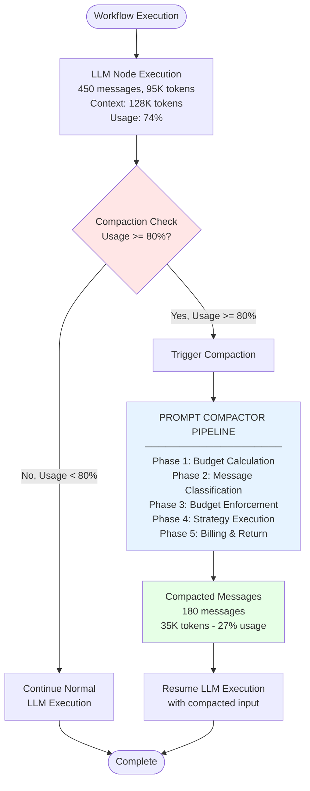

### Compaction Pipeline - Five Phase Process

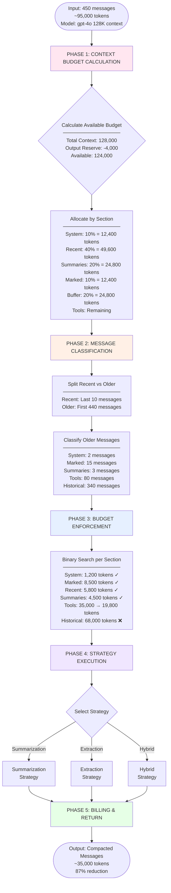

### Strategy Selection Decision Tree

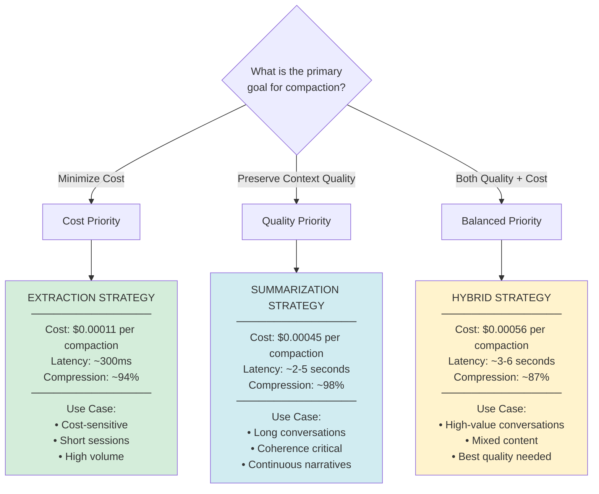

---

## Algorithm Deep Dive

### 1. Budget Allocation Algorithm

#### Budget Allocation Flow

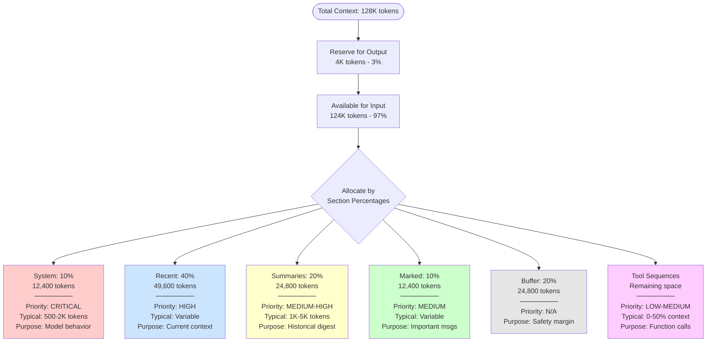

#### Dynamic Budget Reallocation (v2.0)

**v2.0 Implementation: Dynamic Allocation with Priority-Based Reallocation**

**Rationale:** Achieve maximum space efficiency by redistributing unused budget to sections that need it.

**Algorithm:**
```
1. Calculate actual token usage per section
2. Identify surplus (allocated > actual) and deficit (actual > allocated)
3. Redistribute surplus to deficit sections based on priority
4. Never reallocate from sacred buffer (20%)
5. Never reallocate to/from system prompts (static)
```

**Reallocation Priority Order:**
1. **Summaries** - Highest priority (stores compacted history)
2. **Recent Messages** - Second priority (current conversation)
3. **Marked Messages** - Third priority (user-important content)
4. **Tool Sequences** - Can receive surplus if needed

**Sacred Sections (Never Participate in Reallocation):**
- **Buffer** (20%) - Safety margin for token counting uncertainties
- **System Prompts** - Static, unchanging, only 1 per chat

**Example Reallocation:**
```
Section          Allocated    Actual    Surplus/Deficit
───────────────────────────────────────────────────────
System           12.4K        1.2K      +11.2K (donated)
Recent           49.6K        5.8K      +43.8K (donated)
Summaries        24.8K        4.5K      +20.3K (NEED MORE - will receive)
Marked           12.4K        8.5K      +3.9K  (donated)
Buffer           24.8K        24.8K     0      (SACRED - never touched)
Tools            Remaining    35K       -15.2K (needs surplus)

Total Surplus: 11.2K + 43.8K + 20.3K + 3.9K = 79.2K

Reallocation:
  - Summaries: 24.8K → 44.8K (+20K, can fit more summaries)
  - Tools: 19.8K → 35K (+15.2K, filled from surplus)
  - Remaining: 44K surplus → reallocated to recent/marked if needed
```

---

### 2. Binary Search Algorithm for Message Fitting

#### Problem Statement

**Given:**
- Ordered list of N messages: `[m1, m2, ..., mN]`
- Target token budget `T`
- Token counting function `count(messages) → tokens`

**Find:** Maximum k such that `count([m(N-k+1), ..., mN]) ≤ T`
(Keep the most recent k messages that fit within budget T)

#### Algorithm Comparison

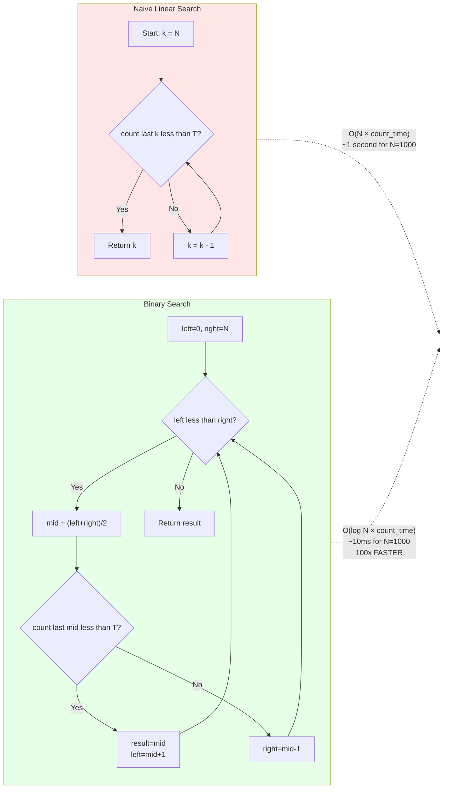

#### Binary Search Visualization

**Finding optimal message count for 20,000 token budget from 80 messages:**

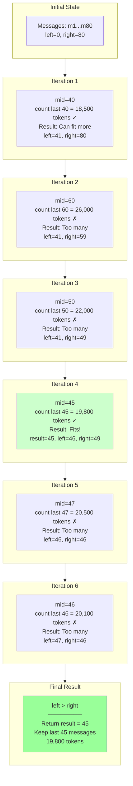

**Convergence Guarantee:**
- `result` always contains valid count where tokens ≤ target
- Never returns count exceeding budget
- Always finds optimal (maximum) fitting count
- Terminates when `left > right`
- Maximum iterations: `⌈log₂(N)⌉` (10 iterations for N=1000)

---

### 3. Message Classification Decision Tree

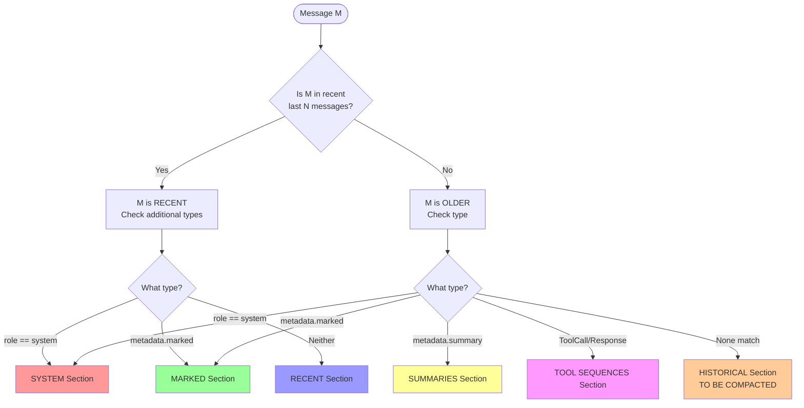

#### Priority-Based Section Hierarchy

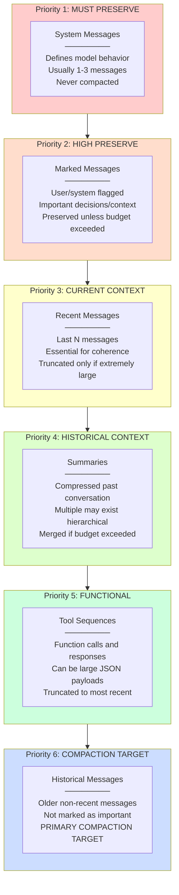

---

### 4. Compaction Strategy Workflows

#### Summarization Strategy - Hierarchical Mode

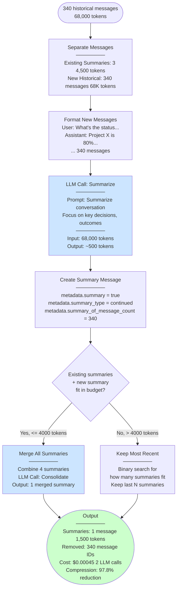

#### Summarization Strategy - From-Scratch Mode

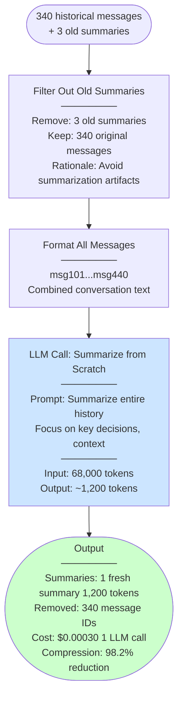

#### Comparison: Hierarchical vs From-Scratch

| Aspect | Hierarchical | From-Scratch |
|--------|--------------|--------------|
| **LLM Calls** | 2 (summarize + merge) | 1 (summarize) |
| **Cost** | ~$0.00045 | ~$0.00030 |
| **Context Quality** | Better (preserves) | Good (fresh) |
| **Artifacts** | Can accumulate | None (fresh start) |
| **Use Case** | Long conversations | Periodic refresh |

---

#### Extraction Strategy Workflow

```mermaid
flowchart TD
    Input([340 historical messages<br/>68,000 tokens<br/>────────<br/>Config: threshold=0.7, top_k=20])

    Input --> Dedup[Deduplication<br/>────────<br/>Check existing marked messages<br/>Build extracted ID set<br/>Build content hash set<br/>────────<br/>Original: 340 messages<br/>After dedup: 335 candidates]

    Dedup --> Embed[Generate Embeddings<br/>────────<br/>Historical: 335 messages → texts<br/>Recent: 10 messages → query text<br/>────────<br/>Call OpenAI Embeddings API<br/>Model: text-embedding-3-small<br/>Batch: 336 texts 1 request<br/>Cost: ~$0.00011]

    Embed --> Split[Split Embeddings<br/>────────<br/>historical_embeddings: 335 vectors<br/>query_embedding: 1 vector]

    Split --> Cosine["Compute Cosine Similarity<br/>────────<br/>For each historical message:<br/>similarity = dot(A,B) / (norm(A) × norm(B))<br/>────────<br/>Filter: similarity >= 0.7<br/>Result: 45 messages above threshold"]

    Cosine --> Rank[Rank and Select Top-K<br/>────────<br/>Sort by similarity descending<br/>────────<br/>Rank 1: msg_234 0.95<br/>Rank 2: msg_189 0.92<br/>...<br/>Rank 20: msg_412 0.72<br/>────────<br/>Select top 20 messages]

    Rank --> Mark[Mark Extracted Messages<br/>────────<br/>Add metadata:<br/>extracted = true<br/>relevance_score = 0.xx<br/>original_message_id<br/>extracted_at timestamp]

    Mark --> Weaviate{use_weaviate_<br/>storage?}

    Weaviate -->|Yes| Store[Store in Weaviate<br/>────────<br/>thread_id, node_id<br/>sequence_no, message_id<br/>embedding, content<br/>────────<br/>Benefits:<br/>• Reuse embeddings<br/>• Cross-session context<br/>• Faster future searches]

    Weaviate -->|No| Output
    Store --> Output

    Output([Output<br/>────────<br/>Extracted: 20 messages ~4,000 tokens<br/>Removed: 315 message IDs<br/>Cost: $0.00011 embeddings only<br/>Compression: 94.1% reduction<br/>────────<br/>Added to marked section<br/>Preserved in future compactions])

    style Embed fill:#ffe6cc
    style Cosine fill:#cce5ff
    style Store fill:#e6ccff
    style Output fill:#ccffcc
```

#### Cosine Similarity Calculation Example

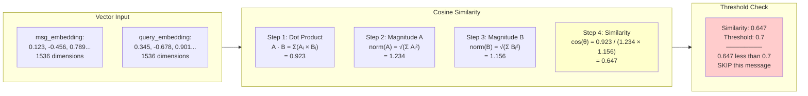

#### Similarity Threshold Impact

| Threshold | Precision | Recall | Typical Extraction | Use Case |
|-----------|-----------|--------|-------------------|----------|
| **0.9** (Very Strict) | High | Low | 2-5 messages | Avoid redundancy |
| **0.7** (Recommended) | Balanced | Balanced | 15-30 messages | General purpose |
| **0.5** (Relaxed) | Low | High | 40-80 messages | Max context retention |
| **0.3** (Very Relaxed) | Very Low | Very High | Almost all | Not recommended |

---

#### Hybrid Strategy Workflow

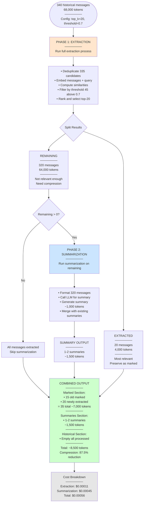

#### Hybrid Strategy Advantages

**Best of Both Worlds:**
- ✓ Preserves highly relevant messages (extraction)
- ✓ Compresses less relevant content (summarization)
- ✓ Better than pure summarization (keeps exact details)
- ✓ Better than pure extraction (compresses remainder)

**Trade-offs:**
- ✗ Most expensive strategy (~5x extraction cost)
- ✓ Highest quality output
- ✓ Best for high-value conversations

---

### 5. Hierarchical Summarization Theory

#### Information Preservation Over Time

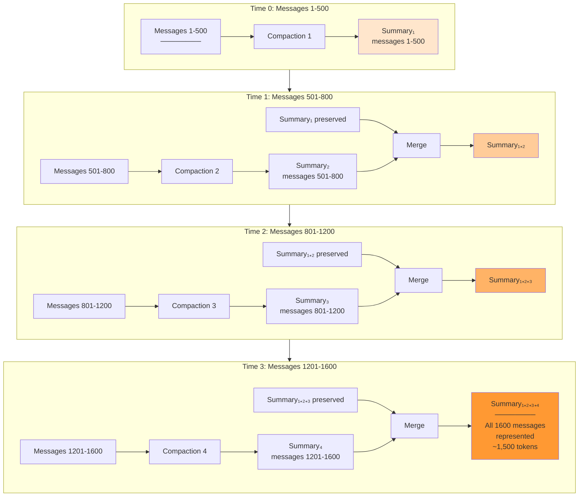

#### Summary Tree Structure

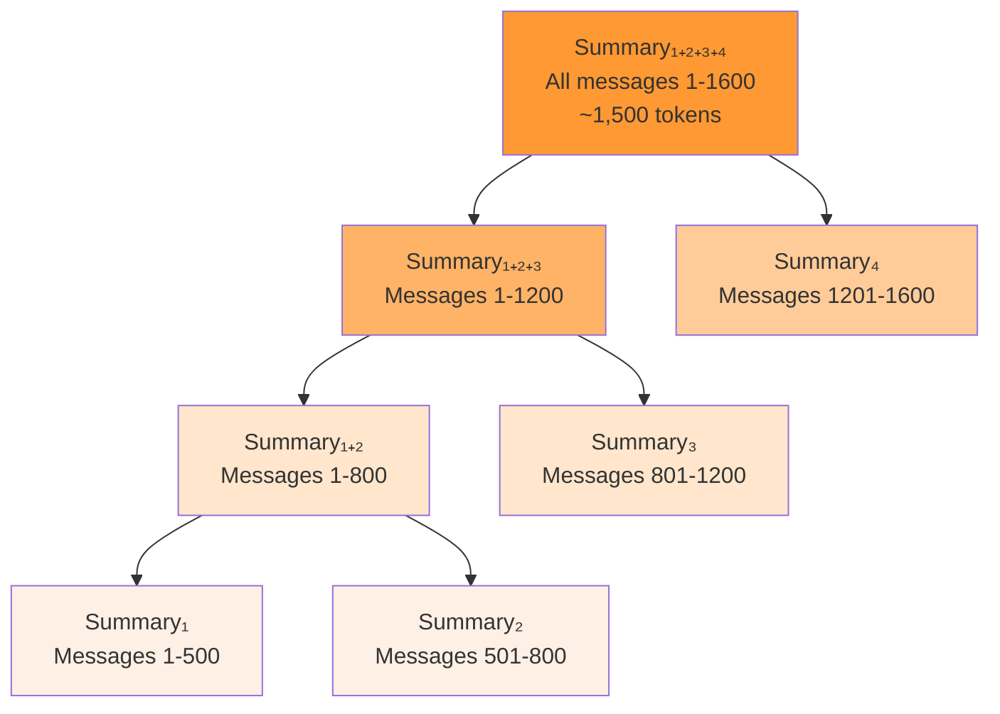

**Information Coverage:**
- All 1600 messages represented in tree
- Progressive compression with no catastrophic loss
- Final summary: ~1,500 tokens (99.9% compression from original)
- Each level preserves information from previous levels

#### Hierarchical vs From-Scratch Trade-off

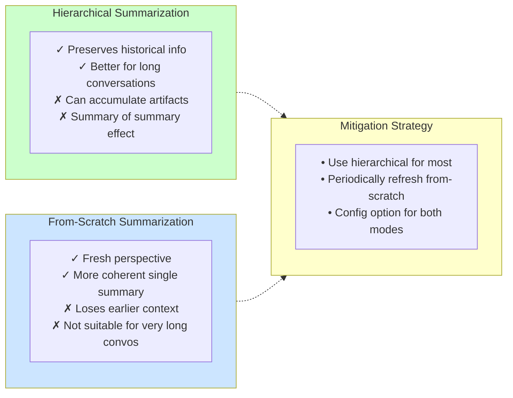

---

### 6. Complexity Analysis

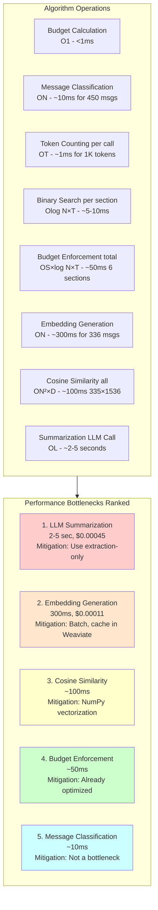

**Legend:**
- N = number of messages
- S = number of sections (6)
- T = token counting time
- D = embedding dimensions (1536)
- L = LLM generation time

**Total Compaction Time (Hybrid):** O(N²×D + L) ≈ 3-6 seconds

---

## Adaptive Compression System

### Overview

The adaptive compression system (v2.0) dynamically calculates compression ratios per compaction round to achieve predictable post-compaction context usage while minimizing LLM costs.

### Compression Modes

```mermaid
flowchart TD
    Start{Compression Mode<br/>Configuration}

    Start -->|adaptive default| Adaptive[ADAPTIVE MODE<br/>────────<br/>Calculate ratio per round<br/>Target: 50% post-compaction<br/>Auto-adjust based on context]

    Start -->|fixed_ratio| Fixed[FIXED RATIO MODE<br/>────────<br/>Use configured ratio<br/>Example: 1:10, 1:100<br/>Predictable compression]

    Start -->|auto_bandwidth| AutoBW[AUTO BANDWIDTH MODE<br/>────────<br/>Calculate from summary budget<br/>Max tokens = remaining × ratio<br/>Budget-constrained]

    Adaptive --> Compute[Compute Compression Ratio<br/>────────<br/>current_usage = 74%<br/>target_usage = 50%<br/>historical_tokens = 68K<br/>────────<br/>ratio = historical / (target - non_compactible)]

    Fixed --> Compute
    AutoBW --> Compute

    Compute --> Execute[Execute Compaction<br/>with calculated ratio]

    style Adaptive fill:#ccffcc
    style Fixed fill:#cce5ff
    style AutoBW fill:#ffffcc
```

### Adaptive Compression Algorithm

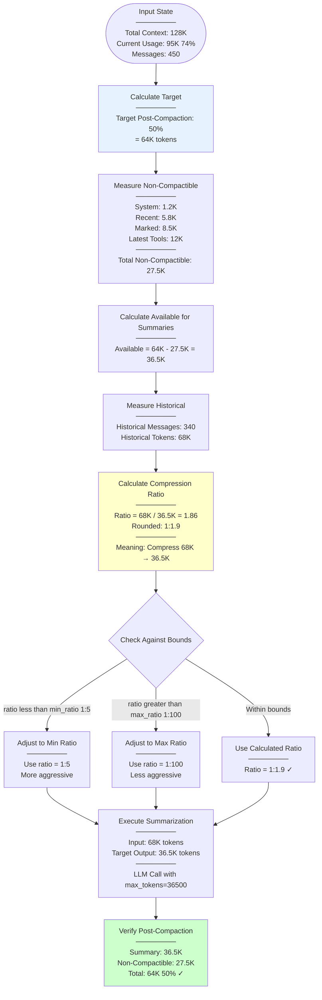

### Summary Budget Management

**Problem:** When summary budget is limited (20% of context), how much historical content can we summarize?

**Formula:**
```
max_summarizable_tokens = (summary_budget - existing_summaries) × compression_ratio

Example:
  Total Context: 128K
  Summary Budget: 20% = 25.6K
  Existing Summaries: 4.5K
  Compression Ratio: 1:10

  Max Summarizable = (25.6K - 4.5K) × 10 = 211K tokens

  If historical > 211K:
    → Must merge existing summaries + new summary in SINGLE LLM call
    → Avoid 2-call approach (expensive output tokens)
```

### Single-Call Merge Strategy

**Cost Comparison:**

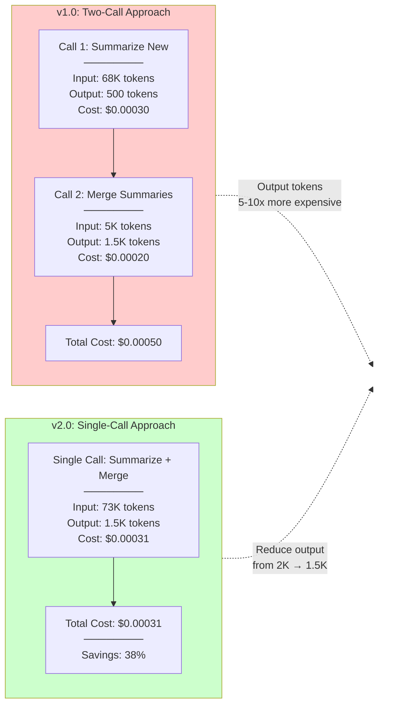

**Two-Phase Prompt (Conceptual):**

```
You are summarizing a conversation. Follow these steps:

PHASE 1: Summarize New Messages
Review these 340 new messages and identify:
- Key decisions made
- Important context established
- Critical outcomes
[... new messages ...]

PHASE 2: Merge with Existing Context
Here are existing summaries from earlier conversation:
[... existing 3 summaries ...]

Your task: Create a SINGLE consolidated summary that:
1. Integrates the new messages' key points
2. Preserves critical information from existing summaries
3. Maintains chronological coherence
4. Targets {target_tokens} tokens in length

Output only the merged summary (not separate summaries).
```

### Compression Ratio Bounds

```mermaid
flowchart TD
    Input([Historical Tokens:<br/>68,000])

    Input --> Calculate[Calculate Adaptive Ratio<br/>Based on target context]

    Calculate --> Ratio[Computed Ratio:<br/>1:1.86]

    Ratio --> Check{Check Bounds}

    Check -->|Less than 1:5| TooLow[TOO AGGRESSIVE<br/>────────<br/>Risk: Loss of information<br/>────────<br/>Clamp to min_ratio<br/>Use 1:5]

    Check -->|Greater than 1:100| TooHigh[TOO CONSERVATIVE<br/>────────<br/>Risk: Insufficient compression<br/>────────<br/>Clamp to max_ratio<br/>Use 1:100]

    Check -->|Between 1:5 and 1:100| Valid[VALID RANGE ✓<br/>────────<br/>Use computed ratio<br/>1:1.86]

    TooLow --> Output[Execute with ratio: 1:5<br/>68K → 13.6K tokens]
    TooHigh --> Output2[Execute with ratio: 1:100<br/>68K → 680 tokens]
    Valid --> Output3[Execute with ratio: 1:1.86<br/>68K → 36.5K tokens]

    style TooLow fill:#ffcccc
    style TooHigh fill:#ffcccc
    style Valid fill:#ccffcc
```

**Configurable Bounds:**
```python
class AdaptiveCompressionConfig(BaseModel):
    mode: Literal["adaptive", "fixed_ratio", "auto_bandwidth"] = "adaptive"

    # Fixed ratio mode
    fixed_compression_ratio: Optional[float] = None  # e.g., 10.0 for 1:10

    # Adaptive mode bounds
    min_compression_ratio: float = 5.0    # Never compress more than 1:5
    max_compression_ratio: float = 100.0  # Never compress less than 1:100

    # Target context post-compaction
    target_context_pct: float = 50.0  # Aim for 50% context usage

    # Auto bandwidth mode
    use_summary_bandwidth: bool = False  # Calculate from remaining summary budget
```

---

## Dynamic Budget Reallocation

### Reallocation Algorithm

```mermaid
flowchart TD
    Start([Budget Enforcement Complete<br/>────────<br/>Initial Allocation Done])

    Start --> Measure[Measure Actual Usage<br/>────────<br/>System: 1.2K / 12.4K<br/>Recent: 5.8K / 49.6K<br/>Summaries: 4.5K / 24.8K<br/>Marked: 8.5K / 12.4K<br/>Buffer: 24.8K / 24.8K SACRED<br/>Tools: 35K / 19.8K OVER]

    Measure --> Calculate[Calculate Surplus/Deficit<br/>────────<br/>Surplus:<br/>  System: +11.2K<br/>  Recent: +43.8K<br/>  Summaries: +20.3K<br/>  Marked: +3.9K<br/>Total Surplus: 79.2K<br/>────────<br/>Deficit:<br/>  Tools: -15.2K]

    Calculate --> Priority[Apply Priority Order<br/>────────<br/>1. Summaries highest<br/>2. Recent second<br/>3. Marked third<br/>4. Tools can receive<br/>────────<br/>Buffer: SACRED excluded<br/>System: Static excluded]

    Priority --> Allocate1[Allocate to Summaries<br/>────────<br/>Summaries need: unlimited can use more<br/>Available surplus: 79.2K<br/>────────<br/>Give: +20K to summaries<br/>New: 24.8K → 44.8K<br/>Remaining: 59.2K]

    Allocate1 --> Allocate2[Allocate to Tools<br/>────────<br/>Tools need: +15.2K<br/>Available: 59.2K<br/>────────<br/>Give: +15.2K to tools<br/>New: 19.8K → 35K<br/>Remaining: 44K]

    Allocate2 --> Allocate3[Allocate to Recent/Marked<br/>────────<br/>Recent could use more: +10K<br/>Marked could use more: +5K<br/>Available: 44K<br/>────────<br/>Give: +10K recent, +5K marked<br/>Remaining: 29K → reserve]

    Allocate3 --> Result[Reallocated Budgets<br/>────────<br/>System: 1.2K actual unchanged<br/>Recent: 5.8K → can expand to 59.6K<br/>Summaries: 4.5K → can expand to 44.8K<br/>Marked: 8.5K → can expand to 17.4K<br/>Buffer: 24.8K SACRED<br/>Tools: 35K filled]

    style Calculate fill:#ffffcc
    style Priority fill:#e6f3ff
    style Result fill:#ccffcc
```

### Sacred vs Reallocatable Sections

```mermaid
flowchart TD
    subgraph Sacred["SACRED SECTIONS Never Reallocated"]
        S1[Buffer 20%<br/>────────<br/>Safety margin<br/>Token counting uncertainties<br/>Never donated<br/>Never receives surplus]

        S2[System Prompts 10% allocated<br/>────────<br/>Static, unchanging<br/>Only 1 per chat<br/>Typically 1-2K actual<br/>Surplus donated but never receives]
    end

    subgraph Donors["DONOR SECTIONS Can Donate Surplus"]
        D1[Recent Messages<br/>────────<br/>Often under-utilized<br/>Can donate surplus<br/>Can receive if needed]

        D2[Marked Messages<br/>────────<br/>Variable usage<br/>Can donate surplus<br/>Can receive if needed]

        D3[Summaries<br/>────────<br/>May have surplus<br/>Can donate<br/>Highest priority to receive]
    end

    subgraph Receivers["RECEIVER SECTIONS Priority Order"]
        R1[1. Summaries HIGHEST<br/>────────<br/>Stores compacted history<br/>Benefits most from expansion]

        R2[2. Recent Messages<br/>────────<br/>Current conversation<br/>Second priority]

        R3[3. Marked Messages<br/>────────<br/>User-important content<br/>Third priority]

        R4[4. Tools<br/>────────<br/>Can receive if over budget<br/>Lowest priority]
    end

    Sacred -.->|Never participate| Note[Reallocation<br/>Process]
    Donors -.->|Donate surplus| Note
    Receivers -.->|Receive surplus| Note

    style Sacred fill:#ffcccc
    style Donors fill:#ffffcc
    style Receivers fill:#ccffcc
```

### Reallocation Example Walkthrough

**Initial State:**
```
Total Context: 128K tokens
Output Reserve: 4K tokens
Available: 124K tokens

Initial Allocation (percentages):
  System: 10% = 12.4K
  Recent: 40% = 49.6K
  Summaries: 20% = 24.8K
  Marked: 10% = 12.4K
  Buffer: 20% = 24.8K
  Tools: Remaining
```

**Actual Usage After Classification:**
```
System: 1.2K (11.2K under budget)
Recent: 5.8K (43.8K under budget)
Summaries: 4.5K (20.3K under budget - BUT needs to grow after compaction)
Marked: 8.5K (3.9K under budget)
Buffer: 24.8K (exactly on budget - SACRED)
Tools: 35K (15.2K OVER initial allocation of 19.8K)
```

**Reallocation Process:**

**Step 1:** Calculate total surplus
```
Surplus = 11.2K + 43.8K + 20.3K + 3.9K = 79.2K
Deficit = 15.2K (tools only)
```

**Step 2:** Apply priority order

*Priority 1: Summaries*
```
Summaries will grow after compaction (340 historical messages → summary)
Estimated summary output: ~36.5K tokens (from adaptive compression)
Current summaries: 4.5K
Total needed: 4.5K + 36.5K = 41K

Allocation: 24.8K → 44.8K (+20K from surplus)
Remaining surplus: 79.2K - 20K = 59.2K
```

*Priority 2-4: Tools, Recent, Marked*
```
Tools deficit: -15.2K
  Allocate: 19.8K → 35K (+15.2K from surplus)
  Remaining: 59.2K - 15.2K = 44K

Recent messages could expand (more conversation context):
  Allocate: 49.6K → 59.6K (+10K from surplus)
  Remaining: 44K - 10K = 34K

Marked messages could expand:
  Allocate: 12.4K → 17.4K (+5K from surplus)
  Remaining: 34K - 5K = 29K

Final surplus: 29K reserved for future needs
```

**Final Reallocated Budgets:**
```
System: 1.2K actual (12.4K allocated, surplus donated)
Recent: 5.8K actual (59.6K allocated after reallocation)
Summaries: 41K estimated (44.8K allocated after reallocation)
Marked: 8.5K actual (17.4K allocated after reallocation)
Buffer: 24.8K (SACRED, unchanged)
Tools: 35K actual (35K allocated after reallocation)

Total: ~126K ✓ (within 128K context)
```

### Implementation Pseudocode

```python
def reallocate_budget(self, sections: Dict, initial_budget: ContextBudget) -> ContextBudget:
    """
    Reallocate budget from under-utilized to over-utilized sections.
    """
    # Step 1: Measure actual usage
    actual_usage = {
        "system": count_tokens(sections["system"]),
        "recent": count_tokens(sections["recent"]),
        "summaries": count_tokens(sections["summaries"]),
        "marked": count_tokens(sections["marked"]),
        "tools": count_tokens(sections["tool_sequences"]),
    }

    # Buffer is sacred, never measured for reallocation
    # System prompts donate surplus but never receive

    # Step 2: Calculate surplus and deficit
    surplus = {}
    deficit = {}

    for section in ["system", "recent", "summaries", "marked"]:
        allocated = getattr(initial_budget, f"{section}_tokens")
        actual = actual_usage[section]
        diff = allocated - actual

        if diff > 0:
            surplus[section] = diff
        elif diff < 0:
            deficit[section] = abs(diff)

    # Tools special case (uses remaining space)
    if actual_usage["tools"] > initial_budget.tool_tokens:
        deficit["tools"] = actual_usage["tools"] - initial_budget.tool_tokens

    # Step 3: Total available surplus
    total_surplus = sum(surplus.values())

    if total_surplus == 0:
        return initial_budget  # No reallocation needed

    # Step 4: Allocate to deficit sections by priority
    reallocation_priority = ["summaries", "recent", "marked", "tools"]
    reallocated_budget = initial_budget.copy()
    remaining_surplus = total_surplus

    for section in reallocation_priority:
        if section in deficit and remaining_surplus > 0:
            # Calculate how much this section needs
            needed = deficit[section]

            # Give min(needed, remaining_surplus)
            allocated = min(needed, remaining_surplus)

            # Update budget
            current = getattr(reallocated_budget, f"{section}_tokens")
            setattr(reallocated_budget, f"{section}_tokens", current + allocated)

            remaining_surplus -= allocated

    # Step 5: If surplus remains, distribute to expandable sections
    if remaining_surplus > 0:
        # Give to sections that can benefit from more space
        for section in ["summaries", "recent", "marked"]:
            if remaining_surplus > 0:
                bonus = min(5000, remaining_surplus)  # Max 5K bonus per section
                current = getattr(reallocated_budget, f"{section}_tokens")
                setattr(reallocated_budget, f"{section}_tokens", current + bonus)
                remaining_surplus -= bonus

    return reallocated_budget
```

---

## Tool Compression Edge Cases

### Tool Sequence Classification

```mermaid
flowchart TD
    Start([All Messages in Conversation])

    Start --> Scan[Scan from End Backwards]

    Scan --> FindLast{Find Last Message}

    FindLast -->|ToolResponse| IncludeTR[Include in Latest<br/>Tool Sequence]
    FindLast -->|HumanMessage after ToolResponse| IncludeHuman[Include Human Message<br/>as part of Tool Sequence]
    FindLast -->|AIMessage or other| NotTool[Latest sequence<br/>does NOT include tools]

    IncludeTR --> ScanBack[Scan Backwards<br/>Find Contiguous Tools]
    IncludeHuman --> ScanBack

    ScanBack --> CheckPrev{Previous Message Type?}

    CheckPrev -->|ToolCall or ToolResponse| AddTool[Add to<br/>Latest Tool Sequence<br/>Continue scanning]
    CheckPrev -->|AIMessage that called tool| AddAI[Add AIMessage<br/>that initiated tools<br/>Continue scanning]
    CheckPrev -->|Other message type| StopScan[Stop Scanning<br/>Tool Sequence Complete]

    AddTool --> ScanBack
    AddAI --> ScanBack
    StopScan --> Latest[Latest Tool Sequence<br/>────────<br/>AIMessage tool_calls=X<br/>ToolCall×N<br/>ToolResponse×N<br/>Optional HumanMessage]

    NotTool --> NoTools[No Latest Tool Sequence<br/>────────<br/>All tools are old<br/>Can be compressed normally]

    Latest --> OtherTools[Other Tools Classification<br/>────────<br/>Any ToolCall/ToolResponse<br/>with AIMessage separator<br/>= OLD TOOLS<br/>Compress as historical]

    style Latest fill:#ccffcc
    style NoTools fill:#ffffcc
    style OtherTools fill:#e6f3ff
```

### Tool Compression Decision Tree

```mermaid
flowchart TD
    Start([Compaction Triggered])

    Start --> Round1[Round 1: Standard Compaction<br/>────────<br/>Compress historical messages<br/>Max out summary budget<br/>Max out marked budget]

    Round1 --> Measure[Measure Post-Compaction Usage]

    Measure --> Check1{Context Usage?}

    Check1 -->|Less than 50%| Success[Success ✓<br/>────────<br/>Target achieved<br/>Return compacted messages]

    Check1 -->|50-80%| CheckTools{Latest Tools<br/>greater than 30%<br/>of context?}

    Check1 -->|Greater than 80%| Emergency[EMERGENCY CASE<br/>────────<br/>Context too high<br/>Check tool compression]

    CheckTools -->|Yes, tools greater than 30%| Acceptable[Acceptable Exception<br/>────────<br/>Latest tools are large<br/>Allow up to 80% usage<br/>Return compacted messages]

    CheckTools -->|No, tools less than 30%| Continue[Continue compaction<br/>────────<br/>More aggressive<br/>historical compression]

    Emergency --> CanCompress{Can compress<br/>other sections<br/>further?}

    CanCompress -->|Yes| AggressiveComp[Aggressive Compression<br/>────────<br/>Merge all summaries<br/>Truncate oldest summaries<br/>Reduce marked messages]

    CanCompress -->|No, all maxed| CheckSacred{Context - Total<br/>less than<br/>Sacred Buffer<br/>20%?}

    CheckSacred -->|No, buffer safe| Fail[Cannot compress further<br/>────────<br/>Return best effort<br/>Log warning]

    CheckSacred -->|Yes, violates buffer| Round2[Round 2: Tool Compression<br/>────────<br/>LAST RESORT<br/>Compress latest tool sequence]

    Round2 --> CompressTools[Compress Tool Sequence<br/>────────<br/>AIMessage + ToolCalls + ToolResponses<br/>→ Single Tool Summary Message<br/>────────<br/>Target: 50% of context max]

    CompressTools --> Verify[Verify Final Usage]

    Verify --> Final{Final Usage?}

    Final -->|Less than 80%| FinalSuccess[Success ✓<br/>────────<br/>Tool compression worked<br/>Return compacted messages]

    Final -->|Greater than 80%| LastResort[Last Resort Truncation<br/>────────<br/>Truncate oldest summaries<br/>Truncate tool summary<br/>Keep only:<br/>- System prompts<br/>- Buffer<br/>- Latest 1-2 messages]

    style Success fill:#ccffcc
    style Acceptable fill:#ffffcc
    style FinalSuccess fill:#ccffcc
    style LastResort fill:#ffcccc
```

### Two-Round Compaction Example

**Scenario:** Latest tool calls are massive, preventing 50% target

**Initial State:**
```
Total Context: 128K
Current Messages: 500 messages, 110K tokens (86% usage)

Message Breakdown:
  System: 1K
  Recent (last 10): 6K
  Historical (340 messages): 68K
  Latest Tool Sequence (50 messages): 35K
    - AIMessage with tool_calls
    - 12× ToolCall messages
    - 12× ToolResponse messages (large JSON payloads)
    - 1× HumanMessage after tools

Target Post-Compaction: 64K (50%)
```

**Round 1: Standard Compaction**

```
Step 1: Classify messages
  System: 1K
  Recent: 6K
  Historical: 68K → TO COMPACT
  Latest Tools: 35K → PRESERVE (needed for LLM response)
  Marked: 8K

Step 2: Dynamic reallocation
  Summaries budget: 24.8K → 40K (reallocated)

Step 3: Compress historical with adaptive ratio
  Historical: 68K → Summary: 38K (1:1.8 ratio)

Step 4: Measure result
  System: 1K
  Recent: 6K
  Summaries: 38K (newly created)
  Latest Tools: 35K
  Marked: 8K
  Buffer: 24.8K
  ────────
  Total: 112.8K (88% usage) ❌ STILL TOO HIGH

  Latest tools = 35K / 128K = 27% of context
  Non-compactible = 1K + 6K + 35K + 8K = 50K
  With summaries = 50K + 38K = 88K
```

**Check Conditions:**
```
✗ Usage > 80% (88% > 80%)
✗ Latest tools < 30% (27% < 30%) → Cannot use tool exception
✓ All other sections maxed out (summaries at 38K, marked at 8K)
✓ Context - Total < Buffer? → 128K - 112.8K = 15.2K < 24.8K sacred buffer

Decision: MUST compress tool sequence (Round 2)
```

**Round 2: Tool Compression**

```
Step 1: Extract latest tool sequence
  Messages:
    - AIMessage(tool_calls=[...12 calls...])
    - ToolCall("search_documents", args={...})
    - ToolResponse(output="{...large JSON...}")
    - ... 11 more tool pairs ...
    - HumanMessage("Please analyze the results")

  Total: 35K tokens

Step 2: Compress tool sequence
  Prompt:
    "Summarize these tool calls and responses:
     - 12 document searches performed
     - Key findings: [extract from responses]
     - User requested analysis of results

     Target length: 15K tokens"

  LLM Call:
    Input: 35K tokens (tool sequence)
    Output: 12K tokens (tool summary)

  Result: ToolSummaryMessage
    content: "The system performed 12 document searches...
              Key findings include... User requested analysis..."
    metadata:
      tool_summary: true
      original_tool_count: 50
      compressed_from: msg_450
      compressed_to: msg_500

Step 3: Replace tools with summary
  System: 1K
  Recent: 6K
  Summaries: 38K
  Tool Summary: 12K (was 35K)
  Marked: 8K
  Buffer: 24.8K
  ────────
  Total: 89.8K (70% usage) ✓ SUCCESS

Step 4: Verify
  ✓ Usage < 80% (70% < 80%)
  ✓ Within buffer constraints
  ✓ All critical information preserved in summaries
```

**Final Result:**
```
Compaction Rounds: 2
Final Usage: 70% (from 86%)
Reduction: 20.2K tokens saved (18% reduction)
Cost:
  - Round 1 Summarization: $0.00031
  - Round 2 Tool Compression: $0.00018
  - Total: $0.00049
```

### Tool Compression Prompt Template

```python
def compress_tool_sequence(
    self,
    tool_sequence: List[BaseMessage],
    target_tokens: int,
    model_metadata: ModelMetadata,
) -> ToolSummaryMessage:
    """
    Compress a contiguous tool call/response sequence into a summary.

    Args:
        tool_sequence: List of AIMessage, ToolCall, ToolResponse, optional HumanMessage
        target_tokens: Target summary length
        model_metadata: LLM to use for compression

    Returns:
        ToolSummaryMessage with compressed content
    """

    # Extract components
    ai_messages = [m for m in tool_sequence if isinstance(m, AIMessage)]
    tool_calls = [m for m in tool_sequence if isinstance(m, ToolCallMessage)]
    tool_responses = [m for m in tool_sequence if isinstance(m, ToolResponseMessage)]
    human_messages = [m for m in tool_sequence if isinstance(m, HumanMessage)]

    # Build prompt
    prompt = f"""You are compressing a tool execution sequence from a conversation.

CONTEXT:
This is a sequence of {len(tool_calls)} tool calls and their responses that occurred in a conversation.
The LLM needs to understand what tools were called and what results were obtained to continue the conversation.

TOOL CALLS MADE:
{self._format_tool_calls(tool_calls)}

TOOL RESPONSES RECEIVED:
{self._format_tool_responses(tool_responses)}

{f"USER FOLLOW-UP: {human_messages[0].content}" if human_messages else ""}

YOUR TASK:
Create a comprehensive summary that preserves:

1. WHAT tools were called and WHY (intent/purpose)
2. KEY RESULTS from each tool response (important data, not full JSON)
3. Any ERRORS or NOTABLE OBSERVATIONS
4. The SEQUENCE/ORDER of tool execution if relevant
5. User's follow-up question/request if present

CRITICAL: The LLM will use this summary to generate its next response. Include enough detail
that the LLM can answer the user's question without access to the original tool outputs.

TARGET LENGTH: Approximately {target_tokens} tokens

OUTPUT FORMAT:
Write a flowing narrative summary (not a list). Be concise but preserve critical information.
"""

    # Call LLM
    result = await self.llm_utils.call_llm_for_compaction(
        prompt=prompt,
        model_metadata=model_metadata,
        ext_context=self.ext_context,
        max_tokens=target_tokens,
        temperature=0.0,
    )

    # Create summary message
    return ToolSummaryMessage(
        content=result["content"],
        metadata={
            "tool_summary": true,
            "original_tool_count": len(tool_sequence),
            "tool_types": list(set(tc.name for tc in tool_calls)),
            "compressed_from": tool_sequence[0].id,
            "compressed_to": tool_sequence[-1].id,
            "compression_cost": result["cost"],
            "compressed_at": datetime.utcnow().isoformat(),
        }
    )
```

### Old Tools vs Latest Tools

**Classification Rules:**

```mermaid
flowchart TD
    Start([All ToolCall/ToolResponse<br/>Messages in Conversation])

    Start --> Identify[Identify Latest<br/>Contiguous Tool Sequence<br/>from end of messages]

    Identify --> Latest[Latest Tool Sequence<br/>────────<br/>Contiguous tools<br/>ending with ToolResponse<br/>or HumanMessage after ToolResponse]

    Identify --> Check[Check Remaining Tools]

    Check --> HasAI{Has AIMessage<br/>separator between<br/>this and latest?}

    HasAI -->|Yes| OldTool[OLD TOOL<br/>────────<br/>Separated by AIMessage<br/>Not part of latest sequence<br/>────────<br/>Classification: HISTORICAL<br/>Can compress like<br/>regular messages]

    HasAI -->|No, contiguous| PartOfLatest[Part of Latest Sequence<br/>────────<br/>Add to latest tool sequence]

    Latest --> Preserve[LATEST TOOLS<br/>────────<br/>Preserved by default<br/>Only compressed if:<br/>1. Context - Total less than 20% buffer<br/>2. All other sections maxed<br/>3. Round 2 compression needed]

    OldTool --> Compress[Compress as Historical<br/>────────<br/>Include in regular<br/>historical message<br/>compaction in Round 1]

    style Latest fill:#ccffcc
    style OldTool fill:#ffffcc
    style Preserve fill:#ccffcc
    style Compress fill:#e6f3ff
```

**Example:**

```
Message Sequence:
  1-100: Regular conversation
  101: AIMessage(content="Let me search for X", tool_calls=[search])
  102: ToolCall(search)
  103: ToolResponse(search results)
  104: AIMessage(content="Based on results, let me search Y", tool_calls=[search])  ← SEPARATOR
  105: ToolCall(search)
  106: ToolResponse(search results)
  107: AIMessage(content="Now let me analyze", tool_calls=[analyze])
  108: ToolCall(analyze)
  109: ToolResponse(analysis results)
  110: HumanMessage("Great, what about Z?")  ← Included in latest

Classification:
  Messages 101-103: OLD TOOLS (separated by AIMessage 104)
    → Compress as historical in Round 1

  Messages 105-110: LATEST TOOL SEQUENCE
    → Preserve until Round 2 (if needed)
    → Contiguous from 105 to 110
    → Ends with HumanMessage after ToolResponse
```

---

## Edge Case Catalog

### Comprehensive Edge Case Handling

This section documents all edge cases encountered in prompt compaction and their solutions, ensuring **infinite thread support** without failure.

### Edge Case 1: Tool Sequence Exceeds 80% After Compaction

**Scenario:**
```
Post Round 1 Compaction:
  System: 1K
  Recent: 6K
  Summaries: 38K (all historical compressed)
  Latest Tools: 105K (82% of 128K context)
  Total: 150K → OVERFLOW (117%)
```

**Solution:**
```
Step 1: Check if tools > 30% of context
  ✓ 105K / 128K = 82% > 30%

Step 2: Check if context - total < sacred buffer (20%)
  ✓ 128K - 150K = -22K < 25.6K (20% buffer)

Step 3: Trigger Round 2 Tool Compression
  Compress 105K tools → 40K tool summary (1:2.6 ratio)

Step 4: Verify
  System: 1K
  Recent: 6K
  Summaries: 38K
  Tool Summary: 40K
  Total: 85K (66% usage) ✓
```

**Never Fail:** If tool summary still exceeds 80%, truncate tool summary aggressively (keep only most recent tool results).

### Edge Case 2: All Sections At Maximum, Cannot Fit Within Budget

**Scenario:**
```
After aggressive compaction:
  System: 1K (minimum)
  Recent: 6K (last 10 messages, cannot reduce)
  Summaries: 60K (budget maxed at 24.8K → reallocated to 60K)
  Marked: 15K (user-important, budget maxed)
  Latest Tools: 30K (needed for response)
  Buffer: 25.6K (sacred)
  Total: 137.6K > 128K → STILL OVERFLOW
```

**Solution Hierarchy:**
```
Priority 1: Truncate oldest summaries
  - Keep only most recent 1-2 summaries
  - Summaries: 60K → 20K (truncate first 3 summaries)
  - New Total: 97.6K ✓

If still over:
  Priority 2: Truncate tool summaries (if any)
  - Keep only most recent tool summary

If still over:
  Priority 3: Truncate marked messages (LRU eviction)
  - Keep most recently marked
  - Marked: 15K → 8K

If still over:
  Priority 4: Truncate recent messages
  - Keep last 5 instead of last 10
  - Recent: 6K → 3K

If still over:
  Priority 5: Compress latest tools (Round 2)

Never touch:
  - System prompts (critical for behavior)
  - Buffer (sacred 20%)
  - Latest 1-2 messages (need for coherence)
```

**Never Fail:** Always produce valid result, even if losing old context.

### Edge Case 3: Summary Budget Fully Consumed

**Scenario:**
```
Summary Budget: 20% = 25.6K
Existing Summaries: 4 summaries totaling 25K
New Historical to Compress: 340 messages, 68K tokens

Summary Budget Full: 25K / 25.6K = 98% utilized
Cannot add new summary without exceeding budget
```

**Solution:**
```
Calculate max summarizable with compression ratio:
  Remaining: 25.6K - 25K = 0.6K
  Compression Ratio: 1:10 (adaptive)
  Max Summarizable: 0.6K × 10 = 6K tokens

  Historical: 68K > 6K → MUST MERGE

Step 1: Merge all summaries + new content in SINGLE LLM call
  Input:
    - 4 existing summaries (25K tokens)
    - 340 new historical messages (68K tokens)
    - Total input: 93K tokens

  Prompt: "Summarize and merge into single consolidated summary"
  Target Output: 22K tokens (within 25.6K budget)

  Result: 1 merged summary (22K tokens)

Step 2: Verify
  Summaries: 22K / 25.6K = 86% ✓
  Room for future compaction: 3.6K
```

**Cost Optimization:** Single LLM call instead of 2 saves 30% cost (reduced output tokens).

### Edge Case 4: Marked Messages Exceed Their Budget

**Scenario:**
```
Marked Budget: 10% = 12.4K
User marks 50 messages as important
Total marked tokens: 45K

Marked messages: 45K > 12.4K budget
```

**Solution with Dynamic Reallocation:**
```
Step 1: Check for surplus budget
  System surplus: +11K
  Recent surplus: +40K
  Total available: 51K

Step 2: Reallocate to marked (priority #3)
  Marked: 12.4K → 30K (after reallocation)

Step 3: Fit marked messages within reallocated budget
  Binary search: Keep most recent 30 marked messages
  Total: 28K tokens

  Remaining 20 marked messages: 17K tokens
  → Move to historical section for compaction

Step 4: If still over budget after reallocation
  LRU eviction: Keep most recently marked
  Older marked messages → compressed as historical
```

**Never Fail:** Gracefully degrade by compressing oldest marked messages.

### Edge Case 5: Single Message Exceeds Section Budget

**Scenario:**
```
Marked Budget: 12.4K
User marks single message: 18K tokens (very large)
Single message exceeds entire budget
```

**Solution:**
```
Option A: Extract most important content
  - Use extraction strategy on single message
  - Extract top-K salient points
  - Create extracted message: ~3K tokens

Option B: Summarize single message
  - Compress large message with LLM
  - "Summarize this message preserving key points"
  - Output: ~3K tokens

Option C: Keep as-is and reallocate
  - Reallocate surplus budget to marked section
  - Marked: 12.4K → 25K (after reallocation)
  - Fits single 18K message

Decision: Try Option C first (reallocation), fallback to Option B (summarization)
```

**Never Fail:** Always compress large single messages if cannot fit otherwise.

### Edge Case 6: Rapid Compaction Cycles (Infinite Loop Prevention)

**Scenario:**
```
Context grows very fast (1000 messages added in 1 minute)
Compaction triggers every 10 messages
Risk: Infinite compaction loop, high cost
```

**Solution:**
```
Cooldown Mechanism:
  - Track messages_since_last_compaction
  - Minimum cooldown: 5 messages (configurable)
  - Even if threshold exceeded, wait for cooldown

Adaptive Compression Aggressiveness:
  - If compaction_frequency > threshold:
    - Increase compression ratio (more aggressive)
    - Lower trigger threshold (compact earlier)

  Example:
    Normal: trigger at 80%, compress 1:10
    High frequency: trigger at 70%, compress 1:20
    Very high: trigger at 60%, compress 1:50

Rate Limiting:
  - Max compactions per minute: 10
  - If exceeded, queue compaction for later
  - Log warning for investigation
```

**Never Fail:** Prevent runaway compaction with cooldowns and rate limits.

### Edge Case 7: No Historical Messages to Compress

**Scenario:**
```
Thread just started: 20 messages total
Recent message count: 10
Historical: 10 messages (not enough for meaningful compaction)
Context usage: 82% (triggering compaction)

Problem: Not enough history to compress effectively
```

**Solution:**
```
Check Historical Percentage:
  historical_pct = (total_messages - recent_messages) / total_messages
  historical_pct = (20 - 10) / 20 = 50%

  Threshold: Require at least 50% historical for compaction

  Decision:
    If historical_pct < 50%:
      - Skip compaction
      - Use buffer to handle temporary overflow
      - Wait for more history to accumulate

    If context > 90% (emergency):
      - Reduce recent_message_count: 10 → 5
      - This moves more messages to historical
      - Retry compaction

Alternative: Dynamic Recent Count
  - Normally keep last 10 messages as recent
  - If low history, reduce to last 5 messages
  - Creates more historical messages for compaction
```

**Never Fail:** Adjust recent message count dynamically or skip compaction until sufficient history.

### Edge Case 8: Embedding Service Unavailable (Extraction Strategy)

**Scenario:**
```
Strategy: Extraction or Hybrid
Compaction triggered
Embedding call fails: Weaviate down or API error
```

**Solution:**
```
Fallback Chain:
  1. Retry embedding call (up to 3 times with exponential backoff)
     - Retry 1: after 1s
     - Retry 2: after 2s
     - Retry 3: after 4s

  2. If all retries fail:
     - Fallback to Summarization strategy
     - Log warning: "Extraction unavailable, using summarization"
     - Continue with LLM-based compression

  3. If summarization also fails:
     - Fallback to simple truncation
     - Keep most recent messages within budget
     - Log error for investigation

State Tracking:
  - Track embedding_service_failures
  - If failure_count > 5:
    - Automatically switch to summarization strategy
    - Retry embeddings on next compaction round
```

**Never Fail:** Always have fallback strategies, never block workflow execution.

### Edge Case 9: LLM Call Fails During Compaction

**Scenario:**
```
Summarization strategy executing
LLM API call fails: timeout, rate limit, or service error
Compaction cannot complete
```

**Solution:**
```
Retry with Exponential Backoff:
  Attempt 1: immediate
  Attempt 2: after 2s (if rate limit or timeout)
  Attempt 3: after 5s (if rate limit or timeout)
  Attempt 4: after 10s (if rate limit or timeout)

Fallback Strategies:
  1. If LLM still failing after 3 retries:
     - Try alternative strategy:
       - If summarization failed → try extraction
       - If extraction failed → try simple truncation

  2. Simple Truncation (last resort):
     - Binary search to fit messages within budget
     - Keep most recent messages
     - Discard oldest messages
     - No compression, just truncation

  3. If workflow cannot proceed without LLM:
     - Return original messages (no compaction)
     - Log error: "Compaction failed, continuing without compression"
     - Workflow continues (may hit context limit on LLM call)

Circuit Breaker Pattern:
  - If LLM_failures > 10 in last hour:
    - Disable compaction temporarily (30 minutes)
    - Auto-re-enable after cooldown
    - Prevent cascading failures
```

**Never Fail:** Multiple fallback strategies ensure workflow always proceeds.

### Edge Case 10: Budget Reallocation Creates Circular Dependencies

**Scenario:**
```
Complex reallocation scenario:
  - Summaries need surplus from Recent
  - Recent needs surplus from Marked
  - Marked needs surplus from Summaries

Risk: Circular dependency, infinite loop
```

**Solution:**
```
Single-Pass Reallocation (No Circularity):
  Algorithm:
    1. Calculate all surpluses ONCE (based on initial allocation)
    2. Calculate all deficits ONCE
    3. Apply fixed priority order ONCE
    4. No re-calculation, no circular dependencies

  Priority Order (fixed):
    1. Summaries (highest priority to receive)
    2. Recent
    3. Marked
    4. Tools

  Example:
    Initial:
      Summaries: 24.8K allocated, 40K needed → deficit 15.2K
      Recent: 49.6K allocated, 10K actual → surplus 39.6K
      Marked: 12.4K allocated, 15K needed → deficit 2.6K

    Reallocation (single pass):
      Step 1: Summaries receive first (priority 1)
        Give 15.2K from recent surplus
        Summaries: 24.8K → 40K ✓
        Recent surplus remaining: 39.6K - 15.2K = 24.4K

      Step 2: Marked receive second (priority 3)
        Give 2.6K from recent surplus
        Marked: 12.4K → 15K ✓
        Recent surplus remaining: 24.4K - 2.6K = 21.8K

      Step 3: Recent keeps remaining surplus
        Recent: 49.6K → 71.4K (for future growth)

    NO circular dependency - single pass, fixed priority
```

**Never Fail:** Algorithm guarantees termination in single pass.

### Edge Case Summary Table

| Edge Case | Detection | Solution | Fallback |
|-----------|-----------|----------|----------|
| **1. Tools > 80%** | Post-compaction usage > 80%, tools > 30% | Round 2 tool compression | Truncate tool summary |
| **2. All maxed out** | Cannot fit within budget after max allocation | Hierarchical truncation (summaries → tools → marked → recent) | Keep only system + buffer + last 2 msgs |
| **3. Summary budget full** | Existing summaries ≥ summary budget | Single-call merge of all summaries + new | Truncate oldest summaries |
| **4. Marked exceeds budget** | Marked messages > allocated + reallocated | LRU eviction, keep most recent | Compress oldest marked |
| **5. Single large message** | One message > section budget | Reallocation → Summarization → Extraction | Truncate large message |
| **6. Rapid compaction cycles** | Compaction frequency > threshold | Cooldown (min 5 msgs), rate limiting | Increase compression aggressiveness |
| **7. No historical** | Historical < 50% of messages | Skip compaction, use buffer | Reduce recent count to create history |
| **8. Embeddings fail** | API error during extraction | Retry 3x → Fallback to summarization → Truncation | Simple truncation |
| **9. LLM fails** | API error during summarization | Retry 3x → Fallback to extraction → Truncation | Return original (no compaction) |
| **10. Circular dependencies** | Complex reallocation needs | Single-pass fixed priority algorithm | No circularity possible |

### Infinite Thread Support Guarantees

**Core Principle:** Compaction must NEVER fail, even with unlimited thread length.

**Guarantees:**

1. **Always Produce Valid Result**
   - Even if quality is degraded
   - Even if old context is lost
   - Workflow execution never blocked

2. **Graceful Degradation**
   - Truncate oldest summaries before recent messages
   - Preserve system prompts + buffer + latest messages
   - Lose distant history rather than fail

3. **Multiple Fallback Layers**
   - Primary strategy fails → fallback strategy
   - All strategies fail → simple truncation
   - Truncation ensures fit within context

4. **Sacred Content Never Lost**
   - System prompts: Always preserved (defines LLM behavior)
   - Buffer: Always preserved (20% safety margin)
   - Latest 1-2 messages: Always preserved (coherence)

5. **Cost-Aware**
   - Single-call merge saves 30% cost
   - Adaptive compression prevents over-compression
   - Circuit breakers prevent runaway costs

---

## Architecture

### System Architecture Overview

```mermaid
flowchart TB
    subgraph Workflow["Workflow Execution Layer"]
        WF[LangGraph Workflow]
        LLM[LLM Node]
    end

    subgraph Compaction["Prompt Compaction System"]
        PC[PromptCompactor<br/>Main Orchestrator]

        subgraph Context["Context Management"]
            CM[ContextBudget<br/>Budget Calculator]
            MC[MessageClassifier<br/>Classify Messages]
            BE[BudgetEnforcer<br/>Binary Search Enforcement]
        end

        subgraph Strategies["Compaction Strategies"]
            S1[SummarizationStrategy]
            S2[ExtractionStrategy]
            S3[HybridStrategy]
        end

        subgraph Utils["Utilities"]
            TU[TokenUtils<br/>tiktoken counting]
            LU[LLMUtils<br/>Non-streaming calls]
            U[Utils<br/>Message formatting]
        end
    end

    subgraph Integration["Integration Layer"]
        Billing[Billing Service]
        Weaviate[Weaviate Client<br/>Optional]
    end

    WF --> LLM
    LLM -->|Messages exceed<br/>threshold| PC

    PC --> CM
    PC --> MC
    PC --> BE
    PC --> S1
    PC --> S2
    PC --> S3

    S1 --> LU
    S2 --> LU
    S3 --> LU

    S1 --> TU
    S2 --> TU
    S3 --> TU

    S1 --> U
    S2 --> U
    S3 --> U

    S2 -.->|Optional| Weaviate
    S3 -.->|Optional| Weaviate

    PC --> Billing

    PC -->|Compacted<br/>Messages| LLM

    style PC fill:#cce5ff
    style Context fill:#e6f3ff
    style Strategies fill:#ffe6cc
    style Utils fill:#ccffcc
```

---

## Data Structures

### Configuration Schema

```mermaid
classDiagram
    class PromptCompactionConfig {
        +bool enabled
        +CompactionStrategyType strategy
        +float trigger_threshold_pct
        +SummarizationMode summarization_mode
        +float similarity_threshold
        +int top_k
        +str embedding_model
        +bool use_weaviate_storage
        +int recent_message_count
        +ContextBudgetConfig context_budget
        +AdaptiveCompressionConfig compression v2.0
        +DynamicReallocationConfig reallocation v2.0
        +ToolCompressionConfig tool_compression v2.0
    }

    class AdaptiveCompressionConfig {
        +str mode adaptive/fixed/auto
        +Optional[float] fixed_compression_ratio
        +float min_compression_ratio 5.0
        +float max_compression_ratio 100.0
        +float target_context_pct 50.0
        +bool use_summary_bandwidth
    }

    class DynamicReallocationConfig {
        +bool enabled true
        +List[str] reallocation_priority
        +float min_sacred_buffer_pct 20.0
        +bool system_prompts_excluded true
    }

    class ToolCompressionConfig {
        +bool enabled true
        +float tool_exception_threshold_pct 30.0
        +float max_context_with_tools_pct 80.0
        +bool include_user_msg_after_tool true
        +int min_cooldown_messages 5
    }

    class CompactionStrategyType {
        <<enumeration>>
        SUMMARIZATION
        EXTRACTION
        HYBRID
    }

    class SummarizationMode {
        <<enumeration>>
        CONTINUED
        FROM_SCRATCH
    }

    class ContextBudgetConfig {
        +float system_pct
        +float recent_pct
        +float summary_pct
        +float marked_pct
        +float buffer_pct
    }

    class ContextBudget {
        +int total_context
        +int max_output_tokens
        +int available_tokens
        +int system_tokens
        +int recent_tokens
        +int summary_tokens
        +int marked_tokens
        +int buffer_tokens
        +int tool_tokens
    }

    class CompactionResult {
        +List~BaseMessage~ compacted_messages
        +Dict sections
        +float cost
        +Dict metadata
        +int compaction_rounds v2.0
        +float target_context_achieved v2.0
    }

    PromptCompactionConfig --> CompactionStrategyType
    PromptCompactionConfig --> SummarizationMode
    PromptCompactionConfig --> ContextBudgetConfig
    PromptCompactionConfig --> AdaptiveCompressionConfig
    PromptCompactionConfig --> DynamicReallocationConfig
    PromptCompactionConfig --> ToolCompressionConfig
    ContextBudgetConfig --> ContextBudget
    CompactionResult ..> BaseMessage
```

### Message Metadata Structure

```mermaid
graph TD
    subgraph Summary["Summary Message Metadata"]
        SM[AIMessage<br/>────────<br/>metadata.summary = true<br/>metadata.summary_type = continued/from_scratch/hierarchical_merge<br/>metadata.summary_of_message_count = 340<br/>metadata.created_at = 2025-01-15T10:30:00Z]
    end

    subgraph Extracted["Extracted Message Metadata"]
        EM[BaseMessage<br/>────────<br/>metadata.extracted = true<br/>metadata.relevance_score = 0.85<br/>metadata.original_message_id = msg_123<br/>metadata.extracted_at = 2025-01-15T10:30:00Z<br/>metadata.embedding = optional]
    end

    subgraph Marked["Marked Message Metadata"]
        MM[BaseMessage<br/>────────<br/>metadata.marked = true<br/>metadata.marked_reason = user_flagged/system_important]
    end

    style SM fill:#ffffcc
    style EM fill:#ccffcc
    style MM fill:#ffcccc
```

---

## Integration Points

### LLM Node Integration Flow

```mermaid
sequenceDiagram
    participant W as Workflow
    participant L as LLM Node
    participant P as PromptCompactor
    participant S as Strategy
    participant B as Billing

    W->>L: Execute LLM node
    L->>L: _prepare_messages()
    L->>L: Check compaction config.enabled

    alt Compaction Enabled
        L->>L: Init compactor (cached)
        L->>P: should_compact(messages)?
        P-->>L: true (usage >= 80%)

        L->>P: compact(messages, ext_context, app_context)

        P->>P: Calculate budget
        P->>P: Classify messages
        P->>P: Enforce budget

        P->>S: Execute strategy
        S->>S: Process messages
        S-->>P: Compacted result

        P->>B: Bill operation
        B-->>P: Billed

        P-->>L: Compacted messages

        L->>L: Use compacted messages
    else Compaction Disabled
        L->>L: Use original messages
    end

    L->>L: Call LLM API
    L-->>W: Return result
```

### Billing Integration

```mermaid
flowchart LR
    subgraph Events["Billing Events"]
        E1[compaction_summarization<br/>────────<br/>Credits: LLM token cost × markup<br/>Metadata: token counts, model]

        E2[compaction_extraction<br/>────────<br/>Credits: Embedding cost<br/>Metadata: message counts, similarity]

        E3[compaction_hybrid<br/>────────<br/>Credits: Extraction + Summarization<br/>Metadata: Both operations]
    end

    subgraph Billing["Billing Service"]
        BS[record_event<br/>────────<br/>org_id<br/>user_id<br/>event_type<br/>credits<br/>metadata]
    end

    E1 --> BS
    E2 --> BS
    E3 --> BS

    style E1 fill:#cce5ff
    style E2 fill:#ffe6cc
    style E3 fill:#fff0cc
```

---

## Cost Model

### Strategy Cost Comparison

```mermaid
graph TB
    subgraph Extraction["Extraction Strategy"]
        EC[Cost per Compaction:<br/>$0.00011<br/>────────<br/>Components:<br/>• Embeddings: 50 msgs<br/>• Token usage: ~5,000<br/>• Model: text-embedding-3-small<br/>────────<br/>Relative Cost: 1.0x baseline]
    end

    subgraph Summarization["Summarization Strategy"]
        SC[Cost per Compaction:<br/>$0.00045<br/>────────<br/>Components:<br/>• LLM calls: 1-2<br/>• Input tokens: 500-1000<br/>• Output tokens: 500<br/>────────<br/>Relative Cost: 4.0x]
    end

    subgraph Hybrid["Hybrid Strategy"]
        HC[Cost per Compaction:<br/>$0.00056<br/>────────<br/>Components:<br/>• Extraction: $0.00011<br/>• Summarization: $0.00045<br/>────────<br/>Relative Cost: 5.0x]
    end

    style Extraction fill:#ccffcc
    style Summarization fill:#cce5ff
    style Hybrid fill:#fff0cc
```

### Cost Scaling with Trigger Threshold

| Threshold | Compactions per 1000 msgs | Approx Cost (Hybrid) |
|-----------|---------------------------|---------------------|
| 70% | ~20 compactions | $0.011 |
| 80% (Recommended) | ~15 compactions | $0.008 |
| 90% | ~10 compactions | $0.006 |
| 95% | ~5 compactions | $0.003 |

### Configuration Cost Matrix

| Configuration | Cost/1000 msgs | Quality | Use Case |
|--------------|---------------|---------|----------|
| Extraction, threshold=90% | $0.0011 | Good | Cost-sensitive |
| Extraction, threshold=80% | $0.0016 | Good | Balanced |
| Summarization, threshold=80% | $0.0067 | Better | Context preservation |
| Hybrid, threshold=80%, top_k=10 | $0.0084 | Best | High-value conversations |
| Hybrid, threshold=80%, top_k=20, Weaviate | $0.0090 | Best | Long-term context tracking |

---

## Performance Considerations

### Performance Profile

```mermaid
gantt
    title Compaction Operation Timeline (Hybrid Strategy)
    dateFormat X
    axisFormat %L ms

    section Budget & Classification
    Budget Calculation: 0, 1
    Message Classification: 1, 10
    Token Counting: 10, 15

    section Budget Enforcement
    Binary Search (6 sections): 15, 50

    section Extraction
    Embedding Generation: 50, 350
    Cosine Similarity: 350, 450

    section Summarization
    LLM Call: 450, 3450

    section Finalization
    Result Assembly: 3450, 3460
    Billing: 3460, 3470
```

**Total Time Breakdown:**
- Budget & Classification: ~15ms (0.4%)
- Budget Enforcement: ~35ms (1.0%)
- Extraction Phase: ~400ms (11.5%)
- Summarization Phase: ~3000ms (86.0%)
- Finalization: ~10ms (0.3%)
- **Total: ~3.5 seconds**

### Memory Usage Profile

```mermaid
graph TB
    subgraph Memory["Memory Usage for 1000 Messages"]
        M1[Original Messages<br/>~1 MB<br/>1KB per message]
        M2[Embeddings<br/>~6 MB<br/>1536 floats × 4 bytes per message]
        M3[Temporary Structures<br/>~2 MB<br/>Classification, budgets, intermediate]
        M4[Peak Total<br/>~9 MB]
    end

    style M4 fill:#ffcccc
```

---

## Testing Strategy

### Test Pyramid

```mermaid
flowchart TB
    subgraph Unit["Unit Tests Fast, Isolated"]
        U1[Token Utils<br/>────────<br/>• count_tokens<br/>• binary_search_message_count<br/>• estimate_tokens]
        U2[Context Manager<br/>────────<br/>• calculate_budget<br/>• message_classification<br/>• budget_enforcement]
        U3[Utils<br/>────────<br/>• hash_content<br/>• format_messages<br/>• create_summary_message]
        U4[Strategies<br/>────────<br/>• summarization_strategy<br/>• extraction_strategy<br/>• hybrid_strategy]
        U5[Compactor<br/>────────<br/>• should_compact<br/>• get_usage_percentage<br/>• compact_full_flow]
    end

    subgraph Integration["Integration Tests Real Services"]
        I1[Weaviate Integration<br/>────────<br/>• store_and_retrieve_embeddings<br/>• similarity_search<br/>• cleanup_old_threads]
        I2[LLM Integration<br/>────────<br/>• real_summarization<br/>• real_extraction<br/>• model_provider_switching]
    end

    subgraph E2E["End-to-End Tests Full Flow"]
        E1[Workflow Tests<br/>────────<br/>• workflow_with_compaction<br/>• multiple_compaction_rounds<br/>• long_conversation 1000+ msgs]
    end

    Unit --> Integration --> E2E

    style Unit fill:#ccffcc
    style Integration fill:#cce5ff
    style E2E fill:#fff0cc
```

### Load Testing Scenarios

```mermaid
flowchart LR
    subgraph Scenario1["Large Message History"]
        S1[10,000 messages<br/>────────<br/>Measure: compaction time<br/>Verify: memory stays bounded]
    end

    subgraph Scenario2["Concurrent Workflows"]
        S2[100 workflows simultaneously<br/>────────<br/>Each: compaction enabled<br/>Verify: no resource contention]
    end

    subgraph Scenario3["Repeated Compaction"]
        S3[100 rounds on same history<br/>────────<br/>Verify: no degradation<br/>Check: memory leaks]
    end

    style Scenario1 fill:#ffe6cc
    style Scenario2 fill:#cce5ff
    style Scenario3 fill:#e6ccff
```

---

## Configuration Examples

### Example 1: Cost-Optimized

```mermaid
graph LR
    subgraph Config["Configuration"]
        C[enabled: true<br/>strategy: extraction<br/>trigger_threshold_pct: 90.0<br/>similarity_threshold: 0.7<br/>top_k: 10<br/>embedding_model: text-embedding-3-small<br/>use_weaviate_storage: false]
    end

    subgraph Profile["Profile"]
        P[Cost: ~$0.0011 per 1000 msgs<br/>Quality: Good<br/>Use Case: High-volume, cost-sensitive]
    end

    Config --> Profile

    style Config fill:#ccffcc
    style Profile fill:#ffffcc
```

### Example 2: Quality-Optimized

```mermaid
graph LR
    subgraph Config["Configuration"]
        C[enabled: true<br/>strategy: hybrid<br/>trigger_threshold_pct: 75.0<br/>summarization_mode: continued<br/>similarity_threshold: 0.75<br/>top_k: 20<br/>embedding_model: text-embedding-3-large<br/>use_weaviate_storage: true]
    end

    subgraph Profile["Profile"]
        P[Cost: ~$0.010 per 1000 msgs<br/>Quality: Best<br/>Use Case: High-value customer conversations]
    end

    Config --> Profile

    style Config fill:#cce5ff
    style Profile fill:#ffffcc
```

### Example 3: Balanced (Recommended)

```mermaid
graph LR
    subgraph Config["Configuration"]
        C[enabled: true<br/>strategy: hybrid<br/>trigger_threshold_pct: 80.0<br/>summarization_mode: continued<br/>similarity_threshold: 0.7<br/>top_k: 15<br/>embedding_model: text-embedding-3-small<br/>use_weaviate_storage: false]
    end

    subgraph Profile["Profile"]
        P[Cost: ~$0.0084 per 1000 msgs<br/>Quality: Very Good<br/>Use Case: Most workflows, balanced approach]
    end

    Config --> Profile

    style Config fill:#fff0cc
    style Profile fill:#ffffcc
```

---

## Glossary

- **Context Window**: Maximum tokens an LLM can process (input + output)
- **Token**: Unit of text for LLM processing (~4 chars in English)
- **Compaction**: Process of reducing message history size
- **Budget**: Token allocation for different message sections
- **Binary Search**: Algorithm to find optimal message count within budget
- **Cosine Similarity**: Measure of similarity between two vectors (0-1)
- **Embedding**: Vector representation of text (1536 dimensions)
- **Marked Message**: Message flagged as important for preservation
- **Summary Message**: AI-generated summary of multiple messages
- **Extracted Message**: Message selected as relevant via vector similarity
- **Historical Messages**: Older messages (candidates for compaction)
- **Recent Messages**: Most recent N messages (preserved)
- **Tool Sequences**: Function calls and responses from LLM tools
- **Adaptive Compression** (v2.0): Dynamic compression ratio calculation per compaction round
- **Dynamic Reallocation** (v2.0): Real-time budget redistribution based on actual usage
- **Tool Compression** (v2.0): Emergency compression of latest tool call sequences
- **Sacred Buffer** (v2.0): Reserved 20% budget never reallocated, ensures safety margin
- **Two-Round Compaction** (v2.0): Emergency compaction with tool sequence compression

---

## Future Enhancements

This section documents design ideas deferred for future implementation.

### Progressive Summarization Tiers (v3.0)

**Concept:** Multi-tier summarization with increasing compression as messages age.

```
Tier 1: Recent Historical (last 100-500 msgs)
  → Summary A (1:10 compression, high detail)

Tier 2: Medium Historical (500-1000 msgs)
  → Summary B (1:30 compression, moderate detail)

Tier 3: Ancient Historical (1000+ msgs)
  → Summary C (1:100 compression, minimal detail)
```

**Benefits:**
- Better information preservation across time
- Adaptive detail level based on recency
- More nuanced context management

**Complexity:** High - requires tracking message age tiers and tier transitions

**Status:** Deferred - too complex for current requirements

### Hierarchical Summary Compression (Future)

**Concept:** When merging summaries, don't merge all at once - use hierarchical tree structure.

**Approach:**
```
Instead of: [S1, S2, S3, S4] → merge all → S_merged

Use tree:
  Level 1: [S1, S2] → S12  and [S3, S4] → S34
  Level 2: [S12, S34] → S_final
```

**Benefits:**
- Better information distribution
- Parallel merge operations possible
- Clearer provenance tracking

**Complexity:** Moderate - requires tree management

**Status:** Considered but not implemented - single-call merge sufficient for now

**Note:** User clarified this is similar to "merge all" approach, deferred as footnote.

### LRU-Based Summary Eviction (Considered)

**Concept:** Instead of truncating oldest summaries, track which summaries are "accessed" (referenced in recent context) and evict least-recently-used.

**Approach:**
```python
summary_access_tracker = {
    summary_id: last_accessed_timestamp
}

# On compaction, evict summaries with oldest last_accessed
```

**Benefits:**
- Preserve frequently-referenced context
- More intelligent than pure chronological eviction

**Challenges:**
- How to detect "access"? (semantic similarity to recent messages?)
- Added complexity for marginal benefit

**Status:** Considered but not implemented - chronological eviction simpler and sufficient

### Per-Strategy Compression Ratios (Decided Against)

**Concept:** Different compression ratios for different strategies.

```
Extraction: 1:20 (less aggressive, preserves more)
Summarization: 1:10 (standard)
Hybrid: 1:15 (balanced)
```

**Decision:** NOT implementing this.

**Rationale (from user feedback):**
- Keep same ratios across strategies
- Focus on adaptive compression ratios, dynamic reallocation, and overflow handling
- Per-strategy ratios add unnecessary complexity

**Status:** Rejected

### Cross-Session Context (Long-Term)

**Concept:** Use Weaviate to preserve context across workflow sessions.

**Approach:**
```
Session 1: User discusses Project X
  → Store embeddings + summaries in Weaviate with session_id

Session 2: User mentions Project X again
  → Query Weaviate for Project X context
  → Inject relevant historical summaries from Session 1
```

**Benefits:**
- True long-term memory across sessions
- Personalized context for users
- Better continuity in multi-session workflows

**Challenges:**
- Privacy/security (cross-session data access)
- Storage costs
- Retrieval latency

**Status:** Future exploration - requires product-level decision on cross-session memory

---

**Document Version:** 2.0
**Last Updated:** 2025-01-XX
**Authors:** Claude Code Implementation
**Status:** Design Complete (v2.0), Implementation Pending
