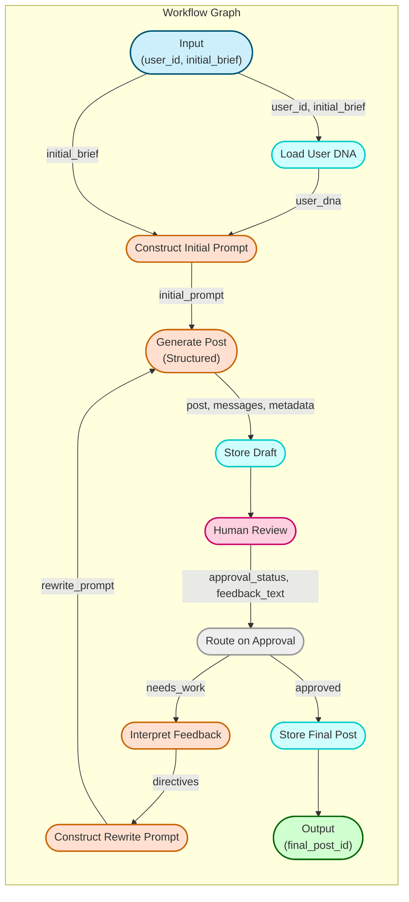

# Plan: AI-Human Post Creation Workflow (Revised)

## 1. Introduction & Goal

This document outlines the revised plan to build the "AI-Human Post Creation" workflow. The goal remains to produce a LinkedIn post through an iterative AI generation and human review process.

Key changes in this revision:
*   Streamlined node structure leveraging node configurations (e.g., `construct_options`).
*   Explicit use of `$graph_state` for managing shared data like message history, user DNA, and current draft.
*   Parallel execution branches after initial content generation: one for storing the draft (`StoreCustomerDataNode`) and one for initiating human review (`HITLNode`).
*   Refined iteration limit checking mechanism.
*   Clearer definition of nodes, edges, and state management.

The workflow starts with an initial brief, loads user preferences (`LoadCustomerDataNode`), constructs a prompt (`PromptConstructorNode`), generates the draft (`LLMNode`), and then *simultaneously* saves the draft (`store_draft`) and sends it for human review (`capture_approval`). The human review decision (`route_on_approval`) determines the next step. If feedback is provided (`needs_work`), it triggers the feedback loop: check iteration limits (`check_iteration_limit`, `route_on_limit_check`), interpret feedback (`interpret_feedback`), construct a rewrite prompt (`construct_rewrite_prompt`), and regenerate content (`generate_content`). This loop continues until the post is approved (`approved`) or the iteration limit is met, at which point the post is finalized (`finalize_post`).

## 2. Mapping PRD Nodes to Available Workflow Nodes

This mapping reflects the nodes used in the *revised* `GraphSchema`.

| PRD Node (#)                   | Conceptual Role                          | Revised Implementation Strategy                                                                                                                            | Notes                                                                                                                                                         |
| :----------------------------- | :--------------------------------------- | :--------------------------------------------------------------------------------------------------------------------------------------------------------- | :------------------------------------------------------------------------------------------------------------------------------------------------------------ |
| 2.1 Read & Extract             | Read from state                          | Read from `"$graph_state"` via edge mappings (`src_node_id: "$graph_state"`).                                                                                | Handled by edge configuration.                                                                                                                              |
| 2.2 Assemble Context           | Combine data                             | `PromptConstructorNode` uses `construct_options` to source variables directly from mapped inputs (e.g., `user_dna_doc`, `initial_content_brief`).         | Context assembly simplified within prompt nodes.                                                                                                            |
| 2.3 Write State                | Write to state                           | Write to `"$graph_state"` via edge mappings (`dst_node_id: "$graph_state"`). `StoreCustomerDataNode` for persistent storage (`store_draft`, `finalize_post`). | State updates managed via edges.                                                                                                                            |
| 2.4 Construct Prompt           | Build LLM prompt                         | `PromptConstructorNode` (`construct_initial_prompt`, `construct_rewrite_prompt`).                                                                          | Direct mapping.                                                                                                                                             |
| 2.5 Generate Content           | AI Text Generation                       | `LLMNode` (`generate_content` with structured output schema).                                                                                              | Direct mapping. Handles initial generation and rewrites.                                                                                                    |
| 2.6 Transform Content          | Modify text                              | Handled by **regenerating content** (`generate_content`) based on interpreted feedback.                                                                    | No separate transform node.                                                                                                                                 |
| 2.7 Parse Edit Operations      | Structure raw edits                      | **External:** Handled by the UI/system providing input to `capture_approval` (`HITLNode`).                                                                   | Assumed provided to HITL node.                                                                                                                              |
| 2.8 Apply Edits                | Apply structured text edits              | **Removed from Scope.**                                                                                                                                    | Focus remains on rewrite/regeneration.                                                                                                                      |
| 2.9 Interpret Feedback         | Analyze free-form text                   | `LLMNode` (`interpret_feedback` with structured output schema).                                                                                            | Direct mapping. Requires specific prompt.                                                                                                                   |
| 2.10 Capture Approval          | Get Human Yes/No/Needs Work              | `HITLNode` (`capture_approval`).                                                                                                                           | Direct mapping. Runs in parallel with `store_draft`. Triggers feedback loop or finalization.                                                                |
| 2.11 Capture Feedback          | Get Human free-form text                 | `HITLNode` (`capture_approval`).                                                                                                                           | Direct mapping.                                                                                                                                             |
| 2.12-2.16                      | Audience/Performance Features            | **Out of Scope** for this core workflow plan.                                                                                                              | Can be added as subsequent steps or separate workflows.                                                                                                     |
| 2.17 Compare Metrics           | Threshold comparison                     | `IfElseConditionNode` (`check_iteration_limit`). Reads `generation_metadata.iteration_count` from `$graph_state`.                                          | Direct mapping for iteration limit check.                                                                                                                   |
| 2.18 Conditional Router        | Route based on conditions                | `RouterNode` (`route_on_approval`, `route_on_limit_check`).                                                                                                | Direct mapping.                                                                                                                                             |
| 2.19 Preference & Pattern      | Learn user preferences                   | Potentially `LLMNode` + `StoreCustomerDataNode`, but **Out of Scope** for this core workflow.                                                              | Advanced feature.                                                                                                                                           |
| 2.20 Log Change                | Audit logging                            | `StoreCustomerDataNode` can store versions (`store_draft`, `finalize_post`). Workflow execution logs provide basic audit trail.                            | Versioning provides history. Engine logs capture execution.                                                                                                 |

**Conclusion:** The core loop uses `LLMNode` for generation/interpretation, `PromptConstructorNode` for prompts, `HITLNode` for feedback, `Load/StoreCustomerDataNode` for data persistence, and `RouterNode`/`IfElseConditionNode` for control flow. `$graph_state` is central. Parallel execution is introduced post-generation.

## 3. Revised Workflow Mermaid Diagram

This diagram illustrates the flow based on the `GraphSchema`. State reads/writes are shown conceptually connecting to the `$graph_state` box; the actual flow is managed by specific edge mappings defined in the schema.

### Simple Diagram


### Detailed Diagram

```mermaid
%%{init: {"theme": "base", "themeVariables": {
  "primaryColor": "#f4f4f4",
  "primaryTextColor": "#333",
  "lineColor": "#666",
  "edgeLabelBackground": "#e8e8e8"
}}}%%
flowchart TD
  subgraph "AI-Human Post Creation Workflow"
    direction TB

    %% --- Input and Initial Setup ---
    INPUT(["Workflow Input<br/>(post_draft_name, initial_content_brief)"]):::input 
      --> STATE_WRITE_INPUT["Write Inputs<br/>(post_draft_name, initial_content_brief)"]:::state_io 
      --> graph_state
    INPUT -- "Trigger" --> LOAD_USER_DNA["Load User DNA<br/>(LoadCustomerDataNode)<br/>(namespace: ${user_dna_namespace}<br/>doc: ${user_dna_docname})"]:::storage

    LOAD_USER_DNA -- "user_dna_doc" --> STATE_WRITE_DNA["Write<br/>(user_dna_doc)"]:::state_io 
      --> graph_state
    LOAD_USER_DNA -- "user_dna_doc" --> CONSTRUCT_INITIAL_PROMPT["Construct Initial Prompt<br/>(PromptConstructorNode)"]:::processing
    graph_state -- "initial_content_brief" --> STATE_READ_BRIEF["Read<br/>(initial_content_brief)"]:::state_io 
      --> CONSTRUCT_INITIAL_PROMPT

    %% --- Generation Core ---
    CONSTRUCT_INITIAL_PROMPT -- "initial_generation_prompt, system_prompt" 
      --> GENERATE_CONTENT["Generate Post (Structured)<br/>(LLMNode - ${generation_model_name})"]:::processing
    graph_state -- "messages_history" --> STATE_READ_MSG_HIST_1["Read<br/>(messages_history)"]:::state_io 
      --> GENERATE_CONTENT

    %% --- Parallel Branches Post-Generation ---
    GENERATE_CONTENT -- "structured_output" 
      --> STORE_DRAFT["Store Initial Draft (Parallel 1)<br/>(StoreCustomerDataNode - Versioned 'draft_v1')<br/>(namespace: ${draft_storage_namespace})"]:::storage
    graph_state -- "post_draft_name" --> STATE_READ_DRAFT_NAME_1["Read<br/>(post_draft_name)"]:::state_io 
      --> STORE_DRAFT

    GENERATE_CONTENT -- "structured_output (as draft_for_review)" 
      --> CAPTURE_APPROVAL["Human Review (Parallel 2)<br/>(HITLNode)"]:::human

    %% --- State Update Post-Generation ---
    GENERATE_CONTENT -- "current_messages, metadata, structured_output" 
      --> STATE_WRITE_GEN_RESULTS["Write Gen Results<br/>(messages_history, generation_metadata, current_post_draft)"]:::state_io 
      --> graph_state

    %% --- Human Feedback Handling ---
    STATE_WRITE_GEN_RESULTS --> CAPTURE_APPROVAL

    CAPTURE_APPROVAL -- "approval_status, feedback_text" 
      --> STATE_WRITE_FEEDBACK["Write Feedback<br/>(current_feedback_text)"]:::state_io 
      --> graph_state
    CAPTURE_APPROVAL -- "approval_status" 
      --> ROUTE_ON_APPROVAL["Route on Approval<br/>(RouterNode)"]:::decision

    %% --- Feedback & Revision Loop ---
    subgraph "Feedback & Revision Loop (Max ${max_iterations} Iterations)"
      direction TB

      ROUTE_ON_APPROVAL -- "'needs_work'" 
        --> CHECK_ITERATION_LIMIT["Check Iteration Limit<br/>< ${max_iterations}<br/>(IfElseConditionNode)"]:::decision
      graph_state -- "generation_metadata" 
        --> STATE_READ_METADATA["Read<br/>(generation_metadata)"]:::state_io 
        --> CHECK_ITERATION_LIMIT

      CHECK_ITERATION_LIMIT -- "branch, tag_results, condition_result" 
        --> ROUTE_ON_LIMIT_CHECK["Route on Limit Check<br/>(RouterNode)"]:::decision

      ROUTE_ON_LIMIT_CHECK -- "'true_branch' (Continue Loop)" 
        --> INTERPRET_FEEDBACK["Interpret Feedback (Structured)<br/>(LLMNode - ${feedback_analysis_model})"]:::processing
      graph_state -- "feedback_messages_history" 
        --> STATE_READ_MSG_HIST_2["Read<br/>(feedback_messages_history)"]:::state_io 
        --> INTERPRET_FEEDBACK
      graph_state -- "current_feedback_text" 
        --> STATE_READ_FEEDBACK_TEXT["Read<br/>(current_feedback_text)"]:::state_io 
        --> INTERPRET_FEEDBACK

      INTERPRET_FEEDBACK -- "structured_output (rewrite_interpretation)" 
        --> CONSTRUCT_REWRITE_PROMPT["Construct Rewrite Prompt<br/>(PromptConstructorNode)"]:::processing
      INTERPRET_FEEDBACK -- "current_messages" 
        --> STATE_WRITE_INTERPRET_MSG["Write Feedback Analysis Msgs<br/>(feedback_messages_history)"]:::state_io 
        --> graph_state

      CONSTRUCT_REWRITE_PROMPT -- "rewrite_prompt" --> GENERATE_CONTENT
    end

    %% --- Finalization Path ---
    ROUTE_ON_APPROVAL -- "'approved'" 
      --> FINALIZE_POST["Store Final Post<br/>(StoreCustomerDataNode - Versioned 'finalized_v1')"]:::storage
    ROUTE_ON_LIMIT_CHECK -- "'false_branch' (Limit Reached)" --> FINALIZE_POST

    graph_state -- "current_post_draft" 
      --> STATE_READ_FINAL_DRAFT["Read<br/>(current_post_draft)"]:::state_io 
      --> FINALIZE_POST
    graph_state -- "post_draft_name" 
      --> STATE_READ_DRAFT_NAME_2["Read<br/>(post_draft_name)"]:::state_io 
      --> FINALIZE_POST

    %% --- Output ---
    FINALIZE_POST -- "paths_processed" 
      --> OUTPUT_FINAL_PATHS(["Workflow Output<br/>(final_post_paths)"]):::output
    graph_state -- "current_post_draft" 
      --> STATE_READ_FINAL_CONTENT["Read<br/>(current_post_draft)"]:::state_io 
      --> OUTPUT_FINAL_CONTENT(["Workflow Output<br/>(final_post_content)"]):::output

    %% --- Central State Representation ---
	  subgraph "Central Graph State" as graph_state
	    direction LR
	    style graph_state fill:#e3f2fd,stroke:#1e88e5;
	
	    STATE_KEYS[" "]:::state_key
	    style STATE_KEYS fill:none,stroke:none;
	
	    subgraph "State Keys Managed"
	      direction TB
	      S_DRAFT_NAME["post_draft_name"]:::state_key
	      S_BRIEF["initial_content_brief"]:::state_key
	      S_USER_DNA["user_dna_doc"]:::state_key
	      S_MESSAGES["messages_history"]:::state_key
	      S_FEEDBACK_MESSAGES["feedback_messages_history"]:::state_key
	      S_METADATA["generation_metadata<br/>(incl. iter_count)"]:::state_key
	      S_DRAFT_CONTENT["current_post_draft"]:::state_key
	      S_FEEDBACK_TEXT["current_feedback_text"]:::state_key
	    end
	  end

  end

  %% Styling
  classDef input      fill:#CDEFFC,stroke:#005577,stroke-width:2px,color:#005577;
  classDef processing fill:#FFF9C4,stroke:#FBC02D,stroke-width:2px,color:#6b4f00;
  classDef storage    fill:#E8F5E9,stroke:#388E3C,stroke-width:2px,color:#1B5E20;
  classDef human      fill:#FFEBEE,stroke:#D32F2F,stroke-width:2px,color:#BF360C;
  classDef decision   fill:#E0E0E0,stroke:#616161,stroke-width:2px,color:#333;
  classDef output     fill:#D1C4E9,stroke:#512DA8,stroke-width:2px,color:#311B92;
  classDef state_io   fill:#f0f4c3,stroke:#afb42b,stroke-width:1px,color:#5d620a,stroke-dasharray:3 3;
  classDef state_key  fill:#fff,stroke:#fff,color:#555;


```


## 4. Detailed `GraphSchema` Plan (Nodes & Edges)

This section outlines the nodes and edges for the core workflow based on the revised plan. Placeholders are marked with `${...}`.

```json
// Paste the JSON schema from _test_content_workflow.py here
// It should be the same as the previous version you provided.
// Make sure placeholders like ${user_dna_namespace}, ${generation_model_name}, etc. are used.
{
  "nodes": {
    "input_node": {
      "node_id": "input_node",
      "node_name": "input_node",
      "node_config": {},
      "dynamic_output_schema": {
        "fields": {
          "post_draft_name": {
            "type": "str",
            "required": true,
            "description": "Name of the post being drafted for saving."
          },
          "initial_content_brief": {
            "type": "str",
            "required": true,
            "description": "Content brief for the post being generated."
          }
        }
      }
    },
    "load_user_dna": {
      "node_id": "load_user_dna",
      "node_name": "load_customer_data",
      "node_config": {
        "load_paths": [
          {
            "filename_config": {
              "static_namespace": "${user_dna_namespace}",
              "static_docname": "${user_dna_docname}"
            },
            "output_field_name": "user_dna_doc"
          }
        ]
      },
      "dynamic_output_schema": {
        "fields": {
          "user_dna_doc": {
            "type": "dict",
            "required": true,
            "description": "User DNA document containing user preferences."
          }
        }
      }
    },
    "construct_initial_prompt": {
      "node_id": "construct_initial_prompt",
      "node_name": "prompt_constructor",
      "node_config": {
        "prompt_templates": {
          "initial_generation_prompt": {
            "id": "initial_generation_prompt",
            "template": "Create a LinkedIn post based on the following:\nBrief: {brief}\nUser Style: {user_style}\n\n",
            "variables": {
              "brief": null,
              "user_style": "default"
            },
            "construct_options": {
              "user_style": "user_dna_doc.style_preference",
              "brief": "initial_content_brief"
            }
          },
          "system_prompt": {
            "id": "system_prompt",
            "template": "You are a LinkedIn post generator. You are given a brief and a user style. You need to generate a LinkedIn post based on the brief and user style guidelines. If you are given feedback, you should rewrite it based on the user's feedback.",
            "variables": {}
          }
        }
      }
    },
    "generate_content": {
      "node_id": "generate_content",
      "node_name": "llm",
      "node_config": {
        "llm_config": {
          "model_spec": {
            "provider": "${llm_provider}",
            "model": "${generation_model_name}"
          },
          "temperature": "${temperature}",
          "max_tokens": "${max_tokens}"
        },
        "output_schema": {
          "dynamic_schema_spec": {
            "schema_name": "LinkedInPost",
            "fields": {
              "post_text": {
                "type": "str",
                "required": true,
                "description": "The main body of the LinkedIn post."
              },
              "hashtags": {
                "type": "list",
                "items_type": "str",
                "required": true,
                "description": "Suggested hashtags."
              }
            }
          }
        }
      }
    },
    "store_draft": {
      "node_id": "store_draft",
      "node_name": "store_customer_data",
      "node_config": {
        "global_versioning": {
          "is_versioned": true,
          "operation": "initialize",
          "version": "draft_v1"
        },
        "store_configs": [
          {
            "input_field_path": "structured_output",
            "target_path": {
              "filename_config": {
                "static_namespace": "${draft_storage_namespace}",
                "input_docname_field": "post_draft_name"
              }
            }
          }
        ]
      }
    },
    "capture_approval": {
      "node_id": "capture_approval",
      "node_name": "hitl_node__default",
      "node_config": {},
      "dynamic_output_schema": {
        "fields": {
          "approval_status": {
            "type": "enum",
            "enum_values": [
              "approved",
              "needs_work"
            ],
            "required": true,
            "description": "User decision on the draft."
          },
          "feedback_text": {
            "type": "str",
            "required": false,
            "description": "Optional feedback text from the user."
          }
        }
      }
    },
    "route_on_approval": {
      "node_id": "route_on_approval",
      "node_name": "router_node",
      "node_config": {
        "choices": [
          "check_iteration_limit",
          "finalize_post"
        ],
        "allow_multiple": false,
        "choices_with_conditions": [
          {
            "choice_id": "check_iteration_limit",
            "input_path": "approval_status_from_hitl",
            "target_value": "needs_work"
          },
          {
            "choice_id": "finalize_post",
            "input_path": "approval_status_from_hitl",
            "target_value": "approved"
          }
        ]
      }
    },
    "check_iteration_limit": {
      "node_id": "check_iteration_limit",
      "node_name": "if_else_condition",
      "node_config": {
        "tagged_conditions": [
          {
            "tag": "iteration_limit_check",
            "condition_groups": [
              {
                "logical_operator": "and",
                "conditions": [
                  {
                    "field": "generation_metadata.iteration_count",
                    "operator": "less_than",
                    "value": "${max_iterations}"
                  }
                ]
              }
            ],
            "group_logical_operator": "and"
          }
        ],
        "branch_logic_operator": "and"
      }
    },
    "route_on_limit_check": {
      "node_id": "route_on_limit_check",
      "node_name": "router_node",
      "node_config": {
        "choices": [
          "interpret_feedback",
          "finalize_post"
        ],
        "allow_multiple": false,
        "choices_with_conditions": [
          {
            "choice_id": "interpret_feedback",
            "input_path": "if_else_condition_tag_results::iteration_limit_check",
            "target_value": true
          },
          {
            "choice_id": "finalize_post",
            "input_path": "iteration_branch_result",
            "target_value": "false_branch"
          }
        ]
      }
    },
    "interpret_feedback": {
      "node_id": "interpret_feedback",
      "node_name": "llm",
      "node_config": {
        "llm_config": {
          "model_spec": {
            "provider": "${llm_provider}",
            "model": "${feedback_analysis_model}"
          },
          "temperature": "${temperature}",
          "max_tokens": "${max_tokens}"
        },
        "default_system_prompt": "You're an expert LinkedIn Marketing Analyst. \nInterpret the user's feedback and provide specific instructions for rewriting the LinkedIn post.",
        "output_schema": {
          "dynamic_schema_spec": {
            "schema_name": "FeedbackDirectives",
            "fields": {
              "feedback_type": {
                "type": "enum",
                "enum_values": [
                  "rewrite_request",
                  "unclear"
                ],
                "required": true,
                "description": "Classification of the feedback intent."
              },
              "summary": {
                "type": "str",
                "required": false,
                "description": "A concise summary of the feedback."
              },
              "rewrite_instructions": {
                "type": "str",
                "required": false,
                "description": "Specific instructions extracted for the rewrite."
              }
            }
          }
        }
      }
    },
    "construct_rewrite_prompt": {
      "node_id": "construct_rewrite_prompt",
      "node_name": "prompt_constructor",
      "node_config": {
        "prompt_templates": {
          "rewrite_prompt": {
            "id": "rewrite_prompt",
            "template": "Rewrite the LinkedIn post based on the following feedback.Feedback Summary: {feedback_summary}\nRewrite Instructions: {rewrite_instructions}\n\n",
            "variables": {
              "feedback_summary": null,
              "rewrite_instructions": null
            },
            "construct_options": {
              "feedback_summary": "rewrite_interpretation.summary",
              "rewrite_instructions": "rewrite_interpretation.rewrite_instructions"
            }
          }
        }
      }
    },
    "finalize_post": {
      "node_id": "finalize_post",
      "node_name": "store_customer_data",
      "node_config": {
        "global_versioning": {
          "is_versioned": true,
          "operation": "upsert_versioned",
          "version": "finalized_v1"
        },
        "store_configs": [
          {
            "input_field_path": "current_post_draft",
            "target_path": {
              "filename_config": {
                "static_namespace": "${draft_storage_namespace}",
                "input_docname_field": "post_draft_name"
              }
            }
          }
        ]
      }
    },
    "output_node": {
      "node_id": "output_node",
      "node_name": "output_node",
      "node_config": {}
    }
  },
  "edges": [
    {
      "src_node_id": "input_node",
      "dst_node_id": "$graph_state",
      "mappings": [
        {
          "src_field": "post_draft_name",
          "dst_field": "post_draft_name",
          "description": "Store the draft name for later use (e.g., saving)."
        },
        {
          "src_field": "initial_content_brief",
          "dst_field": "initial_content_brief",
          "description": "Store the initial brief globally."
        }
      ]
    },
    {
      "src_node_id": "input_node",
      "dst_node_id": "load_user_dna",
      "description": "Trigger loading user data after input."
    },
    {
      "src_node_id": "load_user_dna",
      "dst_node_id": "$graph_state",
      "mappings": [
        {
          "src_field": "user_dna_doc",
          "dst_field": "user_dna_doc",
          "description": "Store the loaded user DNA document globally."
        }
      ]
    },
    {
      "src_node_id": "load_user_dna",
      "dst_node_id": "construct_initial_prompt",
      "mappings": [
        {
          "src_field": "user_dna_doc",
          "dst_field": "user_dna_doc",
          "description": "Pass user DNA for extracting style preference."
        }
      ]
    },
    {
      "src_node_id": "$graph_state",
      "dst_node_id": "construct_initial_prompt",
      "mappings": [
        {
          "src_field": "initial_content_brief",
          "dst_field": "initial_content_brief",
          "description": "Pass the initial brief for the prompt."
        }
      ]
    },
    {
      "src_node_id": "construct_initial_prompt",
      "dst_node_id": "generate_content",
      "mappings": [
        {
          "src_field": "initial_generation_prompt",
          "dst_field": "user_prompt",
          "description": "Pass the main generation prompt to the LLM."
        },
        {
          "src_field": "system_prompt",
          "dst_field": "system_prompt",
          "description": "Pass the system prompt/instructions to the LLM."
        }
      ]
    },
    {
      "src_node_id": "$graph_state",
      "dst_node_id": "generate_content",
      "mappings": [
        {
          "src_field": "messages_history",
          "dst_field": "messages_history",
          "description": "Pass existing message history for context."
        }
      ]
    },
    {
      "src_node_id": "generate_content",
      "dst_node_id": "store_draft",
      "mappings": [
        {
          "src_field": "structured_output",
          "dst_field": "structured_output",
          "description": "Pass the generated post content for saving as a draft. (Parallel Branch 1)"
        }
      ]
    },
    {
      "src_node_id": "$graph_state",
      "dst_node_id": "store_draft",
      "mappings": [
        {
          "src_field": "post_draft_name",
          "dst_field": "post_draft_name",
          "description": "Pass the draft name needed by the node's target_path config."
        }
      ]
    },
    {
      "src_node_id": "generate_content",
      "dst_node_id": "capture_approval",
      "mappings": [
        {
          "src_field": "structured_output",
          "dst_field": "draft_for_review",
          "description": "Pass the generated post content for HITL review. (Parallel Branch 2)"
        }
      ]
    },
    {
      "src_node_id": "generate_content",
      "dst_node_id": "$graph_state",
      "mappings": [
        {
          "src_field": "current_messages",
          "dst_field": "messages_history",
          "description": "Update message history with the latest interaction."
        },
        {
          "src_field": "metadata",
          "dst_field": "generation_metadata",
          "description": "Store LLM metadata (e.g., token usage, iteration count)."
        },
        {
          "src_field": "structured_output",
          "dst_field": "current_post_draft",
          "description": "Store the latest generated post draft globally."
        }
      ]
    },
    {
      "src_node_id": "capture_approval",
      "dst_node_id": "route_on_approval",
      "mappings": [
        {
          "src_field": "approval_status",
          "dst_field": "approval_status_from_hitl",
          "description": "Pass the user's decision ('approved' or 'needs_work')."
        }
      ]
    },
    {
      "src_node_id": "capture_approval",
      "dst_node_id": "$graph_state",
      "mappings": [
        {
          "src_field": "feedback_text",
          "dst_field": "current_feedback_text",
          "description": "Store the user's feedback text globally."
        }
      ]
    },
    {
      "src_node_id": "route_on_approval",
      "dst_node_id": "check_iteration_limit",
      "description": "Trigger iteration check if feedback provided (Control Flow: 'needs_work')."
    },
    {
      "src_node_id": "route_on_approval",
      "dst_node_id": "finalize_post",
      "description": "Trigger finalization if post approved (Control Flow: 'approved')."
    },
    {
      "src_node_id": "$graph_state",
      "dst_node_id": "check_iteration_limit",
      "mappings": [
        {
          "src_field": "generation_metadata",
          "dst_field": "generation_metadata",
          "description": "Pass LLM metadata containing iteration count."
        }
      ]
    },
    {
      "src_node_id": "check_iteration_limit",
      "dst_node_id": "route_on_limit_check",
      "mappings": [
        {
          "src_field": "branch",
          "dst_field": "iteration_branch_result",
          "description": "Pass the branch taken ('true_branch' if limit not reached, 'false_branch' if reached)."
        },
        {
          "src_field": "tag_results",
          "dst_field": "if_else_condition_tag_results",
          "description": "Pass detailed results per condition tag."
        },
        {
          "src_field": "condition_result",
          "dst_field": "if_else_overall_condition_result",
          "description": "Pass the overall boolean result of the check."
        }
      ]
    },
    {
      "src_node_id": "route_on_limit_check",
      "dst_node_id": "interpret_feedback",
      "description": "Trigger feedback interpretation if iterations remain (Control Flow: 'true_branch')."
    },
    {
      "src_node_id": "route_on_limit_check",
      "dst_node_id": "finalize_post",
      "description": "Trigger finalization if iteration limit reached (Control Flow: 'false_branch')."
    },
    {
      "src_node_id": "$graph_state",
      "dst_node_id": "interpret_feedback",
      "mappings": [
        {
          "src_field": "feedback_messages_history",
          "dst_field": "messages_history",
          "description": "Pass message history for LLM context."
        },
        {
          "src_field": "current_feedback_text",
          "dst_field": "user_prompt",
          "description": "Pass the user's feedback as the main input user_prompt for analysis."
        }
      ]
    },
    {
      "src_node_id": "interpret_feedback",
      "dst_node_id": "construct_rewrite_prompt",
      "mappings": [
        {
          "src_field": "structured_output",
          "dst_field": "rewrite_interpretation",
          "description": "Pass the structured analysis (summary, instructions) for constructing the rewrite prompt."
        }
      ]
    },
    {
      "src_node_id": "interpret_feedback",
      "dst_node_id": "$graph_state",
      "mappings": [
        {
          "src_field": "current_messages",
          "dst_field": "feedback_messages_history",
          "description": "Update message history with the feedback analysis interaction."
        }
      ]
    },
    {
      "src_node_id": "construct_rewrite_prompt",
      "dst_node_id": "generate_content",
      "mappings": [
        {
          "src_field": "rewrite_prompt",
          "dst_field": "user_prompt",
          "description": "Pass the rewrite prompt back to the main LLM node to generate a revised post."
        }
      ]
    },
    {
      "src_node_id": "$graph_state",
      "dst_node_id": "finalize_post",
      "mappings": [
        {
          "src_field": "current_post_draft",
          "dst_field": "current_post_draft",
          "description": "Pass the final approved post content for saving."
        },
        {
          "src_field": "post_draft_name",
          "dst_field": "post_draft_name",
          "description": "Pass the draft name for the final save operation."
        }
      ]
    },
    {
      "src_node_id": "finalize_post",
      "dst_node_id": "output_node",
      "mappings": [
        {
          "src_field": "paths_processed",
          "dst_field": "final_post_paths",
          "description": "Pass the path(s) or ID(s) of the finalized stored document(s)."
        }
      ]
    },
    {
      "src_node_id": "$graph_state",
      "dst_node_id": "output_node",
      "mappings": [
        {
          "src_field": "current_post_draft",
          "dst_field": "final_post_content",
          "description": "Pass the final post content itself to the output."
        }
      ]
    }
  ],
  "input_node_id": "input_node",
  "output_node_id": "output_node"
}
```

## 5. Placeholders & Required Inputs

**Configuration Placeholders (Set externally or via environment):**

*   `${user_dna_namespace}`: Namespace for loading user DNA (e.g., `"user_profiles"`).
*   `${user_dna_docname}`: Document name for user DNA (e.g., `"user_dna_doc"` or potentially dynamic like `"user_dna_${user_id}"`).
*   `${draft_storage_namespace}`: Namespace for storing drafts and final posts (e.g., `"post_content"`).
*   `${llm_provider}`: The AI provider (e.g., `"openai"`, `"google_genai"`).
*   `${generation_model_name}`: Model for post generation/rewrite (e.g., `"gpt-4-turbo"`). Must support structured output.
*   `${feedback_analysis_model}`: Model for feedback interpretation (e.g., `"gpt-4-turbo"` or a faster/cheaper alternative like `"gpt-3.5-turbo"`). Must support structured output.
*   `${temperature}`: LLM temperature setting (e.g., `0.5`).
*   `${max_tokens}`: LLM max token setting (e.g., `1000`).
*   `${max_iterations}`: Maximum feedback loops allowed (e.g., `3`).

**Workflow Inputs (Defined by `input_node` schema):**

*   `post_draft_name`: (string) Base name for the document when saving drafts/final post (e.g., `"my_awesome_post_idea"`). Used by `store_draft` and `finalize_post`.
*   `initial_content_brief`: (string) The user's initial request or topic.

**Human Inputs (via `capture_approval` HITLNode):**

*   `approval_status`: (enum: `"approved"`, `"needs_work"`) User's decision.
*   `feedback_text`: (string, optional) User's textual feedback if `needs_work`.

**Implicit Inputs (from `$graph_state`):**

*   `messages_history`: List of messages for LLM context (`generate_content`).
*   `feedback_messages_history`: List of messages for feedback analysis LLM context (`interpret_feedback`).
*   `current_feedback_text`: User's feedback text (`interpret_feedback`).
*   `generation_metadata`: Contains `iteration_count` for loop control (`check_iteration_limit`).
*   `current_post_draft`: The latest generated post content (`finalize_post`, `output_node`).
*   `user_dna_doc`: Loaded user preferences (`construct_initial_prompt`).

**Required Pre-computation / Configuration:**

*   **User DNA Document:** The document specified by `${user_dna_namespace}`/`${user_dna_docname}` must exist and contain the expected structure (e.g., `{"style_preference": "professional"}`).
*   **Prompt Templates:** The `template` strings within `construct_initial_prompt` and `construct_rewrite_prompt` need careful crafting.
*   **Schema Consistency:** The `output_schema` defined in `generate_content` and `interpret_feedback` must be valid and align with the instructions in the corresponding prompts.
*   **(Optional) State Reducers:** While not explicitly included in the final JSON, defining `state_reducers` in the graph's metadata (as shown commented out previously) is **highly recommended** for production to explicitly control how state keys like `messages_history` (append), `generation_metadata` (replace), etc., are updated, especially given potential complexities with parallel branches writing to state.

## 6. Caveats & Watchouts

*   **Structured Output Reliability:** LLMs (`generate_content`, `interpret_feedback`) must consistently produce valid JSON matching the defined schemas. Robust prompt engineering instructing JSON format is crucial. Consider adding explicit JSON validation steps after LLM nodes.
*   **State Management:**
    *   The workflow relies heavily on `$graph_state`. Ensure all necessary data is correctly written and read via edge mappings. Debugging state can be challenging.
    *   **Distinct Message Histories:** Note the use of *two* potential message history keys (`messages_history` for generation, `feedback_messages_history` for interpretation). Ensure edges correctly map the appropriate history to each LLM node. Using separate keys avoids polluting the generation context with the interpretation LLM's internal reasoning if desired. Alternatively, a single history could be used if managed carefully (e.g., using distinct roles).
    *   **Reducer Importance:** Explicitly define `state_reducers` (see Section 5) to prevent unexpected state merging behavior.
*   **Parallel Execution:** The `store_draft` and `capture_approval` nodes run in parallel after `generate_content`.
    *   Ensure the storage operation (`store_draft`) is robust and handles potential initialization conflicts if the workflow restarts unexpectedly. The `initialize` operation helps here.
    *   The graph engine manages the parallel execution; ensure subsequent nodes correctly depend on the necessary outputs (e.g., `route_on_approval` depends on `capture_approval`).
*   **Iteration Count Tracking:** Relies on the `generate_content` LLM node populating `metadata.iteration_count` correctly, storing it in `$graph_state.generation_metadata`, and `check_iteration_limit` accessing it via the specified field path (`generation_metadata.iteration_count`). Verify this path matches the actual LLM node output structure.
*   **Prompt Engineering:** Critical for instructing LLMs on generation, structured output adherence, and feedback interpretation. `PromptConstructorNode` relies on correct variable sourcing via `construct_options` and edge mappings.
*   **Context in Rewrites:** The `construct_rewrite_prompt` relies on the `generate_content` LLM having access to the *previous* conversation turns (including the original post and user style) via the `messages_history` provided from `$graph_state`. Ensure this history is correctly maintained and passed.
*   **Error Handling:** Implement robust error handling for LLM failures, schema validation errors, state access issues, and HITL timeouts/errors.
*   **Cost/Latency:** Multiple LLM calls increase cost and latency. Use appropriate models (e.g., potentially faster/cheaper `feedback_analysis_model`).
*   **Versioning:** `StoreCustomerDataNode` uses versioning (`draft_v1`, `finalized_v1`). Understand how this interacts with the `initialize` and `upsert_versioned` operations. Ensure the `post_draft_name` provides a stable base document name.

This revised plan provides a more detailed and robust structure, leveraging specific node features and explicit state management via edges. Careful implementation of prompts, state handling, and error checking remains crucial.
